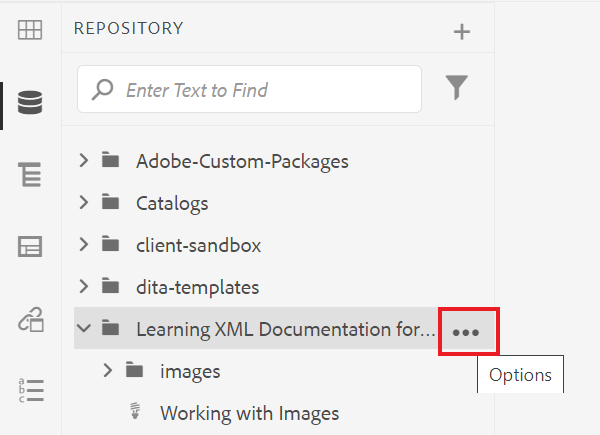
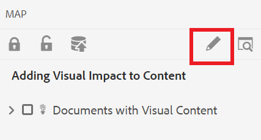

# 创建地图

地图是一种组织工具，可让您以层次结构添加和组织信息。 此任务将向您展示如何创建地图并组织地图中的内容。

您可以从以下位置下载示例DITA文件：

* [Documents-with-Visual-Content.dita](assets/working-with-maps/Documents-with-Visual-Content.dita)
* [使用 — Tables.dita](assets/working-with-maps/Working-with-Tables.dita)

>[!VIDEO](https://video.tv.adobe.com/v/336725?quality=12&learn=on)

## 上传映射组件

如果需要，您可以将本地样例文件上传到AEM，以获取更完整的一组材料。

1. 将任何本地文件拖放到AEM中以上传它们。
1. 根据需要对任何文件（包括图像和主题）重复执行上述步骤。

## 创建映射

1. 要打开 [!UICONTROL 选项] 菜单中，选择主文件夹上的省略号图标。

   

1. 选择 **[!UICONTROL 创建]** > **[!UICONTROL 地图]**.

   

   的 [!UICONTROL 新建映射] 对话框。

1. 在 [!UICONTROL 模板] 字段，选择 **[!UICONTROL Bookmap]** ，并为您的地图提供一个标题。
1. 选择&#x200B;**[!UICONTROL 创建]**。

   此时将创建映射，并且左边栏会自动从“存储库”视图更改为“映射”视图。

## 插入映射组件

1. 选择左边栏中的铅笔图标。

   

   这是编辑图标，用于在编辑器中打开映射。

1. 通过选择存储库图标切换回存储库视图。

   

1. 将主题从存储库拖放到编辑器的映射中，以将其添加到映射中。

   行指示器可显示主题的放置位置。

1. 根据需要继续添加主题。

## 查看映射预览

“预览”功能可使用默认格式快速查看内容。 它显示标题、段落、列表以及主题中显示的任何其他内容。

1. 选择 **[!UICONTROL 预览]** 来访问Advertising Cloud的帮助。

   

您的内容将在 [!UICONTROL 预览].

1. 要返回“创作视图”并恢复映射编辑，请选择 **作者。**

   

## 配置映射结构

您可以编辑映射中主题的层次结构。

1. 单击主题的图标以将其选中。
1. 使用箭头可分别降级和提升元素。

   

## 将映射另存为新版本

映射完成后，您可以将工作另存为新版本并记录更改。

1. 选择 **[!UICONTROL 另存为新版本]** 图标。

   

1. 在“新版本的注释”字段中，输入简短但清晰的更改摘要。

1. 在版本标签字段中，输入任何相关的标签。

   标签允许您指定要在发布时包含的版本。

   >[!NOTE]
   > 
   > 如果您的程序配置了预定义标签，则可以从中进行选择，以确保标签设置一致。

1. 选择&#x200B;**保存**。

   您已创建映射的新版本，版本号已更新。
