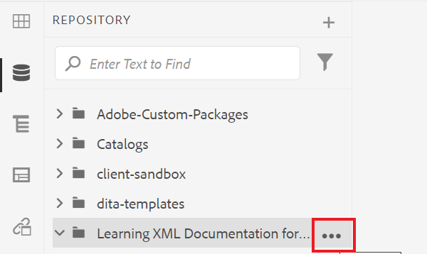

# 创建和结构化内容

一旦您熟悉了用户界面，您就可以开始创建和构建自己的内容。

>[!VIDEO](https://video.tv.adobe.com/v/336657?quality=12&learn=on)

## 创建文件夹

1. 选择&#x200B;**存储库**&#x200B;图标以查看您的文件夹和文件。

   

1. 选择&#x200B;**+**&#x200B;图标和&#x200B;**文件夹**。

   

1. 为文件夹提供一个标题。
1. 选择&#x200B;**创建**。
您已创建一个新文件夹，该文件夹现在显示在存储库中。 此文件夹将是您所有课程内容的主页。

## 创建子文件夹

我们现在可以在新文件夹内创建一个文件夹，以包含图像或其他内容。

1. 将鼠标悬停在存储库中的新文件夹上，然后选择显示的省略号图标。

   

   将显示“选项”菜单。

1. 选择&#x200B;**创建\>文件夹**。
   

1. 为子文件夹指定标题（例如，“图像”），然后选择&#x200B;**创建**。

## 创建和填充新概念

1. 将鼠标悬停在存储库中的父文件夹上，然后选择省略号图标。

   

   将显示“选项”菜单。

1. 选择&#x200B;**创建\>主题**。

   

   此时将显示“创建新主题”对话框。

1. 从对话框的“模板”下拉菜单中，选择&#x200B;**概念**。

   

1. 为您的概念提供一个标题，然后选择&#x200B;**创建**。

   新概念将显示在编辑器中，并填入其标题。

   

1. 通过单击简短描述或段落并键入内容来填充概念。

## 保存并另存为新版本

您可以随时使用“保存”或“另存为新版本”来保存您所做的工作。 使用“保存”可保留更改，使用“另存为新版本”可创建包含当前更改的新主题版本。

### 保存您的工作而不进行版本控制

1. 选择&#x200B;**保存**&#x200B;图标。

   

### 另存为新版本

1. 选择“保存”图标右侧的&#x200B;**另存为新版本**&#x200B;图标。

   

   此时将显示“另存为新版本”对话框。

1. 在新版本的注释字段中，输入简短但清晰的更改摘要。
1. 在版本标签字段中，输入任何相关标签。

   标签允许您指定发布时要包含的版本。

   >[!NOTE]
   > 
   > 如果您的程序配置了预定义标签，则可以从这些标签中进行选择，以确保标签的一致性。

1. 选择&#x200B;**保存**。

   您已经创建了主题的新版本，并且版本号已更新。
