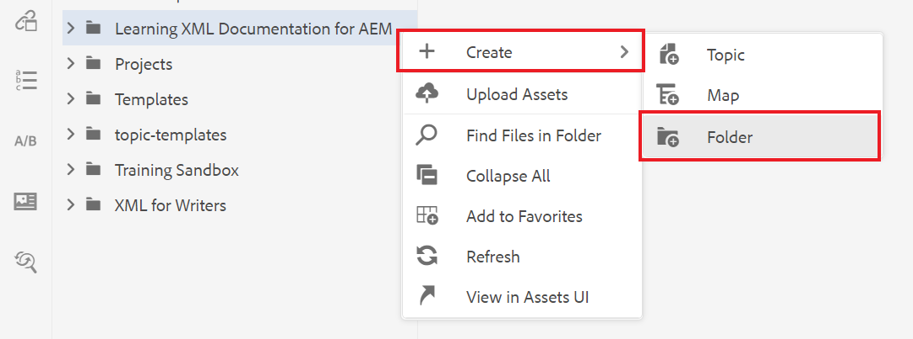

# 创建和构建内容

熟悉用户界面后，您便可以开始创建和构建自己的内容。

>[!VIDEO](https://video.tv.adobe.com/v/336657?quality=12&learn=on)

## 创建文件夹

1. 选择 **存储库** 图标以查看文件夹和文件。

   

1. 选择 **+** 图标和 **文件夹**.

   

1. 为文件夹提供一个标题。
1. 选择&#x200B;**创建**。您已创建了新文件夹，该文件夹现在会显示在存储库中。 此文件夹将是您所有课程内容的主页。

## 创建子文件夹

我们现在可以在您的新文件夹中创建一个文件夹，以包含图像或其他内容。

1. 将鼠标悬停在存储库中的新文件夹上，然后选择显示的省略号图标。

   

   此时将显示“选项”菜单。

1. 选择 **创建\>文件夹**.
   

1. 为子文件夹指定标题（例如“图像”），然后选择 **创建**.

## 创建和填充新概念

1. 将鼠标悬停在存储库中的父文件夹上，然后选择省略号图标。

   

   此时将显示“选项”菜单。

1. 选择 **创建\>主题**.

   

   此时将显示“创建新主题”对话框。

1. 从对话框的模板下拉菜单中，选择 **概念**.

   

1. 为您的概念提供一个标题并选择 **创建**.

   新概念将显示在编辑器中，并填充其标题。

   

1. 通过单击简短描述或段落并键入内容来填充概念。

## 另存为新版本

您可以随时使用“另存为”或“另存为新版本”来保存您的工作。 使用保存保留您所做的更改，然后使用另存为新版本创建具有当前更改的主题的新版本。

### 在不进行版本控制的情况下保存您的工作

1. 选择 **保存** 图标。

   

### 另存为新版本

1. 选择 **另存为新版本** 图标。

   

   此时将显示另存为新版本对话框。

1. 在“新版本的注释”字段中，输入简短但清晰的更改摘要。
1. 在版本标签字段中，输入任何相关的标签。

   标签允许您指定要在发布时包含的版本。

   >[!NOTE]
   > 
   > 如果您的程序配置了预定义标签，则可以从中进行选择，以确保标签设置一致。

1. 选择&#x200B;**保存**。

   您已创建了主题的新版本，并且版本号已更新。
