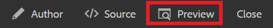

# 链接到网站

Web链接可将读者引导至网站，以获取更多信息、允许他们与外部内容进行交互，或访问可下载的文件。 以下步骤将演示如何向现有概念添加Web链接。

>[!VIDEO](https://video.tv.adobe.com/v/336656?quality=12&learn=on)

## 插入链接

1. 从存储库中选择您的概念，然后在编辑器中将其打开。
2. 在概念中添加一个文本字符串并突出显示该字符串，或突出显示所选的现有文本。

   此突出显示的文本将插入您的链接。
3. 选择 **插入交叉引用** 按钮。

   

   此时将显示“引用”(Reference)对话框。

4. 选择 **Web链接** 菜单中。
5. 粘贴所需的URL，然后单击 **选择**.

   该链接可正常工作，单击后将在新浏览器选项卡中打开一个网页。

## 使用预览来测试链接

“预览”按钮允许您查看主题的预览。 在此，您可以测试链接并按受众的方式查看它们。

1. 选择 **预览** 来访问Advertising Cloud的帮助。

   

   您的概念将在“预览”中打开。

1. 选择您的链接。
链接目标将在另一个选项卡中打开。
1. 通过选择返回“创作”视图 **作者** 来访问Advertising Cloud的帮助。

   

## 另存为新版本

现在，您已向概念中添加了更多内容，接下来可以将您的工作另存为新版本并记录更改。

1. 选择 **另存为新版本** 图标。

   

1. 在“新版本的注释”字段中，输入简短但清晰的更改摘要。
1. 在版本标签字段中，输入任何相关的标签。

   标签允许您指定要在发布时包含的版本。

   >[!NOTE]
   > 
   > 如果您的程序配置了预定义标签，则可以从中进行选择，以确保标签设置一致。

1. 选择&#x200B;**保存**。

   您已创建了主题的新版本，并且版本号已更新。
