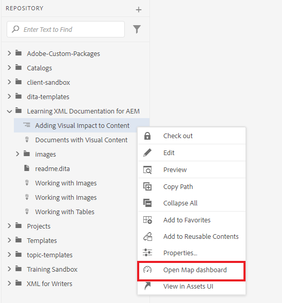

# 发布默认输出

完成映射后，您便可以用多种输出格式发布内容。

>[!VIDEO](https://video.tv.adobe.com/v/336662?quality=12&learn=on)

## 将地图发布为AEM站点和PDF

有许多输出预设可供您选择。 本指南重点介绍AEM站点和PDF输出。

1. 在存储库中，选择地图上的省略号图标以打开“选项”菜单，然后&#x200B;**在地图仪表板中打开。**

   在地图仪表板中

   “映射仪表板”将在另一个选项卡中打开。

1. 在“输出预设”选项卡中，选择AEM Site和PDF 。

   

1. 选择&#x200B;**生成。**

1. 导航到“输出”页面，查看生成的输出的状态。

   绿色圆圈表示生成完成。

   

## AEM站点输出

在AEM站点输出中，使用XML编辑器创建的主题、列表、图像、标题、表格和其他内容都将由AEM自动发布为Web友好内容。

您可以在目录以及相关信息部分中查看从属主题。 这些链接都可以用于导航。

## PDF输出

完成的PDF文档将地图的默认标题作为封面页上的主标题。 章节封面页面使用章节编号进行样式设置，并包含指向中主题的链接。
