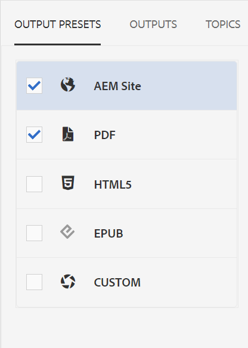

# 发布默认输出

完成映射后，可以以多种输出格式发布内容。

>[!VIDEO](https://video.tv.adobe.com/v/336662?quality=12&learn=on)

## 将地图发布为AEM网站和PDF

有许多输出预设可供您选择。 本指南将重点介绍AEM Site和PDF输出。

1. 在存储库中，选择映射上的省略号图标以打开“选项”菜单，然后 **在地图功能板中打开。**

   

   “映射功能板”(Map Dashboard)将在另一个选项卡中打开。

2. 在“输出预设”选项卡中，选择AEM站点和PDF。

   

3. 选择 **生成。**

4. 导航到“输出”页以查看生成的输出的状态。

   绿色圆圈表示生成已完成。

   

## AEM网站输出

在AEM站点输出中，主题、列表、图像、标题、表格以及使用XML编辑器创建的其他内容都由AEM自动发布到Web友好内容。

您可以在目录以及相关信息部分中看到下属主题。 这些链接都可用于导航。

## PDF输出

完成的PDF文档包含映射的默认标题作为封面上的主标题。 章节封面页面使用章节编号设置样式，并包含指向中主题的链接。
