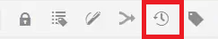

# 版本控制内容

对文档进行版本控制会创建其当前状态的快照。 通过创建主题或映射的多个版本，您可以跟踪更改并恢复旧的工作。

>[!VIDEO](https://video.tv.adobe.com/v/336724?quality=12&learn=on)

## 创建新版本

1. 选择另存为新版本图标。

   

   此时将显示另存为新版本对话框。

1. 在新版本的注释字段中，输入简短但清楚的更改摘要。
1. 在版本标签字段中，输入任何相关标签。

   标签允许您指定发布时要包含的版本。

   >[!NOTE]
   >
   >如果您的程序配置了预定义标签，则可以从中进行选择以确保一致的标签。

1. 选择&#x200B;**保存**。

   您已经创建了主题的新版本，并且版本号已更新。 文档的第一个版本将是版本1.0。

## 查看版本历史记录

一旦您拥有了内容的多个版本，您可能想要探索它们之间的差异。

1. 从工具栏中选择版本历史记录图标。

   

   此时将显示版本历史记录对话框。

1. 从下拉列表中选择一个版本来与当前版本进行比较。

   将显示您的版本到版本更改。

## 还原到选定的版本

如果需要，您可以选择版本并还原到该版本。 这允许您放弃当前版本并返回使用以前的版本。

1. 在版本历史记录对话框中，从下拉菜单中选择要还原到的版本。
1. 选择 **还原到所选版本**.

此时将显示还原版本对话框。

1. 添加描述性评论，说明您为何要还原到以前的版本。
1. 选择 **确认**.

   您的主题已恢复为特定版本。

## 使用过滤器比较版本

您还可以使用右边栏中的跟踪和显示差异过滤器，在预览中查看版本差异。

1. 选择 **预览** 从顶部菜单栏中。

   

   您的主题将在“预览”中打开。

1. 在右边栏上的跟踪下拉列表中，选择 **显示标记**.
1. 在显示差异下拉列表中，选择要进行比较的版本。

   您的更改将显示为格式化的内容。
