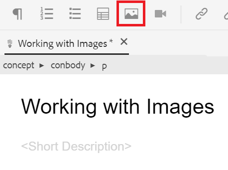

# 使用图像

以下内容将指导您完成上传和插入图像，以及如何保存主题的新版本。

您可以从下载示例图像文件 [这里。](assets/working-with-images/SignInScreen.png)

>[!VIDEO](https://video.tv.adobe.com/v/336661?quality=12&learn=on)

## 上传图像

1. 将鼠标悬停在子文件夹上，然后选择省略号图标以打开“选项”菜单。

   

1. 选择 **[!UICONTROL 上传资产]**.

   

1. 选择要从本地系统上传的图像，然后选择 **打开**.

   的 [!UICONTROL 上传资产] 对话框。

1. 选择 **上传**.

## 在主题中插入图像

在主题中插入图像的方法有多种。

您可以将本地系统中的图像拖放到您的主题中。 如果图像已上传，则还可以将其直接从左边栏拖放到主题中。 或者，您也可以使用插入图像按钮插入左边栏中当前不可见的图像，并在插入图像之前进一步配置图像。

对于以下内容，请确保在文档编辑器中打开您的主题。

### 通过拖放插入图像

1. 从本地系统或左边栏中选择图像文件，然后将其拖放到主题中。

   您的图像会显示在编辑器中。

### 使用“插入图像”按钮插入图像

1. 选择 **插入图像** 图标。

   

   此时将出现“插入图像”对话框。

1. 选择选择文件字段旁边的文件夹图标，以搜索图像或导航到其在存储库中的位置。
1. 选择图像的图标，然后 **选择**.

   

   此时将出现“插入图像”对话框，其中包含所选图像的信息。

1. 根据需要在“图标标题”和“替换文本”字段中输入文本。
1. 选择 **插入**.

   您的图像会显示在编辑器中及其图标标题。

## 从主题中删除图像

1. 在文档编辑器中选择图像，然后按 **删除** 键。

## 保存主题的新版本

版本控制允许您查看和比较不同的版本。 您甚至可以回滚到以前的版本。

由于您对主题进行了重大更改，因此现在可能会发现将当前工作另存为新版本非常有用。

1. 选择 **另存为新版本** 图标。

   

   的 **另存为新版本** 对话框。

1. 在“新版本的注释”字段中，输入简短但清晰的更改摘要。
1. 在版本标签字段中，输入任何相关的标签。

   标签允许您指定要在发布时包含的版本。

   >[!NOTE]
   > 
   > 如果您的程序配置了预定义标签，则可以从中进行选择，以确保标签设置一致。

1. 选择&#x200B;**保存**。

   您已创建了主题的新版本，并且版本号已更新。
