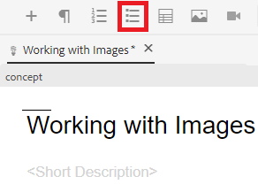

# 使用列表

您可能需要项目符号和编号列表来整理信息。 以下将指导您如何在现有概念中插入和使用列表。

>[!VIDEO](https://video.tv.adobe.com/v/336658?quality=12&learn=on)

## 项目符号列表

当列表组件不需要按特定顺序排列时，应使用项目符号或无序列表。

### 插入项目符号列表

1. 从工具栏中选择&#x200B;**插入项目符号列表**&#x200B;图标。

   

   此时将显示项目符号。 这是您列表的开头。

1. 键入您的第一个列表项。
1. 按Enter创建第二个条目，然后键入您的内容。
1. 根据需要继续添加列表项。

## 编号列表

当列表组件需要以特定方式排序或结构化时，应使用编号列表。

### 插入有序列表

1. 从工具栏中选择&#x200B;**插入编号列表**&#x200B;图标。

   

   将显示一个数字。 这是您列表的开头。

1. 键入您的第一个列表项。
1. 按Enter创建第二个条目，然后键入您的内容。
1. 根据需要继续添加列表项。

## 另存为新版本

现在，您已向概念中添加了更多内容，您可以将所做的工作另存为新版本并记录所做的更改。

1. 选择&#x200B;**另存为新版本**&#x200B;图标。

   

1. 在新版本的注释字段中，输入简短但清晰的更改摘要。
1. 在版本标签字段中，输入任何相关标签。

   标签允许您指定发布时要包含的版本。

   >[!NOTE]
   > 
   > 如果您的程序配置了预定义标签，则可以从这些标签中进行选择，以确保标签的一致性。

1. 选择&#x200B;**保存**。

   您已经创建了主题的新版本，并且版本号已更新。
