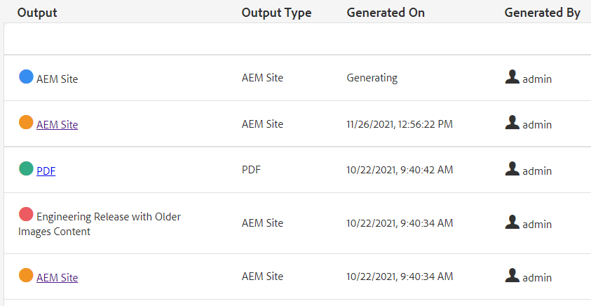

# 批量发布

发布时，通常需要多种类型的文档。 使用地图收藏集，您可以控制要组合和生成的输出的数量和类型，并开始批量发布。 发布仪表板允许您查看活动的发布作业。 批量发布功能板提供了一种批量激活收藏集的方法。

>[!VIDEO](https://video.tv.adobe.com/v/338985?quality=12&learn=on)

## 使用地图收藏集

使用映射集合，您可以控制将为一个或多个映射生成的输出类型。

### 创建地图收藏集

1. 在导航菜单中，单击&#x200B;**Assets**。

1. 选择映射收藏集。

1. 单击&#x200B;**创建**。

1. 键入收藏集标题。

   

1. 单击&#x200B;**创建**。
1. 关闭成功消息。

1. 打开地图收藏集（单击图块下方的灰色部分）

1. 单击&#x200B;**编辑**。

1. 根据需要添加映射。

1. 为每个映射选择或取消选择&#x200B;**输出预设**。
1. 单击&#x200B;**完成**。

### 过滤映射预设

1. 打开映射预设。

1. 在&#x200B;**筛选器**&#x200B;下，展开并根据需要选择选项。

### 在地图收藏集中生成内容

1. 打开映射预设。

1. 如果需要，请单击&#x200B;**生成所有**。

1. 或者，选择要生成的映射和输出类型，然后单击&#x200B;**生成选定项**。

1. 如果需要，请切换到输出选项卡。

1. 查看输出。

## 在发布功能板中查看活动的发布作业

发布功能板允许您查看活动内容
发布作业。 它会显示映射及其当前状态的动态列表。 您可以跟踪、管理或取消发布工作流。

1. 在“导航”视图中，单击&#x200B;**工具**&#x200B;图标。

1. 单击 **[!DNL Guides]**。

1. 选择&#x200B;**发布仪表板**&#x200B;磁贴。

   如果仪表板为空，则表示没有发布作业正在运行。

1. 根据需要筛选功能板以查看所有发布作业。

### 使用批量发布功能板

批量发布功能板允许您处理批量激活收藏集并控制多种类型的输出。

### 创建批量激活收藏集

1. 在“导航”视图中，单击&#x200B;**工具**&#x200B;图标。

1. 单击 **[!DNL Guides]**。

1. 选择&#x200B;**批量发布仪表板**&#x200B;磁贴。

1. 键入收藏集标题。

1. 单击&#x200B;**创建**。

1. 单击&#x200B;**打开**。

1. 打开地图收藏集（单击图块下方的灰色部分）

1. 单击&#x200B;**编辑**。

1. 根据需要添加映射。

1. 为每个映射选择或取消选择&#x200B;**输出预设**。
1. 单击&#x200B;**完成**。
1. 完成时关闭映射收藏集。

### 快速发布批量激活收藏集

1. 选择“批量激活收藏集”拼贴。
1. 单击&#x200B;**打开**。
1. 选择一个或多个映射。
1. 单击&#x200B;**快速发布**。
