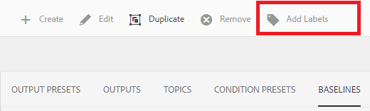

# 使用基线创建和发布

使用基线可以创建地图主题和相关参考内容的版本。 这可以基于特定的日期或时间或标签。

>[!VIDEO](https://video.tv.adobe.com/v/338993?quality=12&learn=on)

## 访问映射仪表板中的“基线”选项卡

您可以在“映射仪表板”中访问基线。

1. 存储库视图，选择地图上的省略号图标以打开“选项”菜单，然后&#x200B;**打开地图仪表板。**

   
“映射仪表板”将在另一个选项卡中打开。

1. 选择&#x200B;**基线**。

   

此时将显示“基线”选项卡。

## 基于标签创建基线

1. 在“基线”选项卡中，选择&#x200B;**创建**。

   

   此时将显示新基线的信息。 其默认名称基于其创建日期。

1. 如果需要，请为您的基线提供一个新名称。

1. 在“设置版本依据”标题下，为“标签”选择圆形。
   

   >[!NOTE]
   >
   >注意：默认情况下选中&#x200B;*如果标签不存在，则使用最新版本*&#x200B;复选框。 如果未选择此项，并且映射中存在没有所选标签的主题或媒体文件，则基线创建过程将失败。

1. 输入要使用的标签。

1. 选择&#x200B;**保存**。

此时将创建基线。 此时将显示一个包含所有主题及其关联信息的表。

### 使用“浏览所有主题”功能

“浏览所有主题”功能允许您查看主题的信息，包括版本和标签，以及指定使用的版本。 在创建或编辑基线时，您可以通过选择&#x200B;**浏览所有主题**&#x200B;来访问它。

## 基于日期和时间创建基线

您还可以创建及时作为快照的基线。

1. 确保打开了“基线”选项卡，然后选择“创建”。

   

1. 在“Set the version based（设置版本依据）”标题下，选择“Version On（版本启用）”的圆圈。

   

1. 选择日历图标并指定所需的日期和时间。

   

1. 如果需要，为您的基线提供一个新名称。

1. 选择&#x200B;**保存**。

此时将创建基线。 此时将显示一个包含所有主题及其关联信息的表。

### 向基线添加标签

您可能希望向所有映射内容批量分配一个新标签。

1. 选择要为其添加标签的基线。

1. 选择&#x200B;**添加标签**。

   

   此时将显示“添加标签”对话框。

1. 输入要分配的标签，然后选择&#x200B;**添加**。

标签已添加到所有主题。

## 使用基线生成AEM Site输出

1. 导航到“映射仪表板”中的“输出预设”选项卡。

1. 选中AEM站点复选框。

   

1. 选择&#x200B;**编辑**。

   

   此时将显示一个新页面。

1. 选中使用基线复选框，然后从下拉列表中选择要使用的基线。

   

1. 选择&#x200B;**完成**。

   

1. 选择&#x200B;**生成**。

   

   您的输出已使用基线生成。

## 查看生成的输出

1. 导航到地图仪表板中的输出选项卡。

1. 在“层代设置”列中选择文本以打开输出。
   

## 删除基线

1. 在基线选项卡中，选择要删除的基线。

1. 选择&#x200B;**删除**。

   

   此时将显示“删除基线”对话框。

1. 选择&#x200B;**删除**。

基线被删除。

## 复制基线

1. 在“基线”选项卡中，选择要复制的基线。

1. 选择&#x200B;**复制**。

   

1. 选择&#x200B;**保存**。

   

将创建重复的基线。

## 修改基线

您可以直接指定基线中使用的主题版本。

1. 在“基线”选项卡中，选择要修改的基线。
1. 选择&#x200B;**编辑**。

   

1. 选择&#x200B;**浏览所有主题**。

   

   此时将显示一个主题及其关联信息的表。

1. 对于要修改的主题，请从版本列下的下拉列表中选择所需的版本。

   

1. 选择&#x200B;**保存**。

已保存您的更改。 现在，基线将使用您指定的主题版本。

## 创建自定义的AEM站点输出预设

在“输出”选项卡中，很难区分同一类型的默认输出。 使用具有唯一性和用户友好名称的自定义输出预设，您可以解决此问题。

在本例中，我们将基于基线创建输出预设。

1. 导航到“映射仪表板”中的“输出预设”选项卡。

1. 选择&#x200B;**创建**。

   

   此时将显示一个新的输出预设页面，称为“新建输出”。
1. 在设置名称字段中，输入用户友好名称。

1. 选中使用基线复选框，然后从下拉菜单中选择所需的基线。

   

1. 选择&#x200B;**完成**。

已创建新的输出预设，并显示在输出预设页面上。
