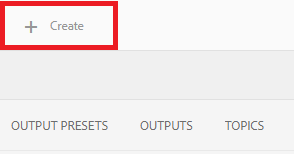
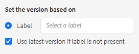
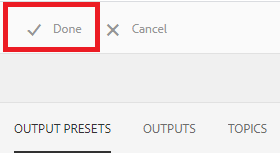

# 使用基线创建和发布

使用基线可创建映射主题和相关参考内容的版本。 这可以基于特定的日期、时间或标签。

>[!VIDEO](https://video.tv.adobe.com/v/338993)

## 访问“映射功能板”中的“基线”选项卡

您可以在“映射功能板”中访问基线。

1. 存储库视图，选择映射中的省略号图标以打开选项菜单，然后 **打开地图功能板。**

   
“映射功能板”(Map Dashboard)将在另一个选项卡中打开。

2. 选择 **基线**.

   

此时会显示“基线”选项卡。

## 基于标签创建基线

1. 在“基线”选项卡中，选择 **创建**.

   

   此时将显示新基线的信息。 默认名称基于其创建日期。

2. 根据需要为基线指定一个新名称。

3. 在“设置基于的版本”标题下，为“标签”选择圆圈。
   

   >[!NOTE]
   >
   >注意：的 *如果标签不存在，则使用最新版本* 复选框。 如果未选择此选项，且映射中存在没有所选标签的主题或媒体文件，则基线创建过程将失败。

4. 输入要使用的标签。

5. 选择&#x200B;**保存**。

将创建基线。 此时将显示一个包含所有主题及其关联信息的表。

### 使用浏览所有主题功能

“浏览所有主题”功能允许您查看主题的信息（包括版本和标签），并指定使用的版本。 您可以通过选择 **浏览所有主题** 创建或编辑基线时。

## 根据日期和时间创建基线

您还可以及时创建作为快照的基线。

1. 确保“基线”选项卡处于打开状态，然后选择“创建”。

   

2. 在“设置基于的版本”标题下，为“版本开启”选择圆。

   

3. 选择日历图标并指定所需的日期和时间。

   

4. 根据需要为基线指定一个新名称。

5. 选择&#x200B;**保存**。

将创建基线。 此时将显示一个包含所有主题及其关联信息的表。

### 向基线添加标签

您可能需要为所有映射内容批量分配新标签。

1. 选择要为其添加标签的基线。

2. 选择 **添加标签**.

   

   此时将显示“添加标签”对话框。

3. 输入要分配的标签，然后选择 **添加**.

标签已添加到所有主题。

## 使用基线生成AEM站点输出

1. 导航到“映射功能板”中的“输出预设”选项卡。

2. 选中AEM Site复选框。

   

3. 选择&#x200B;**编辑**。

   

   此时会显示新页面。

4. 选中使用基线复选框，然后从下拉菜单中选择要使用的基线。

   

5. 选择 **完成**.

   

6. 选择 **生成**.

   

   您的输出已生成基线。

## 查看生成的输出

1. 导航到“映射功能板”中的“输出”选项卡。

2. 在“层代设置”列中选择文本以打开输出。
   

## 删除基线

1. 在基线选项卡中，选择要删除的基线。

2. 选择 **删除**.

   

   此时将显示“删除基线”(Remove Baseline)对话框。

3. 选择 **删除**.

基线将被删除。

## 复制基线

1. 在基线选项卡中，选择要复制的基线。

2. 选择 **复制**.

   

3. 选择&#x200B;**保存**。

   

将创建重复的基线。

## 修改基线

您可以直接指定基线中使用的主题的版本。

1. 在基线选项卡中，选择要修改的基线。
2. 选择&#x200B;**编辑**。

   

3. 选择 **浏览所有主题**.

   

   此时会显示主题表及其关联信息。

4. 对于要修改的主题，从版本列下的下拉菜单中选择所需的版本。

   

5. 选择&#x200B;**保存**。

您的更改已保存。 现在，您的基线将使用您指定的主题版本。

## 创建自定义AEM Site输出预设

在“输出”选项卡中，很难区分同一类型的默认输出。 通过使用具有唯一且用户友好名称的自定义输出预设，您可以解决此问题。

在这种情况下，我们将基于基线创建输出预设。

1. 导航到“映射功能板”中的“输出预设”选项卡。

2. 选择&#x200B;**创建**。

   

   此时将显示一个名为“新建输出”的新输出预设页面。
3. 在设置名称字段中，输入用户友好名称。

4. 选中使用基线复选框，然后从下拉菜单中选择所需的基线。

   

5. 选择 **完成**.

您的新输出预设已创建，并显示在输出预设页面上。
