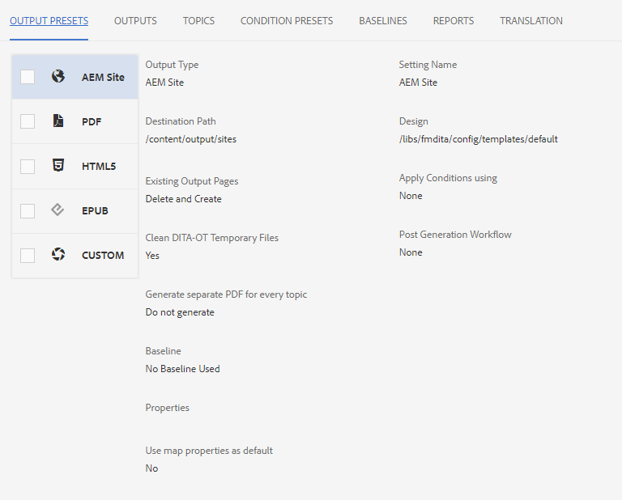

# 地图仪表板简介

下面将概述地图仪表板的主要功能。

>[!VIDEO](https://video.tv.adobe.com/v/339040?quality=12&learn=on)

## 在地图仪表板中打开地图

1. 在存储库视图中，选择地图上的省略号图标以打开选项菜单，然后打开地图仪表板。
   

   “映射仪表板”将在另一个选项卡中打开。

## 地图功能板的组件

“映射仪表板”包含许多选项卡，包括输出预设、输出结果、使用的主题、基线等。

### 输出预设

“输出预设”选项卡显示各种输出类型的默认预设：AEM站点、PDF、HTML5、ePub和自定义。

您可以选择输出预设以查看其设置的详细信息，包括转换名称、目标路径、基线和应用的条件。

### 输出

“输出”选项卡显示之前生成的所有输出和当前生成的输出。

“层代设置”列下的绿色圆圈表示已成功生成输出。 此列中的文本充当活动的超链接，您可以选择它们以打开生成的输出。 “类型”列下的条目指示输出类型。
此处还显示了其他输出生成信息，包括生成输出的用户名称、生成日期和时间，以及生成所用的时间。 如果在生成期间出错，可以在“生成时间”列下选择生成的日期和时间，以打开并查看错误日志。

### 主题

“主题”选项卡显示映射中所有主题的列表。

选中主题复选框允许您执行其他操作。 您可以编辑它，重新生成它，以及显示、应用或隐藏其标记。

### 条件预设

“条件预设”选项卡显示要包含或排除的特定条件内容的设置。

在此，选中Writer Only版本的复选框将导致输出排除具有“audience”属性（具有“designers”标签）的所有内容，并包括具有“writers”标签的所有内容。

### 基线

“基线”选项卡允许您查看基线。

基线可以及时作为快照，并允许您创建主题和资产的版本以供发布。 例如，捕获特定日期和时间内容的基线可以使用一个主题的1.3版本，也可以使用另一个主题的1.0版本，具体取决于它们当时的相应版本。
如果没有指定基线，则使用所有内容的最新版本生成输出。

### 报表

“报告”选项卡显示主题信息的摘要，包括正在使用的主题总数、这些主题中缺少的元素以及文档状态。

如果主题缺少元素，您可以选择行中最右侧的箭头以展开条目并查看有关错误的详细信息。
