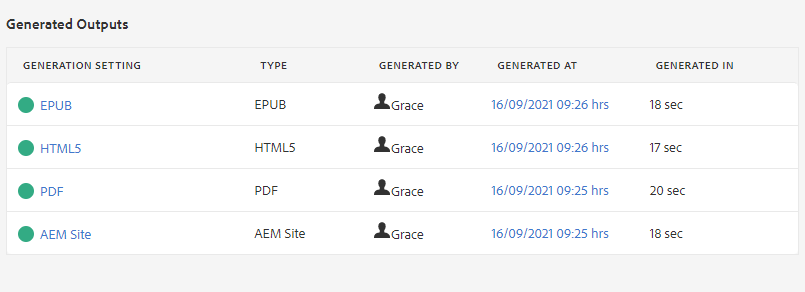

# 地图功能板简介

以下将概述地图功能板的主要功能。

>[!VIDEO](https://video.tv.adobe.com/v/339040)

## 在地图功能板中打开地图

1. 在存储库视图中，选择映射上的省略号图标以打开选项菜单，然后打开映射功能板。
   

   “映射功能板”(Map Dashboard)将在另一个选项卡中打开。

## 映射功能板的组件

“映射功能板”包含许多选项卡，包括输出预设、输出结果、使用的主题、基线等。

### 输出预设

“输出预设”选项卡显示不同类型输出的默认预设：AEM网站、PDF、HTML5、ePub和自定义。

您可以选择输出预设以查看其设置的详细信息，包括转换名称、目标路径、基线和应用的条件。

### 输出

“输出”(Outputs)选项卡显示之前生成和当前生成的所有输出。

“生成设置”列下方的绿色圆圈表示输出已成功生成。 此列中的文本充当活动超链接，您可以选择它们以打开生成的输出。 “类型”列下的条目表示输出类型。
此处还显示其他输出生成信息，包括生成输出的用户名称、生成日期和时间以及生成所用的时间。 如果在生成过程中出错，则可以在生成日期列下选择生成日期和时间，以打开并查看错误日志。

### 主题

“主题”选项卡显示映射中所有主题的列表。

选中主题的复选框可执行其他操作。 您可以编辑、重新生成标记，以及显示、应用或隐藏其标记。

### 条件预设

条件预设选项卡显示要包含或排除的特定条件内容的设置。

在此，选中仅作者版本的复选框将导致输出，该输出将排除具有“设计者”标签的“受众”属性的所有内容，并包含具有“作者”标签的所有内容。

### 基线

“基线”(Balesines)选项卡允许您查看基线。

基线可及时用作快照，并允许您创建主题和资产的版本以进行发布。 例如，在特定日期和时间捕获内容的基线可以使用某个主题的1.3版和另一个主题的1.0版，具体视其当时各自的版本而定。
如果未指定基线，则使用所有内容的最新版本生成输出。

### 报告

“报表”选项卡显示主题信息的摘要，包括使用的主题总数、这些主题中缺少的元素以及文档状态。

如果主题缺少元素，则可以选择行中最右侧的箭头以展开条目并查看有关错误的详细信息。
