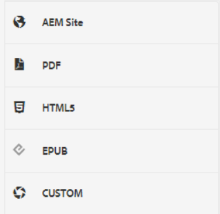

# 输出预设

输出预设是已分配给地图的发布属性的集合。 如果需要，可创建或修改这些内容。

>[!VIDEO](https://video.tv.adobe.com/v/338989?quality=12&learn=on)

## 访问输出预设

在“映射仪表板”中打开XML编辑器中的映射时，将显示输出预设。 预设可以包括关于特定输出类型、目标路径、有关如何管理现有输出页面的说明以及可以应用于映射以产生输出的其他设置的信息。

## 创建输出预设

>[!NOTE]
>
>注意：输出预设使用的某些功能可能取决于首先开发基线或条件预设。 如果需要，您必须使用相应的选项卡配置它们。

1. 选择基线输出预设。 例如，如果要创建的新预设适用于网站或提供AEM内容，则可以选择Adobe PDF或PDF。

1. 单击&#x200B;**创建**。

1. 如果需要，请选择输出类型。

1. 根据输出类型进一步配置选项。

1. 单击&#x200B;**完成**。

## 编辑输出预设

输出预设是预定义的，但可以根据需要进行自定义。

1. 打开地图功能板。

1. 选择&#x200B;**输出预设**&#x200B;选项卡。

1. 选择输出预设。

1. 单击&#x200B;**编辑**。

1. 根据需要修改设置。

   

1. 单击&#x200B;**完成**。
