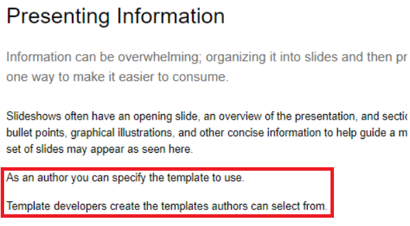

# 发布条件

条件发布允许为一个或多个受众、产品或平台编写一个内容源。 然后，可以动态发布此信息，并且只能将特定所需的内容包含在输出中。

>[!VIDEO](https://video.tv.adobe.com/v/339041)

## 准备练习

您可以在此处下载练习的示例文件。

[练习 — 下载](assets/exercises/publishing-with-conditions.zip)

## 使用条件属性标记内容

1. 打开要修改的主题。

2. 输入要变为条件的文本。 例如，一个或多个段落、整个表、图或其他内容。

   

3. 选择要为其分配条件属性的特定内容。 例如，源中的单个段落。

   

4. 在右边栏中，确保显示属性。

5. 为受众、产品或平台添加属性。

6. 为属性分配值。 已应用显示条件标记的内容显示更新。

   

## 预览条件内容

1. 单击 **预览**.

2. 在 **过滤器**，选择或取消选择要显示或隐藏的条件。

3. 选择或取消选择 **突出显示条件文本**.

   

## 创建条件预设

条件预设是一组属性，这些属性定义在生成输出期间要包含、排除或标记的内容。

1. 从映射功能板中，选择 **条件预设** 选项卡。

2. 单击&#x200B;**创建**。

3. 选择 **添加** (或 **全部添加**)。

4. 命名条件。

5. 选择属性、标签和操作组合。

   

6. 根据需要重复执行上述步骤。

7. 单击&#x200B;**保存**。

## 生成条件输出

将条件应用于内容后，即可将其生成为输出。 这可以使用条件预设或DITAval文件。

## 使用条件预设生成条件输出

1. 选择 **输出预设** 选项卡。

2. 选择输出预设。

3. 单击&#x200B;**编辑**。

4. 在 **应用条件(使用** 选择条件预设。

   

5. 单击&#x200B;**完成**。

6. 生成输出预设并查看内容。

## 使用DITAval文件生成条件输出

DITAval文件可用于发布条件内容。 这要求创建或上传文件，然后在发布时引用该文件。

1. 选择 **输出预设** 选项卡。

2. 选择输出预设。

3. 单击&#x200B;**编辑**。

4. 在“应用条件使用”下，选择DITAval文件。

   

5. 单击&#x200B;**完成**。

6. 生成输出预设并查看内容。
