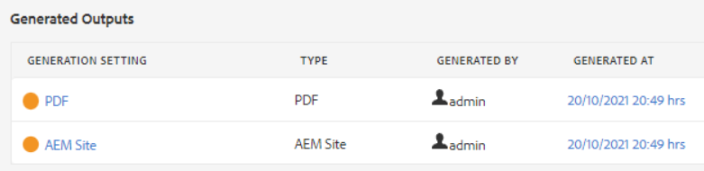

# 排查发布错误

发布地图通常很简单。 打开地图，选择输出预设，然后生成输出！ 但是，如果映射或其主题中存在错误，则输出生成可能会失败。 发生这种情况时，了解如何排除故障非常重要。

>[!VIDEO](https://video.tv.adobe.com/v/338990?quality=12&learn=on)

## 为练习做准备

您可以在此处下载练习的样例文件。

[练习 — 下载](assets/exercises/publishing-basic-to-advanced.zip)

## 发布错误的常见原因

源内容中可能会引入错误。 例如：

* 未正确命名文件路径引用

* 名称不正确的文件夹

* 缺少图形或文件

* 内容引用配置不正确

* 交叉引用中断

* 属性的值错误（例如，字符串而不是数字）

* 使用的组件设置不正确 [!DNL AEM Guides]

## 错误的影响

错误可能是轻微的，并导致简单的注释，让您知道文件未成功打包，或者严重到足以导致无法生成输出。 “输出”选项卡显示颜色编码的图标以显示与输出生成相关的成功、错误或失败。

## 打开和查看错误日志

可以打开生成的日志文件进行查看。

1. 在 **输出** 选项卡，单击 **生成日期下的日期/时间。**

   

1. 滚动浏览错误日志。

## 显示和隐藏错误类型

错误日志以唯一的颜色显示每种错误类型。

1. **选择** 或 **取消选择** 要显示或隐藏突出显示的任何错误类型。

1. 使用 **下一个** 或 **上一个** 按钮（箭头）。

## 解决错误

根据错误类型，分辨率可能简单或复杂。 它可以由作者在XML编辑器中完成，也可以要求管理员使用 [!DNL AEM Guides]. 具体的更正取决于错误、影响以及您的组织工作流。

* 未正确命名文件路径引用

       作者可以更新源文档中的路径引用。
       
   
* 名称不正确的文件夹

       作者可以根据需要更新文件夹名称或移动文件。
       
   
* 缺少图形或文件

       作者可以上传缺少的图形/文件、重命名图形/文件或移动图形/文件
       
   
* 内容引用配置不正确

       作者可以更正引用内容的位置，或更改内容引用的路径。
       
   
* 交叉引用中断

       作者可以更正交叉引用指向的位置，或更改目标文件名或属性
       
   
* 属性的值错误（例如，字符串而不是数字）

       作者可以将属性更新为正确的值，管理员也可以更新系统以支持新值。
       
   
* 使用的组件设置不正确 [!DNL AEM Guides]

       管理员可以更新系统、其组件或权限的安装。
       
   