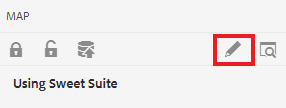
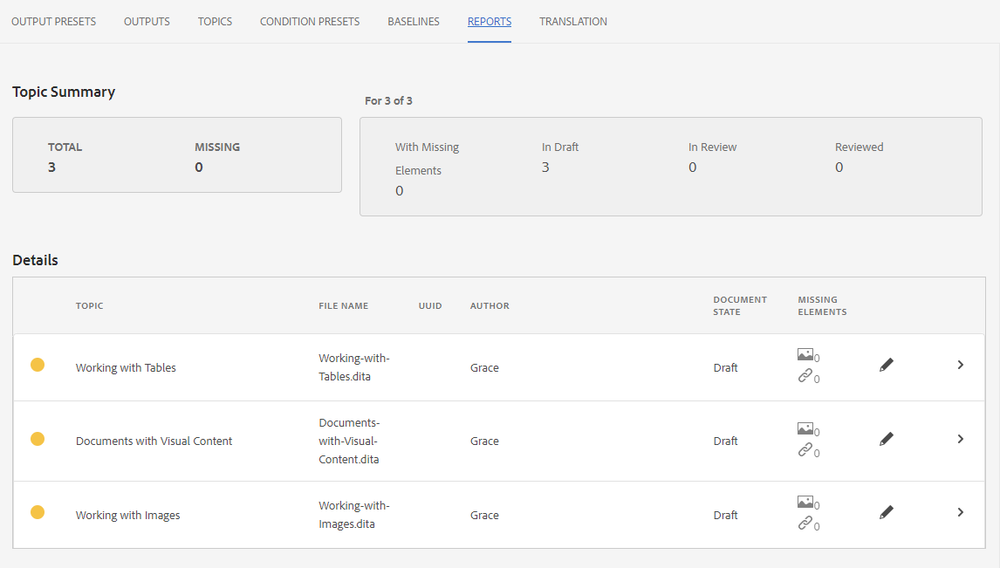

# 使用报表

“映射功能板”中的“报表”选项卡允许您识别和解决损坏的链接、被引用和重用的内容(conref)、交叉引用或其他缺失的信息。

>[!VIDEO](https://video.tv.adobe.com/v/339039?quality=12&learn=on)

## 准备练习

您可以在此处下载练习的示例文件。

[练习 — 下载](assets/exercises/working-with-reports.zip)

## 上传资产

1. 在存储库视图中，选择主文件夹上的省略号图标以打开选项菜单。

   

2. 选择 **[!UICONTROL 上传资产]**.

   

3. 选择要上传到文件夹的文件，然后选择 **上传**.

DITA文件将打开，您应查看这些文件中是否存在缺少内容、conref或交叉引用的问题。

## 创建地图

1. 选择主文件夹上的省略号图标以打开选项菜单。

   

2. 选择 **创建>映射**.

   

   此时将显示“创建新映射”对话框。

3. 在模板字段中，选择 **Bookmap** (或 **地图** 根据您创建的内容类型)，并为映射提供一个标题。

4. 选择&#x200B;**创建**。

此时将创建映射，并且左边栏会自动从“存储库”视图更改为“映射”视图。

## 插入映射组件

1. 选择左边栏中的铅笔图标。
这是编辑图标，用于在编辑器中打开映射。

   

2. 通过选择存储库图标切换回存储库视图。

   

3. 将主题从存储库拖放到编辑器的映射中，以将其添加到映射中。
行指示器将显示主题的放置位置。

4. 根据需要继续添加主题。

5. 完成后，选择 **另存为新版本。**

   

6. 在 *新版本的注释* 字段，输入描述性评论。

7. 选择&#x200B;**保存**。

## 生成AEM站点输出

1. 在存储库中，选择映射上的省略号图标以打开选项菜单，然后 **打开地图功能板。**

   

   “映射功能板”(Map Dashboard)将在另一个选项卡中打开。
2. 在输出预设选项卡中，选择 **AEM Site**.

   

3. 选择 **生成**.

4. 导航到“输出”页以查看生成的输出的状态。
如果出现错误，“输出”选项卡在“生成设置”列下可显示橙色圆圈，而不是绿色圆圈，表示生成已完成。

5. 选择生成设置列下的链接以打开生成的输出。
查看输出中缺少的内容。

## 报表选项卡

“报表”选项卡显示主题摘要，以及包含主题信息和映射中的问题的表。

理想情况下，在导入内容后，您始终会检查报表中的映射。

“缺少的元素”列指示缺少的图像数和损坏的conref。 您可以选择 **铅笔** 图标以在编辑器中打开主题。

## 解决缺少的图像

如果文件中缺少图像，则可能是因为内容已上传，但图像未上传，这是常见原因。 如果是，请通过将图像上传到与文件所需的路径和文件名匹配的特定文件夹，来解决缺少的图像问题。

1. 在 *存储库视图*，选择图像文件夹中的省略号图标以打开选项菜单。

   

2. 选择 **[!UICONTROL 上传资产]**，然后选择缺少的图像。

3. 选择 **上传**.

已上传缺少的图像。 现在，新生成的AEM网站输出将显示这些图像，并且“报表”选项卡将不再显示任何缺少的图像错误。

## 解决conref损坏的问题

如果在其他位置引用的内容（参考）链接到另一个文件夹中某个文件的（例如，一个名为“reuse”的文件）。 内容未上传时，必须解决错误。 例如，您必须创建名为“reuse”的子文件夹，然后将缺失的文件上传到“reuse”中。

### 上传资产时，使用 [!UICONTROL 资产] UI

除 [!UICONTROL 上传资产] 选项，您可以通过将资产拖放到资产UI来上传资产。

1. 在“存储库视图”中，选择重复使用文件夹上的省略号图标以打开选项菜单。

   

2. 选择 **在资产UI中查看**.

   

3. 将文件拖放到文件夹中。
文件已上传，并且解决了conref错误。

现在已解决所有错误。 “报表”页面将指示不再存在错误，生成AEM网站会生成完整输出，且不会缺少组件。
