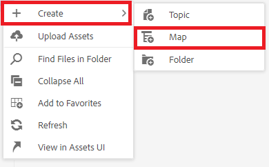
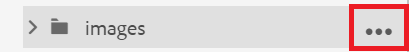
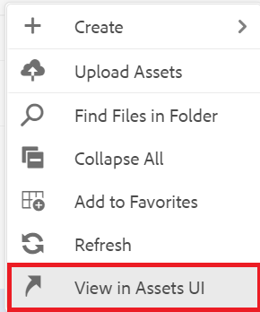

# 使用报告

地图仪表板中的“报表”选项卡允许您识别和解决断开的链接、引用和重复使用的内容(conref)、交叉引用或其他缺失信息。

>[!VIDEO](https://video.tv.adobe.com/v/339039?quality=12&learn=on)

## 为练习做准备

您可以在此处下载练习的样例文件。

[练习 — 下载](assets/exercises/working-with-reports.zip)

## 正在上传资产

1. 在“存储库视图”中，选择主文件夹中的省略号图标以打开“选项”菜单。

   

1. 选择 **[!UICONTROL 上传资产]**.

   

1. 选择要上载到文件夹的文件，然后选择 **上传**.

将打开DITA文件，您应该检查这些文件是否存在缺少内容、conref或交叉引用的问题。

## 创建映射

1. 选择主文件夹中的省略号图标以打开“选项”菜单。

   

1. 选择 **创建>映射**.

   

   此时将显示创建新映射对话框。

1. 在模板字段中，选择 **Bookmap** (或 **映射** 根据您创建的内容类型)，并为您的地图提供一个标题。

1. 选择&#x200B;**创建**。

随即会创建您的映射，并且左边栏会自动从“存储库”视图更改为“映射”视图。

## 插入映射组件

1. 选择左边栏中的铅笔图标。
这是“编辑”图标，允许您在编辑器中打开映射。

   

1. 通过选择“存储库”图标，切换回“存储库”视图。

   

1. 通过将主题从存储库拖放到编辑器中的映射中，将其添加到映射中。
行指示器将显示主题将放置的位置。

1. 根据需要继续添加主题。

1. 完成后，选择 **另存为新版本。**

   

1. 在 *新版本的注释* 字段中，输入说明性备注。

1. 选择&#x200B;**保存**。

## 生成AEM站点输出

1. 在存储库中，选择地图上的省略号图标以打开选项菜单，然后 **打开地图功能板。**

   

   “映射仪表板”将在另一个选项卡中打开。
1. 在输出预设选项卡中，选择 **AEM站点**.

   

1. 选择 **生成**.

1. 导航到“输出”页面以查看生成的输出的状态。
如果出现错误，“输出”选项卡可能会在“层代设置”列下显示橙色圆圈，而不是绿色，这表示层代已完成。

1. 选择“层代设置”列下的链接以打开生成的输出。
检查输出中是否缺少内容。

## “报表”选项卡

“报告”选项卡显示主题摘要和表格，其中包含主题信息和地图中的问题。

理想情况下，在导入内容后，您始终可以在报表中查看映射。

“缺少的元素”列指示缺少的图像和损坏的conref的数量。 您可以选择 **铅笔** 图标以在编辑器中打开主题。

## 解决缺少的图像

如果文件中缺少图像，一个常见原因可能是内容已上传，但图像未上传。 如果是这样，请将图像上传到与文件预期的路径和文件名匹配的特定文件夹，从而解决缺少图像的问题。

1. In *存储库视图*，选择图像文件夹中的省略号图标以打开“选项”菜单。

   

1. 选择 **[!UICONTROL 上传资产]**，然后选择缺少的图像。

1. 选择 **上传**.

已上传缺少的图像。 现在，新生成的AEM Site输出将显示这些图像，并且“报表”选项卡将不再显示任何缺少的图像错误。

## 解决中断的conref

如果在其他位置引用的内容(conref)链接到另一个文件夹中的文件（例如，名为“reuse”的文件），则不会返回任何内容。 并且内容未上传，必须解决错误。 例如，您必须创建一个名为“reuse”的子文件夹，然后将缺少的文件上传到“reuse”中。

### 使用上传资产 [!UICONTROL 资产] UI

除了 [!UICONTROL 上传资产] 选项，您可以通过拖放到资产UI中来上传资产。

1. 在“存储库视图”中，选择重用文件夹上的省略号图标，打开“选项”菜单。

   

1. 选择 **在Assets UI中查看**.

   

1. 将文件拖放到文件夹中。
文件已上传，并解决了conref错误。

所有错误现已得到解决。 “报告”页面将指示没有其他错误，生成AEM Site将导致完整输出，并且没有缺少组件。
