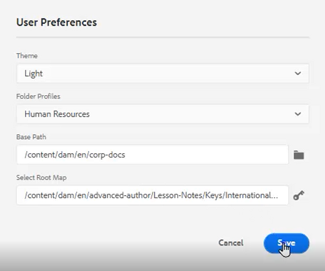

# 条件

在DITA中，条件通常通过产品、平台和受众等属性来驱动。 这些变量还可以分配特定值。 用户可以通过文件夹配置文件控制所有这些。

文件中提供了您可以选择用于本课程的示例文件 [conditions.zip](assets/conditions.zip).

>[!VIDEO](https://video.tv.adobe.com/v/342755?quality=12&learn=on)

## 为文件夹配置文件分配条件

1. 选择 **文件夹配置文件** 拼贴。

1. 单击 [!UICONTROL **条件属性**].

1. 单击 [!UICONTROL **编辑**] 中。

1. 单击 [!UICONTROL **添加**].

   

1. 填写必填字段。

   - 名称应与用于分析的属性相对应。

   - 值是将在DITA代码源中使用的精确条目。

   - “标签”是输入属性的用户将看到的单词。

1. 单击“[!UICONTROL **保存**]”。

>[!NOTE]
>
>注意：配置全局配置文件可能是一种早期而有效的方法，可用于控制属性和值的使用，以遵循一致的风格指南。

## 将属性分配给元素

如果尚未将自定义文件夹配置文件分配给概念，则您可能希望将属性分配给特定元素，如段落。

1. 从 **存储库视图**，单击要处理的元素以将其选中。

1. 在 **内容属性** 面板，单击 [!UICONTROL **属性**] 下拉列表。

1. 选择要分配的属性。

1. 添加 **值**.

现在，属性和值配对将分配给选定的元素。

## 使用条件分配属性和值对

“条件”面板允许对“属性”和“值”配对进行控制分配。

1. 修改 **用户首选项**.

   a.单击用户首选项图标。

   

   b.填写 **用户首选项** 对话框。 例如：

   

   c.单击 [!UICONTROL **保存**].

1. 从“条件”面板中，展开受众和平台的下拉列表。 请注意，可用条件特定于文件夹配置文件。

1. 将条件拖放到所需的元素上以进行分配。

## 分配主体方案

主题方案图是地图的一种专门形式，并且被地图引用。 主题方案用于定义分类。 它们可控制可用值。

1. 导航到 **存储库视图**.

1. 选择引用主体方案编辑器映射的映射。 此示例使用名为 _设计和布局_.

   

1. 配置用户首选项。

   a.单击 [!UICONTROL **用户首选项**] 图标。

   

   b.填充 **用户首选项** 对话框。

   c.单击“基本路径”字段旁边的文件夹符号以选择所需文件的路径。

   d.单击 [!UICONTROL **选择**].

   e.单击 **根映射** 字段输入路径。

   >[!IMPORTANT]
   >
   >重要信息：选定的根映射必须是包含主题方案的映射。

   

   f.通过选择要使用的文件夹来限制显示的资产。

   g.单击 [!UICONTROL **选择**].

   h.单击 [!UICONTROL **保存**].

主体方案现已分配完成。

## 从“条件”面板查看主题方案

1. 导航到 **编辑器设置**.

1. 选择 **条件** 选项卡。

1. 选中框 **在“条件”面板中显示主题方案**
