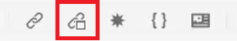

# 内容重用

DITA的主要功能之一是能够重用内容。 它允许重复使用从小短语到整个主题或地图的内容。  但是，要有效地重用内容，必须很好地管理该内容。 在处理可重用信息时，确保您拥有有效的内容策略。

>[!VIDEO](https://video.tv.adobe.com/v/342757?quality=12&learn=on)

## 创建可重复使用的主题

当对可重用源主题进行更改时，该信息将在所有使用内容的地方更新。

1. 导航到&#x200B;**存储库**。

1. 单击重用文件夹旁边的&#x200B;**上下文菜单**。

1. 选择&#x200B;**创建> Dita主题**。

1. 填充创建新主题对话框中的字段。 例如：

   

1. 单击&#x200B;[!UICONTROL **创建**]。

1. 根据需要向主题添加内容。

## 向主题添加新的可重用元素

添加可重用元素的方法有多种。 在此，仅添加一个组件时，第一个工作流效果最佳。 第二个工作流更适合添加多个可重用组件。

### 工作流1

1. 在有效位置单击主题。

1. 选择顶部工具栏上的&#x200B;**插入可重用内容**&#x200B;图标。

   

1. 在“重用内容”对话框中，单击&#x200B;[!UICONTROL **文件夹**]&#x200B;图标。

1. 导航到所需的文件夹。

1. 选择带有可重用组件的主题。
例如：

   

1. 单击&#x200B;[!UICONTROL **选择**]。

1. 选择要重复使用的特定组件。

1. 单击&#x200B;[!UICONTROL **选择**]。

可重用元素现在已插入到主题中。

### 工作流2

1. 导航到左侧面板上的&#x200B;**可重用内容**。

1. 单击“可重用内容”面板上的&#x200B;[!UICONTROL **添加**]&#x200B;图标。

   

1. 导航到文件夹。

1. 选择一个或多个特定主题。

1. 单击&#x200B;[!UICONTROL **添加**]。

1. 在“可重用内容”面板中，展开&#x200B;**元素概述**。

1. 将元素拖放到主题的有效位置。

可重用元素现在已插入到主题中。

## 为元素分配ID和值

您刚刚创建的维度是一个可重用的元素。 因此，它需要一个ID和一个值。

1. 在维度内单击。

1. 在“内容属性”面板中，单击“属性”下的下拉菜单。

1. 选择&#x200B;**ID**。

1. 键入值的逻辑名称。

1. 保存或修订主题，以使更改反映在存储库中。

ID和值已分配给元素。
