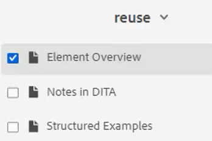
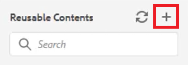

# 内容重用

DITA的主要功能之一是能够重用内容。 它允许重复使用从小短语到整个主题或地图的内容。  但是，要有效地重用内容，必须很好地管理内容。 在使用可重用信息时，确保您拥有有效的内容策略。

>[!VIDEO](https://video.tv.adobe.com/v/342757?quality=12&learn=on)

## 创建可重用主题

当对可重用源主题进行更改时，信息将在所有使用内容的地方更新。

1. 导航到 **存储库**.

1. 单击 **上下文菜单** 位于重用文件夹旁边。

1. 选择 **创建> Dita主题**.

1. 填充“创建新主题”对话框中的字段。 例如：

   

1. 单击&#x200B;[!UICONTROL **创建**]。

1. 根据需要向主题添加内容。

## 向主题添加新的可重用元素

添加可重用元素的方法有多种。 在此，仅添加一个组件时，第一个工作流效果最佳。 第二个工作流更适合添加多个可重用组件。

### 工作流1

1. 单击主题中的有效位置。

1. 选择 **插入可重用内容** 图标。

   

1. 在重用内容对话框中，单击 [!UICONTROL **文件夹**] 图标。

1. 导航到所需的文件夹。

1. 选择包含可重用组件的主题。
例如：

   

1. 单击 [!UICONTROL **选择**].

1. 选择要重用的特定组件。

1. 单击 [!UICONTROL **选择**].

可重用元素现已插入到主题中。

### 工作流2

1. 导航到 **可重用内容** ，位于左侧面板。

1. 单击 [!UICONTROL **添加**] 图标。

   

1. 导航到文件夹。

1. 选择一个或多个特定主题。

1. 单击 [!UICONTROL **添加**].

1. 在“可重用内容”面板中，展开 **元素概述**.

1. 将元素拖放到主题的有效位置。

可重用元素现已插入到主题中。

## 为元素分配ID和值

您刚刚创建的维度是一个可重用的元素。 因此，它需要ID和值。

1. 单击维度内部。

1. 在“内容属性”面板中，单击“属性”下的下拉菜单。

1. 选择 **ID**.

1. 键入值的逻辑名称。

1. 保存主题或设置其版本，以使更改反映在“存储库”中。

ID和值已分配给元素。
