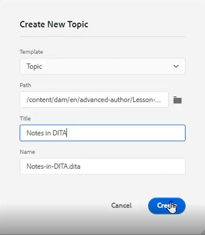

# 内容重用

DITA的主要功能之一是可重复使用内容。 它允许从小短语到整个主题或地图重复使用内容。  但是，要有效地重复使用内容，必须对其进行妥善管理。 使用可重用信息时，请确保您拥有有效的内容策略。

>[!VIDEO](https://video.tv.adobe.com/v/342757)

## 创建可重用主题

当对可重复使用的源主题进行更改时，信息将在使用内容的所有位置更新。

1. 导航到 **存储库**.

2. 单击 **上下文菜单** 重用文件夹旁边。

3. 选择 **“创建”>“Dita主题”**.

4. 填充“创建新主题”对话框中的字段。 例如：

   

5. 单击&#x200B;[!UICONTROL **创建**]。

6. 根据需要向主题添加内容。

## 向主题中添加新的可重用元素

有多种方法可添加可重用元素。 在此，最佳做法是仅添加一个组件时使用第一个工作流。 第二个工作流更适合添加多个可重用组件。

### 工作流1

1. 在有效位置单击主题。

2. 选择 **插入可重用内容** 图标。

   

3. 在重用内容对话框中，单击 [!UICONTROL **文件夹**] 图标。

4. 导航到所需的文件夹。

5. 选择包含可重用组件的主题。
例如：

   

6. 单击 [!UICONTROL **选择**].

7. 选择要重复使用的特定组件。

8. 单击 [!UICONTROL **选择**].

可重用元素现已插入到主题中。

### 工作流2

1. 导航到 **可重用内容** 中。

2. 单击 [!UICONTROL **添加**] 图标。

   

3. 导航到文件夹。

4. 选择特定主题。

5. 单击&#x200B;[!UICONTROL **添加**]。

6. 从可重用内容面板中，展开 **元素概述**.

7. 将元素拖放到主题的有效位置。

可重用元素现已插入到主题中。

## 为元素分配ID和值

您刚刚创建的目录是一个可重复使用的元素。 因此，它需要ID和值。

1. 在目录内单击。

2. 在“内容属性”面板中，单击“属性”下的下拉列表。

3. 选择 **ID**.

4. 键入值的逻辑名称。

5. 保存或版本化主题，以便所做的更改反映在存储库中。

ID和值已分配给元素。
