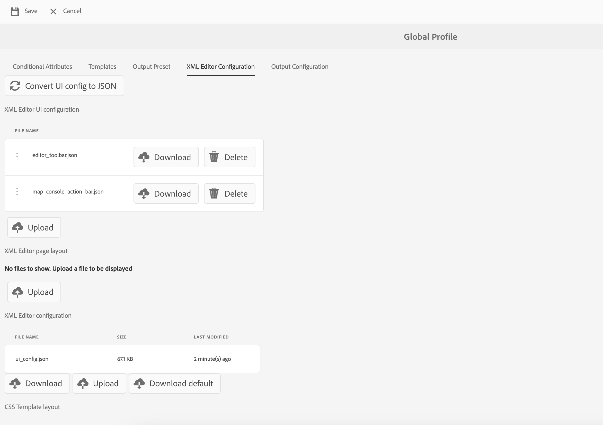

# 概述

从旧UI迁移到新AEM Guides UI时，**ui_config**&#x200B;的更新必须转换为更灵活和模块化的UI配置。 此框架有助于将更改无缝地纳入&#x200B;**editor_toolbar**&#x200B;和[其他工具栏](/help/courses/course-3/conver-ui-config.md#editing-json-for-different-screens)。 该过程还支持修改应用程序中的其他视图和小部件。

>[!NOTE]
>
>在向扩展框架过渡期间，应用于特定按钮的自定义项可能会遇到问题。 如果发生这种情况，您可以参照此页面提出支持工单以提示支持和解决问题。

## 为不同屏幕编辑JSON

可以将JSON文件添加到各种屏幕和小组件的“XML编辑器UI配置”部分。 下面是广泛使用的构件及其ID列表：

1. [editor_toolbar](assets/toolbars/editor_toolbar.json)： Webeditor工具栏包含文件和内容操作。
1. [editor_tab_bar](assets/toolbars/editor_tab_bar.json)： webeditor中打开文件的选项卡式视图，具有可以对打开的文件执行的操作。
1. [file_mode_switcher](assets/toolbars/file_mode_switcher.json)：它有助于在webeditor中已打开文件的不同可用模式（创作、源、预览）之间进行切换。

   

1. [map_console_navigation_bar](assets/toolbars/map_console_navigation_bar.json)：这是在地图控制台中打开的地图的信息栏。 它允许更改映射并提供对设置的访问权限。
1. [map_console_action_bar](assets/toolbars/map_console_action_bar.json)：这是映射控制台项目的操作栏，例如“输出预设”、“基线”、“翻译”和“报表”，它们提供了相关信息以及各自的操作按钮。

   

1. [home_navigation_bar](assets/toolbars/home_navigation_bar.json)： Guides主页标题栏，其中欢迎消息与选定的文件夹配置文件一起显示。

   

<br>

## 每个JSON的一般结构

每个JSON遵循一致结构：

1. `id`：指定要自定义该组件的小组件。
1. `targetEditor`：使用编辑器和模式属性定义何时显示或隐藏按钮：

   `targetEditor`支持以下选项：

   - `mode`
   - `displayMode`
   - `editor`
   - `documentType`
   - `documentSubType`
   - `flag`

   有关详细信息，请查看[了解targetEditor属性](#understanding-targeteditor-properties)

   >[!NOTE]
   >
   > Experience Manager Guides 2506版本引入了新属性： `displayMode`、`documentType`、`documentSubType`和`flag`。 仅从版本2506开始支持这些属性。 同样，从本版本开始，模式属性中从`toc`到`layout`的更改也适用。
   >
   > 新字段`documentType`现在可与现有`editor`字段一起使用。  这两个字段均受支持，可根据需要使用。 但是，建议使用`documentType`以确保实施之间的一致性，尤其是在使用`documentSubType`属性时。 `editor`字段仍然有效，以支持向后兼容性和现有集成。


1. `target`：指定将添加新组件的位置。 它使用键值对或索引进行唯一标识。 视图状态包括：

   - **附加**：在末尾添加。

   - **前置词**：在开头添加。

   - **替换**：替换现有组件。

示例JSON结构：

```json
{
  "id" : "editor_toolbar",
  "view": {
    "items": [
      {
        ...,
        "targetEditor": {
          "mode": [
            "preview"
          ],
          "editor": [
            "xml"
          ]
        },
        "target": {
          "key": "label",
          "value": "Table",
          "viewState": "prepend"
        },
        ...
      },
    ]
  }
}
```

<br>

## 了解`targetEditor`属性

以下是每个属性、其用途和受支持值的明细。

### `mode`

定义编辑器的操作模式。

**支持的值**： `author`、`source`、`preview`、`layout`（以前为`toc`）、`split`

### `displayMode` *（可选）*

控制UI组件的可见性或交互性。 如果未指定，则默认值设置为`show`。

**支持的值**： `show`，`hide`，`enabled`，`disabled`

示例：

```
 {
        "icon": "textBulleted",
        "title": "Custom Insert Bulleted",
        "on-click": "$$AUTHOR_INSERT_REMOVE_BULLETED_LIST",
        "key": "$$AUTHOR_INSERT_REMOVE_BULLETED_LIST",
        "targetEditor": {
          "documentType": [
            "ditamap"
          ],
          "mode": [
            "author"
          ],
          "displayMode": "hide"
        }
      },
```

### `editor`

在编辑器中指定主要文档类型。

**支持的值**： `ditamap`，`bookmap`，`subjectScheme`，`xml`，`css`，`translation`，`preset`，`pdf_preset`

### `documentType`

指示主要文档类型。

**支持的值**： `dita`、`ditamap`、`bookmap`、`subjectScheme`、`css`、`preset`、`ditaval`、`reports`、`baseline`、`translation`、`html`、`markdown`、`conditionPresets`

> 对于特定用例，可能支持其他值。

示例：

```
 {
        "icon": "textNumbered",
        "title": "Custom Numbered List",
        "on-click": "$$AUTHOR_INSERT_REMOVE_NUMBERED_LIST",
        "key": "$$AUTHOR_INSERT_REMOVE_NUMBERED_LIST",
        "targetEditor": {
          "documentType": [
            "dita",
            "ditamap"
          ],
          "mode": [
            "author",
            "source"
          ]

        }
      },
```

### `documentSubType`

进一步根据`documentType`对文档进行分类。

- **对于`preset`**：`pdf`，`html5`，`aemsite`，`nativePDF`，`json`，`custom`，`kb`
- `dita`**的**：`topic`，`reference`，`concept`，`glossary`，`task`，`troubleshooting`

> 对于特定用例，可能支持其他值。

示例：

```
 {
        "icon": "rename",
        "title": "Custom Rename",
        "on-click": "$$PUBLISH_PRESETS_RENAME",
        "label": "Custom Rename",
        "key": "$$PUBLISH_PRESETS_RENAME",
        "targetEditor": {
          "documentType": [
            "preset"
          ],
          "documentSubType": [
            "nativePDF",
            "aemsite",
            "json"
          ]

        }
      },
```

### `flag`

文档状态或功能的布尔指示器。

**支持的值**： `isOutputGenerated`、`isTemporaryFileDownloadable`、`isPDFDownloadable`、`isLocked`、`isUnlocked`、`isDocumentOpen`

此外，您还可以在`extensionMap`内创建一个自定义标志，该标志用作`targetEditor`中的标志。 此处，`extensionMap`是用于添加自定义键或可观察值的全局变量。

示例：

```
 {
        "icon": "filePDF",
        "title": "Custom Export pdf",
        "on-click": "$$DOWNLOAD_TOPIC_PDF",
        "key": "$$DOWNLOAD_TOPIC_PDF",
        "targetEditor": {
          "documentType": [
            "markdown"
          ],
          "mode": [
            "preview"
          ],
          "flag": ["isPDFDownloadable"]

        }
      },
```


## 示例

下面是如何在编辑器工具栏中添加、删除或替换按钮的示例。

### 添加按钮

添加新按钮&#x200B;**在** editor_toolbar **中插入自定义表**&#x200B;以添加仅在预览模式下可见的简单表。

```json
{
  "id": "editor_toolbar",
  "view": {
    "items": [
      {
        "icon": "table",
        "title": "Insert Custom Table",
        "on-click": {
          "name": "$$AUTHOR_INSERT_ELEMENT",
          "args": [
            "simpletable",
            "table",
            "choicetable"
          ]
        },
        "key": "$$AUTHOR_INSERT_ELEMENT",
        "targetEditor": {
          "mode": [
            "preview"
          ],
        },
        "target": {
          "key": "label",
          "value": "Table",
          "viewState": "prepend"
        }
      }
    ]
  }
}
```


### 删除按钮

从工具栏中删除按钮。 在此，我们从编辑器工具栏中删除了添加图像按钮。

```json
{
  "id": "editor_toolbar",
  "view": {
    "items": [
      {
        "hide": true,
        "target": {
          "key": "label",
          "value": "Image",
          "viewState": "replace"
        }
      }
    ]
  }
}
```

### 替换按钮

将工具栏中的&#x200B;**多媒体**&#x200B;按钮替换为&#x200B;**Youtube**&#x200B;链接插入按钮，该按钮仅在创作模式下可见。

```json
{
  "id": "editor_toolbar",
  "view": {
    "items": [
      {
        "icon": "s2youtube",
        "title": "Youtube",
        "on-click": {
          "name": "$$AUTHOR_INSERT_ELEMENT",
          "args": "<object data='http://youtube.com'></object>"
        },
        "targetEditor": {
          "mode": [
            "author"
          ]
        },
        "target": {
          "key": "elementId",
          "value": "toolbar-multimedia",
          "viewState": "replace"
        }
      }
    ]
  }
}
```


<br>

### 在预览模式下添加按钮

根据该设计，针对锁定和未锁定（只读）模式分别管理按钮可见性，以保持清晰可控的用户体验。 默认情况下，当界面处于只读模式时，任何新添加的按钮都会隐藏。
要使按钮在**只读**模式下可见，您必须指定一个目标，以便将该按钮置于即使接口被锁定也保持可访问的工具栏子部分中。
例如，通过将目标指定为**Download作为PDF**，您可以确保该按钮与现有的可见按钮出现在同一部分中，从而使其在解锁模式下可访问。

```json
"target": {
  "key": "label",
  "value": "Download as PDF",
  "viewState": "prepend"
}
```

在&#x200B;**预览**&#x200B;模式下添加按钮&#x200B;**导出为PDF**，该按钮在锁定和解锁模式下均可见。

```json
{
  "id": "editor_toolbar",
  "view": {
    "items": [
      {
        "icon": "filePDF",
        "title": "Export as PDF",
        "on-click": "$$DOWNLOAD_TOPIC_PDF",
        "key": "$$DOWNLOAD_TOPIC_PDF",
        "targetEditor": {
          "editor": [
            "ditamap",
            "xml"
          ],
          "mode": [
            "preview"
          ]
        },
        "target": {
          "key": "label",
          "value": "Download as PDF",
          "viewState": "prepend"
        }
      },
      {
        "icon": "filePDF",
        "title": "Export as PDF",
        "on-click": "$$DOWNLOAD_TOPIC_PDF",
        "key": "$$DOWNLOAD_TOPIC_PDF",
        "targetEditor": {
          "editor": [
            "ditamap",
            "xml"
          ],
          "mode": [
            "preview"
          ]
        }
      }
    ]
  }
}
```

以下代码片段显示了包含锁定方案的&#x200B;**导出为PDF**&#x200B;按钮。


此外，下面的代码片段中还显示带有解锁方案的&#x200B;**导出为PDF**&#x200B;按钮。


## 如何上传自定义JSON

1. 在&#x200B;**XML编辑器配置**&#x200B;选项卡上，单击顶部栏中的&#x200B;**编辑**。
1. 现在，在&#x200B;**XML编辑器UI配置**&#x200B;子部分中，您将能够看到&#x200B;**上载**&#x200B;按钮。

   {width="400" height="150"}

1. 您可以单击并上传修改后的json。 （要上传的json应与自定义小组件ID同名）
1. 上传后，在顶部栏中点击&#x200B;**Save**。

   对于每个上传的文件，您还可以&#x200B;**删除**&#x200B;从UI中删除其json自定义项，或者&#x200B;**下载**&#x200B;以再次查看或修改它。

   {width="400" height="150"}

<br>


## 如何上传自定义的CSS

您还可以添加css以自定义已添加自定义按钮或UI上已存在构件或按钮的外观。

对于新添加的自定义按钮，请将&#x200B;**extraclass**添加到JSON中的自定义按钮或组件。
对于旧类，可以检查元素并修改现有类。

```json
{
  "icon": "table",
  "title": "Insert Custom Table",
  "extraclass": "custom-css",
  "key": "$$AUTHOR_INSERT_ELEMENT",
  "targetEditor": {
    "mode": [
      "preview"
    ],
  },
  "target": {
    "key": "label",
    "value": "Table",
    "viewState": "prepend"
  }
}
```

1. 在&#x200B;**XML编辑器配置**&#x200B;选项卡上，单击顶部栏中的&#x200B;**编辑**。
1. 现在，在&#x200B;**XML编辑器页面布局**&#x200B;子部分中，您将能够看到&#x200B;**上传**&#x200B;按钮。

   {width="400" height="150"}

1. 您可以单击并上传修改的css。 （仅支持css文件）
1. 上传后，在顶部栏中点击&#x200B;**Save**。

   对于每个上载的文件，您还可以&#x200B;**删除**&#x200B;用于从UI中删除其自定义项的css，或者&#x200B;**下载**&#x200B;用于再次查看或修改它。

   {width="400" height="150"}


<br>

### 自定义按钮css的示例

在此处，我们将添加一个新按钮&#x200B;**在** editor_toolbar **中插入自定义表**，以添加仅在预览模式下可见的简单表并对其应用自定义css。
此css可修改按钮的背景及其标题的字体大小。


```css
#editor_toolbar {
  .custom-css {
    background-color: burlywood;
    font-size: 2rem;  
  }
}
```

```json
{
  "id": "editor_toolbar",
  "view": {
    "items": [
      {
        "icon": "table",
        "title": "Insert Custom Table",
        "extraclass": "custom-css",
        ...
      }
    ]
  }
}
```

<br>

## 将ui配置转换为模块化Jsons的步骤

1. 在“导航”屏幕中，单击&#x200B;[!UICONTROL **工具**]&#x200B;图标。

   

1. 在左侧面板上选择&#x200B;**参考线**。

1. 单击&#x200B;[!UICONTROL **文件夹配置文件**]&#x200B;拼贴。

   

1. 选择文件夹配置文件。

1. 单击&#x200B;[!UICONTROL **XML编辑器配置**]&#x200B;选项卡。

1. 您可以单击&#x200B;**将用户界面配置转换为JSON**&#x200B;按钮。 这将生成&#x200B;**editor_toolbar**&#x200B;和&#x200B;**map_console_action_bar** json，其中包含在&#x200B;**ui_config**&#x200B;中完成的更改。

   

1. 您可以检查[编辑器工具栏](assets/editor_toolbar.json)和[映射控制台操作栏](assets/map_console_action_bar.json)的示例生成的json


>[!NOTE]
>
>对&#x200B;**toolbar**&#x200B;和&#x200B;**topbar**&#x200B;节所做的更改已添加到&#x200B;**editor_toolbar** json中，这些更改可在编辑器页面上看到。 对&#x200B;**ui_config**&#x200B;中与“预设”或“翻译”相关的按钮所做的更改已添加到&#x200B;**map_console_action_bar** json，可在映射控制台页面上看到该内容。
