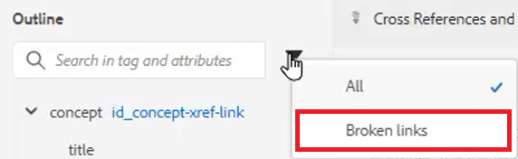

# 交叉引用和链接

XML编辑器和DITA为主题之间的链接提供了一种强大的方式。 请务必有效管理您的内容引用，其中包括使用唯一的ID值。

在此文件中提供了您可以选择用于本课程的示例文件
[crossreferencesandlinks.zip](assets/crossreferencesandlinks.zip)

>[!VIDEO](https://video.tv.adobe.com/v/342764?quality=12&learn=on)

## 创建外部主题的交叉引用

通过将主题从存储库拖放到打开的文件中，可以创建外部交叉引用。 但是，为了避免中断的交叉引用，必须首先将ID定义为与父元素相关的值。 这是创建交叉引用并确保正确分配ID的一种简单方法。

1. 打开要插入外部交叉引用的文件。

1. 为要引用的元素分配一个ID。

   a.单击元素内部。

   b.在“内容属性”面板上，从“属性”下拉列表中选择&#x200B;**ID**。

   c.在“值”字段中键入逻辑名称。

   d.如果需要，在&#x200B;**大纲视图**&#x200B;中查看元素及其值。

1. **保存**&#x200B;主题以确保存储库具有更新的ID。

1. 单击顶部工具栏上的&#x200B;[!UICONTROL **引用**]&#x200B;图标。

   

1. 从&#x200B;**内容引用**&#x200B;选项卡中，选择要作为交叉引用插入的ID和元素配对。

1. 单击&#x200B;[!UICONTROL **选择**]。

交叉引用已添加到主题中。

## 链接到网站

可以在任何主题中插入指向网站的链接。 有关更多信息，请参阅有关链接到网站的AEM Guides课程1视频。

## 查看断开的链接

某些修改可能会导致交叉引用损坏。 这些操作包括删除主题、重新组织包含交叉引用的截面，或在插入交叉引用后更改ID。 请注意，本课程提供了一个示例主题&#x200B;_crossreferencesandlinks.zip_，该主题将导致对内部内容的多个项目符号交叉引用中断。

1. 导航到左侧面板上的&#x200B;**大纲视图**。

1. 单击&#x200B;[!UICONTROL **筛选器**]&#x200B;图标。

1. 选择&#x200B;**断开的链接**。

   

断开的链接显示为可单击对象。 您可以在主题中以红色文本标识它们。
