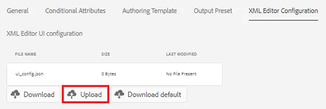

# XML编辑器配置

如果您在受限的环境中工作，则可以通过在特定的文件夹配置文件中自定义编辑器配置来选择作者能够查看的功能。 应用此文件夹配置文件可以更改编辑器本身、CSS模板、可用代码片段和内容版本标签的外观。

文件中提供了您可选择在本课程中使用的示例文件 [xmleditorconfiguration.zip](assets/xmleditorconfiguration.zip).

>[!VIDEO](https://video.tv.adobe.com/v/342762?quality=12&learn=on)

## 自定义默认编辑器UI配置

您始终可以将默认UI配置下载到本地系统，在您选择的文本编辑器中对其进行更改，然后重新上传。

1. 在导航屏幕中，单击 [!UICONTROL **工具**] 图标。

   

1. 选择 **指南** ，位于左侧面板。

1. 单击 [!UICONTROL **文件夹配置文件**] 图块。

   

1. 选择文件夹配置文件。

1. 单击 [!UICONTROL **XML编辑器配置**] 选项卡。

1. 单击 [!UICONTROL **下载**] 默认。

   

您现在可以在文本编辑器中打开和修改内容。 此 _AEM Guides安装和配置_ 本指南包含有关如何在UI配置中移除、自定义或添加函数的示例。

## 上传修改后的XML编辑器UI配置

自定义UI配置后，您可以上传它。 请注意，示例配置文件 _ui-config-restricted-editor.json_ 随本课程的支持主题集一起提供。

1. 在文件夹配置文件中，单击 [!UICONTROL **XML编辑器配置**] 选项卡。

1. 在XML编辑器UI配置下，单击 [!UICONTROL **上传**].

   

1. 双击修改后的UI配置的文件，或如此处所示双击提供的示例文件。

   

1. 单击 [!UICONTROL **保存**] 在屏幕的左上角。

您已成功上传修改过的UI配置。

## 自定义CSS模板布局

与UI配置一样，您可以下载CSS模板布局。 您可以在文本编辑器中打开该主题并进行修改，以在上载之前自定义主题的外观。

1. 在导航屏幕中，单击 [!UICONTROL **工具**] 图标。

   

1. 选择 **指南** ，位于左侧面板。

1. 单击 [!UICONTROL **文件夹配置文件**] 图块。

   

1. 选择文件夹配置文件。

1. 单击 [!UICONTROL **XML编辑器配置**] 选项卡。

1. 在“CSS模板布局”下，单击 [!UICONTROL **下载**].

   

您现在可以在文本编辑器中修改和保存CSS内容。

## 上载修改后的CSS模板布局

自定义CSS模板布局后，您可以上传它。 请注意，示例文件 _css-layout-ONLY-draft-comment-change.css_ 随本课程的支持主题集一起提供。 此文件仅包含草稿注释更改，而 _css-layout-draft-comment-change.css_ 是整个文件，仅供您测试或查看。

1. 在文件夹配置文件中，单击 [!UICONTROL **XML编辑器配置**] 选项卡。

1. 在“CSS模板布局”下，单击 [!UICONTROL **上传**].

   

1. 双击该文件以使用您自己的自定义CSS布局或此处显示的提供的示例文件。

   

1. 单击 [!UICONTROL **保存**] 在屏幕的左上角。
您已成功上传自定义的CSS模板布局。

## 编辑XML编辑器代码片段

代码片段是可重复使用的内容片段，可以特定于产品或组。 请注意，本课程的支持文件随附了示例代码片段。

1. 在导航屏幕中，单击 [!UICONTROL **工具**] 图标。

   

1. 选择 **指南** ，位于左侧面板。

1. 单击 [!UICONTROL **文件夹配置文件**] 图块。

   

1. 选择文件夹配置文件。

1. 单击 [!UICONTROL **XML编辑器配置**] 选项卡。

1. 在“XML编辑器代码片段”下，单击 **上传**.

   

1. 选择您自己的代码片段或使用提供的示例。

   

1. 单击 [!UICONTROL **保存**] 在屏幕的左上角。

您已成功将新的代码片段添加到编辑器中。

## 自定义XML内容版本标签

默认情况下，允许作者创建自己选择的标签，并将它们与主题文件相关联。 这可能会导致同一标签上出现不同的变体。 为避免标签不一致，您还可以从预定义标签列表中进行选择。

1. 在导航屏幕中，单击 [!UICONTROL **工具**] 图标。

   

1. 选择 **指南** ，位于左侧面板。

1. 单击 [!UICONTROL **文件夹配置文件**] 图块。

   

1. 选择文件夹配置文件。

1. 单击 [!UICONTROL **XML编辑器配置**] 选项卡。

1. 在“XML内容版本标签”下，单击 [!UICONTROL **下载**].

   

现在，您可以根据需要自定义标签。

## 上传XML内容版本标签

下载并修改标签后，即可上传XML内容版本标签主题。 您可以选择使用样例文件 _labels.json_，并提供了本课程的支持主题集。

1. 在文件夹配置文件中，单击 [!UICONTROL **XML编辑器配置**] 选项卡。

1. 在“XML内容版本标签”下，单击 [!UICONTROL **上传**].

   

1. 双击该文件以获取您自己的自定义标签或此处显示的提供的示例文件。

   

1. 单击 [!UICONTROL **保存**] 在屏幕的左上角。

您已成功上载自定义XML内容版本标签。
