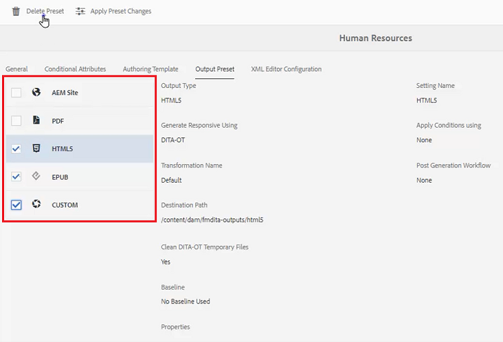

# 文件夹配置文件

AEM提供对配置工具的快速访问。 通过自定义文件夹配置文件，不同的部门或产品可以具有独特的模板、创作环境、条件属性配置文件、代码片段甚至是Web编辑器配置。

您可以选择用于本课程的示例文件在文件[folderprofiles.zip](assets/folderprofiles.zip)中提供。

>[!VIDEO](https://video.tv.adobe.com/v/342758?quality=12&learn=on)

## 访问文件夹配置文件

通过“文件夹配置文件”图标管理配置。

1. 在“导航”屏幕中，单击&#x200B;[!UICONTROL **工具**]&#x200B;图标。

   

1. 在左侧面板上选择&#x200B;**参考线**。

1. 单击&#x200B;[!UICONTROL **文件夹配置文件**]&#x200B;拼贴。

   

1. 选择所需的配置文件。 例如，选择默认配置文件&#x200B;**全局配置文件**。

   

## 编辑全局配置文件中的条件属性

访问全局配置文件后，可以编辑其配置。 除非另有指定，否则全局配置文件设置将应用于所有用户。

1. 在全局配置文件中，选择&#x200B;**条件属性**&#x200B;选项卡。

1. 单击屏幕左上角的&#x200B;[!UICONTROL **编辑**]。

   

1. 单击&#x200B;[!UICONTROL **添加**]。

1. 为新条件填充&#x200B;**Name**、**Value**&#x200B;和&#x200B;**Label**&#x200B;字段。

   

1. 单击屏幕左上角的&#x200B;[!UICONTROL **保存**]。
新条件现在可供所有用户使用。 您可以在“内容属性”面板中选择它，然后根据需要将其应用于内容。

## 构建新的文件夹配置文件

除了默认的全局配置文件外，您还可以创建自己的自定义配置文件。

1. 在“导航”屏幕中，单击&#x200B;[!UICONTROL **工具**]&#x200B;图标。

   

1. 在左侧面板上选择&#x200B;**参考线**。

1. 单击&#x200B;[!UICONTROL **文件夹配置文件**]&#x200B;拼贴。

   

1. 单击&#x200B;[!UICONTROL **创建**]。

1. 在创建文件夹配置文件对话框中。

   a.命名用户档案。

   b.指定路径。

   c.单击&#x200B;[!UICONTROL **创建**]。

   

“文件夹配置文件”页面上将显示具有新配置文件名称的图块。

## 从“常规”选项卡添加管理用户

管理用户有权更新文件夹配置文件的条件属性、创作模板和输出预设。

1. 单击图块以打开所需的“文件夹配置文件”。

   

1. 选择&#x200B;**常规**&#x200B;选项卡。

1. 单击屏幕左上角的&#x200B;[!UICONTROL **编辑**]。

1. 在管理员用户下，从下拉列表中选择一个用户或键入一个用户名。

1. 单击&#x200B;[!UICONTROL **添加**]。

   如果需要，您可以添加多个管理员用户。

   

1. 添加所有用户后，单击屏幕右上角的&#x200B;[!UICONTROL **保存**]。

管理用户现在已分配给此配置文件。

## 从条件属性选项卡添加新受众

访问全局配置文件后，可以编辑其配置。 除非另有指定，否则全局配置文件设置将应用于所有用户。

1. 从所需的文件夹配置文件中，选择&#x200B;**条件属性**&#x200B;选项卡。

1. 单击屏幕左上角的&#x200B;[!UICONTROL **编辑**]。

   

1. 单击&#x200B;[!UICONTROL **添加**]。

1. 为新条件填充&#x200B;**Name**、**Value**&#x200B;和&#x200B;**Label**&#x200B;字段。

   单击&#x200B;[!UICONTROL **加号**]&#x200B;可为命名属性添加其他值和标签对。

   

1. 单击屏幕左上角的&#x200B;[!UICONTROL **保存**]。

新的条件属性已添加到此配置文件。

## 从“创作模板”选项卡中选择模板和映射

AEM Guides附带现成的创作模板和地图。 您可以将其限制为特定作者。 默认情况下，模板存储在DITA templates文件夹内的Assets位置。

1. 从所需的文件夹配置文件中，选择创作模板选项卡。

1. 单击屏幕左上角的编辑。

1. 添加映射模板。

   a.从&#x200B;**映射模板**&#x200B;下拉列表中，从可用映射中选择一个选项。

   b.单击&#x200B;[!UICONTROL **添加**]。

   

1. 添加主题模板。

   a.从&#x200B;**主题模板**&#x200B;下拉列表中，从可用模板中选择一个选项。

   

1. 单击&#x200B;[!UICONTROL **添加**]。

1. 根据需要添加其他主题模板。

1. 完成后，单击屏幕左上角的&#x200B;[!UICONTROL **保存**]。

新的创作模板已添加到此配置文件。

## 从“输出预设”选项卡中删除不必要的预设

您可以根据文件夹配置文件配置每个输出预设。 应删除不需要的输出预设。

1. 从所需的文件夹配置文件中，选择&#x200B;**输出预设**&#x200B;选项卡。

1. 在左侧面板中，选中任何不需要的预设的复选框。

   

1. 单击屏幕左上角的&#x200B;[!UICONTROL **删除预设**]。

1. 在“删除预设”对话框中，单击&#x200B;[!UICONTROL **删除**]。

   

现在，显示的唯一输出预设是将要使用的输出预设。

## 从XML编辑器的“配置”选项卡上传代码片段

1. 从所需的文件夹配置文件中，选择&#x200B;**XML编辑器配置**&#x200B;选项卡。

1. 在“XML编辑器代码片段”下，单击&#x200B;[!UICONTROL **上传**]。

   

1. 导航到之前创建的代码片段。

1. 单击&#x200B;[!UICONTROL **打开**]。

1. 单击屏幕左上角的&#x200B;[!UICONTROL **保存**]。

您已成功修改编辑器配置以包含代码片段。

## 在存储库中指定文件夹配置文件

在编辑器中，您可以查看对文件夹配置文件进行修改的结果。

1. 导航到&#x200B;**存储库视图**。

1. 单击要处理的内容的文件夹。

1. 单击顶部工具栏上的&#x200B;[!UICONTROL **用户首选项**]&#x200B;图标。

   

1. 在用户首选项对话框中，从下拉列表中选择所需的文件夹配置文件。

   

1. 单击&#x200B;[!UICONTROL **保存**]。

您已将文件夹配置文件应用于您的内容。 现在，当您创建新的DITA主题时，您将看到基于文件夹配置文件的受限主题类型列表。 受众条件包含全局设置以及特定于文件夹配置文件的设置。 您上传的代码片段文件创建了一组默认代码片段以供选择。 映射仪表板显示受限制的输出预设。
