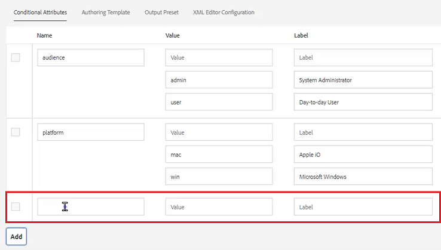

# 文件夹配置文件

AEM提供对配置工具的快速访问。 通过自定义文件夹配置文件，不同的部门或产品可以具有唯一的模板、创作环境、条件属性配置文件、代码片段，甚至Web编辑器配置。

文件中提供了您可以选择用于本课程的示例文件 [folderprofiles.zip](assets/folderprofiles.zip).

>[!VIDEO](https://video.tv.adobe.com/v/342758?quality=12&learn=on)

## 访问文件夹配置文件

可通过文件夹配置文件图标管理配置。

1. 在导航屏幕中，单击 [!UICONTROL **工具**] 图标。

   

1. 选择 **指南** 中。

1. 单击 [!UICONTROL **文件夹配置文件**] 拼贴。

   

1. 选择所需的配置文件。 例如，选择 **全局配置文件**，这是默认的用户档案。

   

## 编辑全局配置文件中的条件属性

访问全局配置文件后，即可编辑其配置。 除非另有指定，否则“全局配置文件”设置将应用于所有用户。

1. 在全局配置文件中，选择 **条件属性** 选项卡。

1. 单击 [!UICONTROL **编辑**] 中。

   

1. 单击 [!UICONTROL **添加**].

1. 填充 **名称**, **值**&#x200B;和 **标签** 字段。

   

1. 单击 [!UICONTROL **保存**] 的位置。
现在，所有用户都可以使用新条件。 您可以在“内容属性”面板中选择该组件，然后根据需要将其应用于内容。

## 构建新文件夹配置文件

除了默认的全局配置文件之外，您还可以创建自己的自定义配置文件。

1. 在导航屏幕中，单击 [!UICONTROL **工具**] 图标。

   

1. 选择 **指南** 中。

1. 单击 [!UICONTROL **文件夹配置文件**] 拼贴。

   

1. 单击&#x200B;[!UICONTROL **创建**]。

1. 在创建文件夹配置文件对话框中。

   a.命名配置文件。

   b.指定路径。

   c.单击 [!UICONTROL **创建**].

   

“文件夹配置文件”页面上会显示一个具有新配置文件名称的拼贴。

## 从“常规”选项卡添加管理用户

管理用户有权更新文件夹配置文件的条件属性、创作模板和输出预设。

1. 单击图块以打开所需的文件夹配置文件。

   

1. 选择 **常规** 选项卡。

1. 单击 [!UICONTROL **编辑**] 中。

1. 在“管理员用户”下，从下拉菜单中选择用户或键入用户名。

1. 单击 [!UICONTROL **添加**].

   您可以根据需要添加多个管理员用户。

   

1. 单击 [!UICONTROL **保存**] 中)来访问Advertising Cloud的帮助。

管理用户现在已分配给此配置文件。

## 从条件属性选项卡中添加新受众

访问全局配置文件后，即可编辑其配置。 除非另有指定，否则“全局配置文件”设置将应用于所有用户。

1. 从所需的文件夹配置文件中，选择 **条件属性** 选项卡。

1. 单击 [!UICONTROL **编辑**] 中。

   

1. 单击 [!UICONTROL **添加**].

1. 填充 **名称**, **值**&#x200B;和 **标签** 字段。

   单击 [!UICONTROL **加号**] sign允许您为指定属性添加其他值和标签对。

   

1. 单击 [!UICONTROL **保存**] 的位置。

新的条件属性已添加到此配置文件中。

## 从“创作模板”选项卡中选择模板和映射

AEM指南提供了现成的创作模板和映射。 您可以将其限制为特定作者。 默认情况下，模板存储在DITA模板文件夹内的Assets位置中。

1. 从所需的文件夹配置文件中，选择创作模板选项卡。

1. 单击屏幕左上角的编辑。

1. 添加映射模板。

   a.从 **地图模板** 下拉列表中，从可用映射中选择一个选项。

   b.单击 [!UICONTROL **添加**].

   

1. 添加主题模板。

   a.从 **主题模板** 下拉菜单中，从可用的模板中选择一个选项。

   

1. 单击 [!UICONTROL **添加**].

1. 根据需要添加其他主题模板。

1. 完成后，单击 [!UICONTROL **保存**] 中。

此配置文件中添加了新的创作模板。

## 从“输出预设”选项卡中删除非必需的预设

您可以根据文件夹配置文件配置每个输出预设。 应删除不需要的输出预设。

1. 从所需的文件夹配置文件中，选择 **输出预设** 选项卡。

1. 在左侧面板中，选中任何非必需预设的复选框。

   

1. 单击 [!UICONTROL **删除预设**] 中。

1. 在删除预设对话框中，单击 [!UICONTROL **删除**].

   

现在，显示的唯一输出预设就是将使用的输出预设。

## 从“XML编辑器配置”选项卡中上载代码片段

1. 从所需的文件夹配置文件中，选择 **XML编辑器配置** 选项卡。

1. 在“XML Editor Snippets（XML编辑器代码片段）”下，单击 [!UICONTROL **上传**].

   

1. 导航到之前创建的代码片段。

1. 单击 [!UICONTROL **打开**].

1. 单击 [!UICONTROL **保存**] 中。

您已成功修改了编辑器配置以包含代码片段。

## 在存储库中指定文件夹配置文件

在编辑器中，您可以看到对文件夹配置文件所做修改的结果。

1. 导航到 **存储库视图**.

1. 单击要处理的内容的文件夹。

1. 单击 [!UICONTROL **用户首选项**] 图标。

   

1. 在用户首选项对话框中，从下拉菜单中选择所需的文件夹配置文件。

   

1. 单击“[!UICONTROL **保存**]”。

您已将文件夹配置文件应用到您的内容。 现在，在创建新DITA主题时，您将看到基于文件夹配置文件的主题类型受限列表。 “受众条件”包含全局设置以及特定于文件夹配置文件的设置。 您上传的代码片段文件创建了一组默认的代码片段供选择。 地图功能板显示受限的输出预设。
