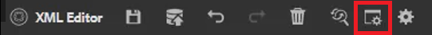

# 术语表

术语表面板允许解析映射。 您可以创建术语表主题文件，并将其包含在常用的术语表映射中。 然后，可以将此映射添加到其他映射中。 使用术语表，可以更轻松地以一致的方式提供短语信息，并使读者更加清晰。

文件中提供了您可以选择用于本课程的示例文件 [glossary.zip](assets/glossary.zip).

>[!VIDEO](https://video.tv.adobe.com/v/342765?quality=12&learn=on)

## 向主题添加术语表条目

1. 导航到 **术语表** 的上界。

2. 从 **术语表** 面板中的任意位置。

如果映射包含术语表条目且配置正确，则主题可自动更新为包含缩写形式。

## 指定根映射

必须选择正确的根映射才能正确使用术语表。 当根映射找到术语表条目时，这些条目会显示在“术语表”面板中。

1. 打开主题后，选择 **术语表** 中。

2. 单击 [!UICONTROL **用户首选项**] 图标。

   

3. 单击键图标可指定正确的根映射以使用术语表。

4. 单击 [!UICONTROL **选择**].

5. 单击“[!UICONTROL **保存**]”。

“术语表”面板会自动更新。

## 使用术语表

1. 导航到 **存储库视图**.

2. 选择已预配置以用于术语表的映射。

   

3. 选择 [!UICONTROL **映射视图**].

4. 验证映射视图是否显示所需主题。

## 预览Glossentry

由于可以进行批量更改，因此预览光泽度很重要。

1. 选择 **术语表** 中。

2. 单击术语表旁边的上下文菜单，然后选择 [!UICONTROL **预览**].

将显示缩写形式和术语定义。

## 查看热点工具设置

使用热点工具从单个映射中创建术语表条目的整个集合。 您甚至可以搜索特定文本词并将其转换为链接的术语表缩写。

1. 从术语表面板中，选择 [!UICONTROL **热点图标**].

   

2. 单击 [!UICONTROL **术语表键**] 下拉菜单，然后仅选择要应用的键。

3. 单击 [!UICONTROL **主题**] 下拉列表，选择应受影响的内容。

4. 单击 [!UICONTROL **按状态筛选主题**] 用于查看已配置选项的下拉菜单。

5. 根据需要配置其余设置。

6. 完成后，单击 [!UICONTROL **转换**].

“术语表”面板现在显示所有更新的主题以及有错误的主题。
