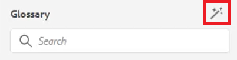

# 术语表

“术语表”面板允许对地图进行解析。 您可以创建词汇表主题文件，并将其包含在通用词汇表映射中。 然后，可将此映射添加到其他映射。 使用词汇表更容易一致地表述信息，并使读者更清晰明了。

您可选择用于本课程的示例文件在文件[glossary.zip](assets/glossary.zip)中提供。

>[!VIDEO](https://video.tv.adobe.com/v/342765?quality=12&learn=on)

## 在主题中添加术语表条目

1. 导航到&#x200B;**词汇表**&#x200B;面板。

1. 将条目从&#x200B;**术语表**&#x200B;面板拖放到您主题中的所需位置。

如果映射包含词汇表条目且配置正确，则主题会自动更新以包含缩写表单。

## 指定根映射

要正确使用术语表，必须选择正确的根映射。 根映射找到术语表条目时，它们将显示在“术语表”面板中。

1. 打开主题后，从左侧面板中选择&#x200B;**词汇表**。

1. 单击顶部工具栏上的&#x200B;[!UICONTROL **用户首选项**]&#x200B;图标。

   

1. 单击键图标以指定使用术语表的正确根映射。

1. 单击&#x200B;[!UICONTROL **选择**]。

1. 单击&#x200B;[!UICONTROL **保存**]。

“术语表”面板会自动更新。

## 使用术语表

1. 导航到&#x200B;**存储库视图**。

1. 选择已预配置为使用术语表的映射。

   

1. 选择&#x200B;[!UICONTROL **映射视图**]。

1. 验证映射视图是否显示所需的主题。

## 预览注释

由于可以进行批量更改，因此预览光泽度可能很重要。

1. 从左侧面板中选择&#x200B;**词汇表**。

1. 单击glossentry旁边的上下文菜单，然后选择&#x200B;[!UICONTROL **预览**]。

缩写表单和术语定义都会显示。

## 查看热点工具设置

使用热点工具从单个映射创建完整的术语表条目集合。 您甚至可以搜索特定的文本术语并将其转换为链接的术语表缩写。

1. 从“术语表”面板中，选择&#x200B;[!UICONTROL **热点图标**]。

   

1. 单击&#x200B;[!UICONTROL **词汇表键**]&#x200B;下拉列表，并只选择要应用的键。

1. 单击&#x200B;[!UICONTROL **主题**]&#x200B;下拉列表以选择应受影响的内容。

1. 单击&#x200B;[!UICONTROL **按状态筛选主题**]&#x200B;下拉菜单以查看配置的选项。

1. 根据需要配置其余设置。

1. 完成后，单击&#x200B;[!UICONTROL **转换**]。

词汇表面板现在显示所有更新的主题以及有错误的主题。
