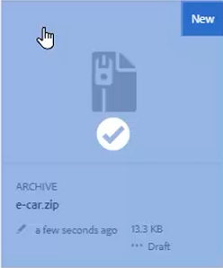
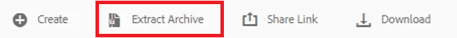
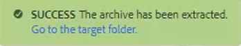
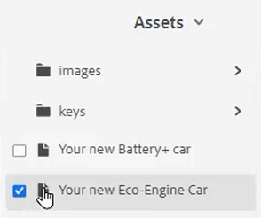
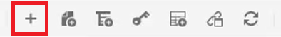

# 键

不同的材料集可能包含类似的信息，需要在特定位置进行定制。 键允许您在使用DITA时包含变量信息。

您可以选择用于本课程的示例文件在文件[keys.zip](assets/keys.zip)中提供。

>[!VIDEO](https://video.tv.adobe.com/v/342756?quality=12&learn=on)

## 启用键

1. 上传提供的示例文件集。

   答： 加载zip文件。

   b. 刷新AEM环境。

   c. 选择要提取的文件。

   

   d. 单击顶部工具栏中的&#x200B;[!UICONTROL **提取存档**]。

   

   e. 在对话框中，选择要提取文件的特定位置，例如名为“键”的文件夹。

   f. 单击&#x200B;[!UICONTROL **下一步**]。

   g. 跳过任何冲突，因为以前从未上传过的内容不存在这些冲突。

   h. 选择屏幕右上方的&#x200B;[!UICONTROL **提取**]。

1. 提取完成后，单击&#x200B;[!UICONTROL **转到目标文件夹**]。

   

## 将键解析为引用的值

要正确使用密钥，用户首选项必须将特定映射引用为根映射。 此映射内部是键的集合，这些键在主题组中分组在一起。 打开映射和主题将键解析为此映射引用的值。

1. 指定根映射。

   答： 在“键”屏幕中，打开一个映射。

   b. 配置用户首选项。

   c. 单击顶部工具栏上的&#x200B;[!UICONTROL **用户首选项**]&#x200B;图标。

   

   d. 单击键图标以指定将用于解析键的&#x200B;**根映射**。

   e. 选中任何所需的Assets对应的复选框。

   

   f. 单击&#x200B;[!UICONTROL **选择**]。

   g. **保存**&#x200B;用户首选项。

1. 导航到&#x200B;**映射视图**。

1. 打开指定的映射。

键已解析。

## 手动添加新键盘

1. 使用指定的根映射打开映射。

1. 选择一个键。

   

1. 插入新键盘。

   答： 在地图中的有效位置单击。

   b. 选择顶部工具栏上的&#x200B;**Keydef**&#x200B;图标。

   

   c. 在“插入Keydef”对话框中，为要创建的定义输入唯一的Keys值。

   d. 单击&#x200B;[!UICONTROL **插入**]。

1. 在keydef中添加topicmeta。

   答： 单击顶部工具栏上的&#x200B;[!UICONTROL **插入元素**]&#x200B;图标。

   

   b. 在“插入元素”对话框中，搜索并选择“topicmeta”。

1. 在topicmeta中添加关键字。

   答： 单击顶部工具栏上的&#x200B;[!UICONTROL **插入元素**]&#x200B;图标。

   

   b. 在插入元素对话框中，搜索并选择“关键字”。

1. 在topicmeta中添加关键字。

   答： 单击顶部工具栏上的&#x200B;[!UICONTROL **插入元素**]&#x200B;图标。

   

   b. 在&#x200B;**插入元素**&#x200B;对话框中，搜索并选择“关键字”

1. 在关键字中键入keydef的值。

在地图中，您的keydef现在应如下所示：

## 将keydef配置为代码片段

片段是小型内容片段，可在文档项目的各种主题中重复使用。 您可以配置单个密钥作为代码片段，而不是手动生成每个密钥文件。

1. 在映射中选择keydef元素。

1. 在上下文菜单中，单击&#x200B;[!UICONTROL **创建代码片段**]。

1. 在新代码片段对话框中，添加标题和描述。
您可能还希望从内容中删除现有的键或关键字定义。

1. 单击&#x200B;[!UICONTROL **创建**]。

1. 在左侧面板上，选择&#x200B;**代码片段**。

1. 将您刚刚创建的代码片段从“代码片段”面板拖放到地图中。

1. 根据需要使用内容属性更新keydef。
保存并刷新后，此组密钥将可供已定义包含相同根映射的映射的任何用户使用。
