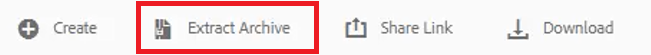
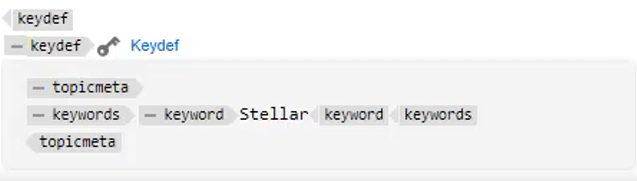

# 键

不同的材料集可能包含需要在选定位置中自定义的类似信息。 使用键，可在使用DITA时包含的变量信息。

文件中提供了您可以选择用于本课程的示例文件 [keys.zip](assets/keys.zip).

>[!VIDEO](https://video.tv.adobe.com/v/342756?quality=12&learn=on)

## 启用键

1. 上载提供的示例文件集。

   a.加载zip文件。

   b.刷新AEM环境。

   c.选择要提取的文件。

   

   d.单击 [!UICONTROL **提取存档**] 中。

   

   e.在对话框中，选择要提取文件的特定位置，如名为“键值”的文件夹。

   f.单击 [!UICONTROL **下一个**].

   g.跳过任何冲突，因为以前从未上传的内容不存在这些冲突。

   h.选择 [!UICONTROL **Extract**] 中。

2. 提取完成后，单击 [!UICONTROL **转到目标文件夹**].

   

## 将键解析为引用值

要正确使用键，用户首选项必须引用特定映射作为根映射。 在此映射中是键值集合，这些键值在主题组中分组在一起。 打开映射和主题会将键值解析为此映射引用的值。

1. 指定根映射。

   a.从键屏幕中，打开映射。

   b.配置用户首选项。

   c.单击 [!UICONTROL **用户首选项**] 图标。

   

   d.单击键图标可指定 **根映射** 用于解析密钥。

   e.选中任何所需资产对应的复选框。

   

   f.单击 [!UICONTROL **选择**].

   g. **保存** 用户首选项。

2. 导航到 **映射视图**.

3. 打开指定的映射。

密钥已解析。

## 手动添加新密钥定义

1. 打开具有指定根映射的映射。

2. 选择键。

   

3. 插入新密钥定义。

   a.在映射中的有效位置单击。

   b.选择 **Keydef** 图标。

   

   c.在“插入键定义”对话框中，为键输入唯一值，该值对您创建的定义有意义。

   d.单击 [!UICONTROL **插入**].

4. 在keydef中添加topicmeta。

   a.单击 [!UICONTROL **插入元素**] 图标。

   

   b.在“插入元素”对话框中，搜索并选择“topicmeta”。

5. 在topicmeta中添加关键词。

   a.单击 [!UICONTROL **插入元素**] 图标。

   

   b.在插入元素对话框中，搜索并选择“关键词”。

6. 在topicmeta中添加关键词。

   a.单击 [!UICONTROL **插入元素**] 图标。

   

   b.在 **插入元素** 对话框，搜索并选择“关键词”

7. 在关键字中键入keydef的值。

在图中，您的keydef现在应如下所示：

## 将keydef配置为代码片段

片段是小内容片段，可在文档项目的各种主题中重复使用。 您可以将单个keydef配置为代码片段，而不是手动生成每个keydef。

1. 在映射中选择一个keydef元素。

2. 在上下文菜单中，单击 [!UICONTROL **创建代码片段**].

3. 在“新建代码片段”对话框中，添加标题和描述。
您也可能希望从内容中删除现有键或关键字定义。

4. 单击&#x200B;[!UICONTROL **创建**]。

5. 在左侧面板中，选择 **代码片段**.

6. 将您刚刚创建的代码片段从“代码片段”面板拖放到映射中。

7. 使用内容属性，根据需要更新密钥定义。
保存和刷新后，此组键值将可供任何定义了包含相同根映射的映射的用户使用。
