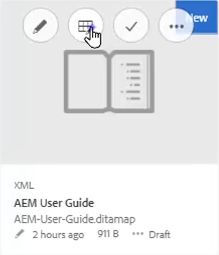
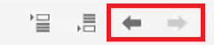

# 地图和书签图

Adobe Experience Manager指南的映射编辑器允许您创建和编辑映射文件。 使用映射编辑器，您可以编辑两种类型的文件 — DITA映射和书签映射。 就我们的目的而言，将这些概念视为基本上可互换的概念。
地图编辑器有两种模式：基本地图编辑器和高级地图编辑器。

>[!VIDEO](https://video.tv.adobe.com/v/342766)

## 创建映射

AEM指南提供了两个现成的映射模板 — DITA映射和书签映射。 您还可以创建自己的映射模板，并将这些模板与作者共享以创建映射文件。

执行以下步骤以创建映射文件。

1. 在资产UI中，导航到要创建映射文件的位置。

2. 单击 [!UICONTROL **创建> DITA映射**].

3. 在Blueprint页面上，选择要使用的映射模板类型，然后单击 [!UICONTROL **下一个**].

4. 在“属性”页面上，输入 **标题** 和 **名称** 地图。

5. 单击&#x200B;[!UICONTROL **创建**]。

## 使用高级映射编辑器打开映射

1. 在 **资产UI**，选择要编辑的映射。

2. 单击 [!UICONTROL **编辑主题**].

   

或者

1. 将鼠标悬停在地图图标上。

2. 选择 **编辑主题** 从 **操作** 菜单。

## 向映射或书签添加内容

1. 导航到 **存储库视图**.

2. 将存储库视图中的内容拖放到映射或书签中的有效位置。

或者

1. 在映射或书签映射中的有效位置单击。

2. 单击相应的 [!UICONTROL **工具栏图标**] 添加章节、主题或topicref。

   

3. 选择要添加的一个或多个资产。

4. 单击 [!UICONTROL **选择**].

### 提升或降低映射中的元素

使用 **工具栏箭头** 在地图或书本图中提升或降级章节和topicref。

1. 在映射中选择一个元素。

2. 单击 [!UICONTROL **向左箭头**] 将topicref提升到章节，或 [!UICONTROL **向右箭头**] 将章节降级为topicref。

   

3. 保存并版本映射（如果需要）。

或者

1. 拖放元素以重新组织它们。

## 将元数据添加到映射

1. 从 **映射工具栏**，插入主题组。

   

2. 单击 [!UICONTROL **加号图标**] 插入元素。

3. 选择要插入的元素。

   

4. 单击&#x200B;[!UICONTROL **关闭**]。

## 向映射中添加可靠项

在构建映射后，可以添加可重复项。

1. 在要插入该可靠项的映射中单击。

2. 使用 **工具栏图标** 向映射中添加可变元素。

   

3. 配置对话框。

4. 单击 [!UICONTROL **插入**].

5. 拖放 **存储库** 到可变的。

6. 使用标准键盘快捷键，将映射中的所需元素复制并粘贴到可变元素中。

## 在映射中为topicref分配属性

1. 突出显示映射中topicref的topicref或嵌套集合。

2. 在“内容属性”面板的“其他属性”下，选择 **属性** 和 **值。**

   
