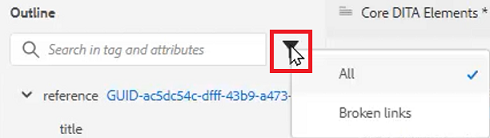

# 大纲视图

在处理结构化文档时，“大纲视图”提供了广泛的支持。 展开和折叠视图、导航结构、使用属性（例如创建新ID），以及在单击按钮时重新组织、取消包装和重构元素。

>[!VIDEO](https://video.tv.adobe.com/v/342767)

## 展开和折叠大纲视图

可以根据需要展开元素以显示子元素或折叠元素。

1. 单击相应的图标可展开或折叠“大纲视图”。

   

   

大纲视图切换为展开或折叠。

## 使用大纲视图导航

1. 单击任何元素以跳转到该位置。

2. 单击 [!UICONTROL **省略号**] 访问快捷方式选项。

   

## 使用大纲视图分配ID

可以根据系统配置自动生成新ID。 使用内容属性，还可以根据需要更新ID及其值。

1. 单击 [!UICONTROL **省略号**] 的子菜单。

2. 选择 **生成ID**.

   

已分配ID。 此时会显示内容属性更新以及元素和属性信息。

## 使用拖放功能重新组织元素

可以在大纲视图中对元素进行重新排序。

1. 单击并将元素拖到“大纲视图”中的其他位置。

2. 将元素拖放到其他元素的顶部以替换它。 此操作由要替换的元素周围的方框表示。

   或者

   将元素拖放到其他两个元素之间以更改其位置。 此操作由将放置新元素的元素之间的一行表示。

## 重命名元素

1. 选择元素。

2. 单击 [!UICONTROL **省略号**].

3. 选择 **重命名元素**.

   

4. 双击新元素名称。

元素现已重命名。

## 取消元素换行

1. 选择要取消换行的元素。

2. 单击 [!UICONTROL **省略号**].

3. 选择 [!UICONTROL **取消换行元素**].

内容仍会保留，但结构已被删除。

## 使用大纲视图过滤内容

1. 单击 [!UICONTROL **过滤器**] 图标。

   

2. 选择 **全部** 显示所有元素或 **断开的链接** 以查找和修复损坏的引用。

## 使用大纲视图搜索

可以限制搜索并根据元素、属性或值返回结果。

1. 键入要在搜索栏中查找的元素名称。

   

2. 选择与您的需求最相关的结果。
