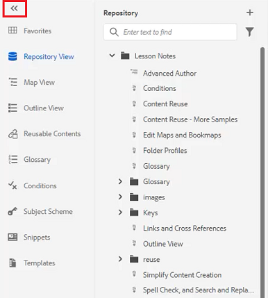
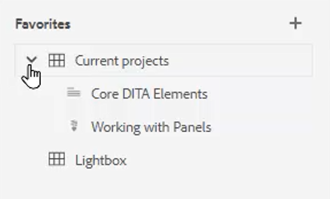
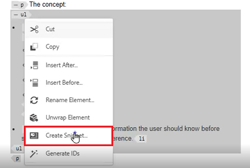
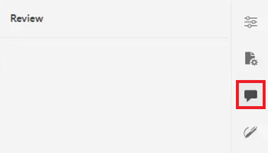

# 面板

AEM指南Web编辑器分为多个部分，包括主工具栏、辅助工具栏、左侧面板、内容编辑区域和右侧面板。

>[!VIDEO](https://video.tv.adobe.com/v/342760)

## 调整左侧面板的大小

永久性面板（如左侧面板）的大小可调。

1. 将光标放在面板边框上。

2. 出现双向箭头时，根据需要单击并向内或向外拖动。

## 展开或折叠左侧面板侧栏

展开的视图显示折叠视图中显示为工具提示的名称和图标。

1. 单击 [!UICONTROL **侧栏**] 图标以展开面板。

   

2. 单击 [!UICONTROL **侧栏**] 图标来折叠面板。

   

## 创建收藏集

在左侧面板中，“收藏夹”允许您创建特定文档的列表并随时间向其添加。 您可以创建和管理收藏集的广泛集合。

1. 选择 **收藏夹** 中。

2. 单击 [!UICONTROL **加号**] 图标。

   

3. 在新建收藏集对话框中，输入 **标题** 和 **描述**.

   请注意，选择“公共”意味着其他用户可以看到此收藏。

4. 单击&#x200B;[!UICONTROL **创建**]。

您现在已创建收藏集。

## 从存储库将文件添加到收藏集

创建收藏集后，您可以开始向其添加收藏集。

1. 选择 **存储库视图** 中。

2. 单击 [!UICONTROL **省略号**] 位于用于访问上下文选项的主题旁边。

3. 选择 **添加到** > **收藏夹**.

4. 在添加到收藏夹对话框中，选择 **新建收藏集** 或 **现有收藏集**.

   在此，我们将选择添加到现有收藏集。

   

5. 如果需要，请从下拉菜单中选择一个收藏集。

6. 单击&#x200B;[!UICONTROL **添加**]。

该主题会添加到您选择的收藏集中。 您可以在“收藏夹”菜单中查看。

## 从编辑器将文件添加到收藏集

向收藏夹添加主题的另一种方法是在编辑器中打开主题。

1. 导航到 **存储库视图**.

2. 双击某个主题以将其打开。

3. 右键单击文件的 **标题选项卡** ，以访问上下文选项。

4. 选择 **添加到** > **收藏夹**.

   

5. 在添加到收藏夹对话框中，选择 **新建收藏集** 或 **现有收藏集**.

   在此，我们将选择添加到新收藏集。

6. 在新建收藏集对话框中，输入 **标题** 和 **描述**.

   请注意，选择 **公共** 表示其他用户可以看到此收藏。

7. 单击&#x200B;[!UICONTROL **创建**]。

已创建新收藏集并对其进行分组。 您可以在“收藏夹”菜单中查看。

## 查看和管理您的收藏夹

您可以轻松查看已添加到收藏夹收藏集的主题。

1. 选择 [!UICONTROL **收藏夹**] 中。

2. 在“收藏夹”下，单击 [!UICONTROL **箭头**] 图标以查看其内容。

   

3. 单击 [!UICONTROL **省略号**] 在主题旁边以显示上下文选项，包括从“收藏夹”列表中将其删除的选项。

## 在存储库视图中过滤搜索

利用存储库中的增强过滤器，可搜索具有各种限制的文本。

1. 导航到 **存储库视图**.

2. 单击 [!UICONTROL **筛选搜索**] 图标。

   

3. 在所选路径中键入文本，或根据需要选择新路径。

   在过滤器中键入文本时，文件列表会随之发生更新。

4. 如果需要，单击搜索类别旁边的箭头图标可进一步缩小搜索范围。

   

可以将搜索范围缩小为DITA主题或DITA映射。 您可以在所选路径中搜索非DITA图像文件、多媒体或其他文档。 您甚至可以将搜索限制为DITA元素或按文件签出方式进行过滤。

## 浏览地图视图

映射视图中提供了一些有用的功能，包括签出和锁定文件、预览映射文件、打开映射功能板，以及在资产UI中查看映射。

请参阅标题为的课程 [地图和书签图](./maps-and-bookmaps.md) 在本课程中，了解有关地图视图及其功能的更多信息。

## 浏览大纲视图

“大纲视图”提供大纲中当前文档的分层视图。 您可以展开“大纲视图”以显示多个元素以及任何分配的ID。

请参阅标题为的课程 [大纲视图](./outline-view.md) 在本课程中，了解有关大纲视图及其功能的详细信息。

## 使用可重用内容

核心DITA功能是能够重复使用内容，从小短语到整个主题或映射。 编辑器提供了一个用于内容重用的拖放界面。

请参阅标题为的课程 [内容重用](./content-reuse.md) 在本课程中，了解有关可重用内容以及如何有效管理内容的更多信息。

## 使用术语表

使用术语表，可以更轻松地以一致的方式提供短语信息，并使读者更加清晰。 编辑器提供了一个拖放界面，用于将术语插入主题。

请参阅标题为的课程 [术语表](./glossary.md) 在本课程中，了解有关配置和使用术语表的更多信息。

## 使用条件

在DITA中，条件通常通过使用属性（如产品、平台和受众）来驱动，这些属性可以分配特定值给它们。 条件通过文件夹配置文件进行管理。

请参阅标题为的课程 [条件](./conditions.md) 在本课程中，了解有关配置和使用条件属性的更多信息。

## 创建代码片段

片段是小内容片段，可重复使用作为内容或结构的起点。 使用代码片段可减少创建内容所需的时间，并提高材料的结构质量和一致性。

1. 在编辑器中打开主题。

2. 选择主题中的元素。

3. 单击元素中的辅助鼠标按钮。

4. 在结果菜单中，选择创建 [!UICONTROL **代码片段**].

   

5. 在“新建代码片段”对话框中，添加 **标题** 和 **描述**.

6. 根据需要编辑代码片段。

   请注意，如果内容中出现错误，上下文检查将会以可视方式通知您。

7. 单击&#x200B;[!UICONTROL **创建**]。

代码片段已添加到可用代码片段的列表中。 它已准备好被拖放到主题中的有效位置。

## 使用模板

使用“模板”面板，管理员可以轻松创建和管理供作者使用的模板。 默认情况下，模板分为“映射”和“主题类型”。

请参阅标题为 [文件夹配置文件](./folder-profiles.md) 和 [简单的内容创建工作流](simple-content-creation-workflows.md) 在本课程中，了解有关配置和应用模板的更多信息。

## 使用“查找并替换”搜索文件

编辑器中提供了两个“查找”和“替换”选项。 第一个允许在特定的开放主题中查找和替换功能，这与传统文字处理器非常相似。 第二个是查找和替换面板，用于搜索存储库中多个文件中的文本。

请参阅标题为的课程 [拼写检查和查找和替换](./spell-check.md)  在本课程中，了解有关“查找和替换”功能的更多信息。

## 更新内容属性

右侧面板上的内容属性包括有关当前选定元素的特定信息，例如“属性ID”和“值”。

1. 在中打开主题 **XML编辑器**.

2. 选择 **元素**.

   “内容属性”显示元素的当前类型和属性。

3. 键入新 **值** 的子菜单。

   

内容属性会在您对元素进行更改时动态更新。

## 使用文件属性向映射中添加主题

文件属性显示有关整个打开主题的其他信息。 其中某些信息由主题属性控制。 对其他材料（如“文档状态”）的修改可能取决于权限。

1. 在编辑器中打开主题。

2. 单击 [!UICONTROL  **文件属性**] 图标。

   

3. 设置 **文档状态** to **编辑**. 请注意，引用列表当前为空。

   

4. 关闭主题。

5. 选择 [!UICONTROL **存储库视图**] 中。

6. 打开地图。

   视图将更改为“映射视图”。

7. 单击 [!UICONTROL **编辑**] 图标。

   

8. 打开地图进行编辑后，切换回 **存储库视图**.

9. 将您正在处理的主题拖放到映射中。

10. 单击 [!UICONTROL **保存**] 图标。

主题将添加到映射中。 现在，当您打开主题并选中文件属性时，您可以看到引用已更新，以反映该主题在指定映射中使用。

## 创建审核任务

右侧面板包含启动审阅工作流的快捷方式。

1. 单击 [!UICONTROL **审阅**] 图标。

   

2. 单击 [!UICONTROL **创建审阅**].

   

3. 在创建审核任务对话框中，根据需要填充字段。

4. 单击&#x200B;[!UICONTROL **下一步**]。

将创建审核任务。

## 跟踪更改

通过能够跟踪更改，您可以大量控制哪些更改会保留在主题的一个版本中，而保留到下一个版本。 您可以使用右侧面板管理跟踪的更改。

请参阅标题为的课程 [跟踪更改](./track-changes.md) 在本课程中，了解有关更改跟踪功能的更多信息。
