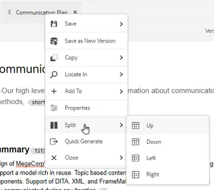

# 简单的内容创建工作流

AEM指南编辑器具有多个可简化内容创建工作流程的快捷键。 这些快捷键允许用户快速添加和修改图像、同时处理多个主题、更正错误、下载主题PDF，以及使用版本和标签。

>[!VIDEO](https://video.tv.adobe.com/v/342770?quality=12&learn=on)

## 添加图像

可以直接从本地驱动器添加图像。

1. 将图像直接拖放到主题中。 的 **上传资产** 对话框。

   

2. 将文件夹路径修改为所需的图像位置。

3. 将图像名称更改为代表其目的的名称。

4. 单击&#x200B;[!UICONTROL **上传**]。

## 修改图像

1. 通过拖放角来调整图像大小。

2. 通过拖放图像以将图像移动到主题中的其他位置。

3. 使用 **内容属性** ，用于修改图像

   - 比例

   - position

   - 对齐，或

   - 其他属性。

   

## 处理多个主题

在比较主题、在主题之间复制和粘贴或将内容从一个主题拖放到另一个主题时，拆分视图非常有用。

1. 打开两个或多个相关主题。

2. 单击一个文件的标题选项卡以打开上下文菜单。

3. 选择 [!UICONTROL **拆分**].

4. 选择 **Right**.

   

## 更正排版错误

1. 找到包含错误的单词或短语。

2. 按住 [!UICONTROL **Ctrl**].

3. 单击错误上的次鼠标按钮。

4. 选择正确的拼写。

已在主题文本中更正错误。

## 下载主题PDF

用户可能想要下载当前主题的PDF以标记或与他人共享。

1. 单击 [!UICONTROL **预览**] 中。

2. 单击 [!UICONTROL **PDF图标**] 在主题上方。 将显示一个对话框。

   

3. 填写以下任一项的信息 **转换名称** 或 **DITA-OT命令行参数** （如果需要）。 请注意，如果所有字段都留空，则仍会生成PDF。

4. 单击&#x200B;[!UICONTROL **下载**]。PDF生成。

5. 使用可用的图标配置、下载或共享PDF主题。

## 在存储库或映射中查找主题

1. 打开主题。

2. 单击“标题”选项卡上的鼠标辅助按钮。

3. 选择 **定位于**.

4. 选择 **存储库** 或 **地图** 跳转到所需的主题位置。

## 版本主题

1. 更改主题。

2. 保存主题。

3. 单击 **存储库** 图标。

   

4. 在对话框中，添加 **新版本的注释**.

   

5. 单击“[!UICONTROL **保存**]”。

版本号会更新。

## 加载版本标签

很难尝试仅基于版本号来跟踪主题的状态。 通过标签，可以更轻松地确定已进行多个修订的主题的确切状态。

1. 选择 **文件夹配置文件**.

2. 在文件夹配置文件中，配置XML编辑器。

   a.选择屏幕左上角的编辑。

   b.在“XML内容版本标签”下，添加新主题或使用现有主题。

   

3. 选择 [!UICONTROL **上传**].

4. 选择文件，如ReviewLabels.json或类似文件。 有关如何创建此类文件的详细信息，请参阅其他视频。

5. 单击 [!UICONTROL **打开**].

6. 单击 [!UICONTROL **保存**] 文件夹配置文件屏幕左上角的位置。

7. 单击 [!UICONTROL **关闭**] 在右上方。

版本标签现已加载。

## 分配版本标签

1. 加载版本标签。

2. 单击 [!UICONTROL **用户首选项**] 图标。

   

3. 选择之前加载版本标签的同一文件夹配置文件。

4. 在“用户首选项”对话框中，确保基本路径引用与文件夹配置文件应用到的信息相同。

   

5. 单击“[!UICONTROL **保存**]”。

6. 版本主题。

7. 添加评论并从下拉菜单中选择版本标签。

   

8. 单击“[!UICONTROL **保存**]”。

版本号会更新。

## 查看版本历史记录和标签

1. 从左侧面板中，找到当前主题标题。

2. 单击标题以打开上下文菜单。

3. 选择 [!UICONTROL **在资产UI中查看**].

   

   - 左侧将显示带有标签的版本历史记录。

   

4. 单击某个版本可访问以下选项 **还原到此版本** 和 **预览版本**.

## 创建新模板

主题和映射均存在模板。 管理员可以访问左侧面板中的模板。

1. 单击 [!UICONTROL **模板**] 中。

2. 选择映射或主题以打开关联的上下文菜单。

3. 单击以添加新模板。

   

4. 填充结果对话框中的字段。

将出现壳模板，其中包含示例内容和示例结构。
