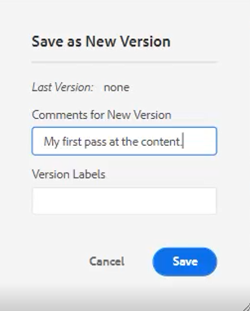
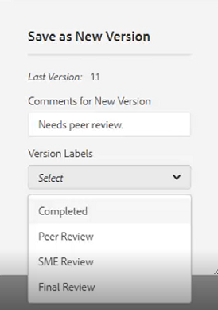

# 简单的内容创建工作流

AEM Guides编辑器具有多个快捷键，可简化内容创建工作流。 这些快捷方式允许用户快速添加和修改图像，同时处理多个主题，更正错误，下载主题PDF，以及处理版本和标签。

>[!VIDEO](https://video.tv.adobe.com/v/342770?quality=12&learn=on)

## 添加图像

可以直接从本地驱动器添加映像。

1. 将图像直接拖放到主题中。 出现&#x200B;**上传Assets**&#x200B;对话框。

   

1. 将文件夹路径修改到所需的图像位置。

1. 将图像名称更改为能够代表其用途的名称。

1. 单击&#x200B;[!UICONTROL **上传**]。

## 修改图像

1. 通过拖放角来调整图像大小。

1. 通过拖放将图像移动到主题中的另一个位置。

1. 使用右侧面板上的&#x200B;**内容属性**&#x200B;修改图像的

   - 缩放

   - position

   - 对齐方式，或

   - 其他属性。

   

## 使用多个主题

在比较主题、在主题之间复制和粘贴内容或将内容从一个主题拖放到另一个主题时，拆分视图会很有帮助。

1. 打开两个或多个相关主题。

1. 单击一个文件的标题选项卡以打开上下文菜单。

1. 选择&#x200B;[!UICONTROL **拆分**]。

1. 选择&#x200B;**右**。

   

## 更正拼写错误

1. 找到包含错误的词或短语。

1. 按住&#x200B;[!UICONTROL **Ctrl**]。

1. 单击错误的次鼠标按钮。

1. 选择正确的拼写。

已在主题文本中更正了错误。

## 下载主题PDF

用户可能希望下载当前主题的PDF以标记或与其他人共享。

1. 单击屏幕右上方的&#x200B;[!UICONTROL **预览**]。

1. 单击主题上方的&#x200B;[!UICONTROL **PDF图标**]。 出现一个对话框。

   

1. 填写&#x200B;**转换名称**&#x200B;或&#x200B;**DITA-OT命令行参数**&#x200B;的信息（如果需要）。 请注意，如果将所有字段留空，仍会生成PDF。

1. 单击&#x200B;[!UICONTROL **下载**]。 PDF生成。

1. 使用可用图标配置、下载或共享PDF主题。

## 在存储库或地图中查找主题

1. 打开主题。

1. 在“Title（标题）”选项卡上单击鼠标辅助按键。

1. 选择&#x200B;**在**&#x200B;中定位。

1. 选择&#x200B;**存储库**&#x200B;或&#x200B;**映射**&#x200B;以跳转到所需的主题位置。

## 版本主题

1. 更改主题。

1. 保存主题。

1. 单击左上角菜单中的&#x200B;**存储库**&#x200B;图标。

   

1. 在对话框中，为新版本&#x200B;**添加**&#x200B;注释。

   

1. 单击&#x200B;[!UICONTROL **保存**]。

版本号将更新。

## 加载版本标签

尝试仅根据版本号跟踪主题的状态可能会很困难。 利用标签，可以更轻松地识别经过多次修订的主题的确切状态。

1. 选择&#x200B;**文件夹配置文件**。

1. 在文件夹配置文件中，配置XML编辑器。

   a.选择屏幕左上方的编辑。

   b.在“XML内容版本标签”下，添加新主题或使用现有主题。

   

1. 选择&#x200B;[!UICONTROL **上传**]。

1. 选择一个文件，如ReviewLabels.json或类似文件。 另一段视频介绍了有关如何创建此类文件的详细信息。

1. 单击&#x200B;[!UICONTROL **打开**]。

1. 单击“文件夹配置文件”屏幕左上角的&#x200B;[!UICONTROL **保存**]。

1. 单击右上方的&#x200B;[!UICONTROL **关闭**]。

现在已加载版本标签。

## 分配版本标签

1. 加载版本标签。

1. 单击当前主题左上角的&#x200B;[!UICONTROL **用户首选项**]&#x200B;图标。

   

1. 选择先前加载版本标签的同一文件夹配置文件。

1. 在“用户首选项”对话框中，确保“基本路径”引用与“文件夹配置文件”已应用到的相同信息。

   

1. 单击&#x200B;[!UICONTROL **保存**]。

1. 对主题进行版本控制。

1. 添加注释并从下拉列表中选择版本标签。

   

1. 单击&#x200B;[!UICONTROL **保存**]。

版本号将更新。

## 查看版本历史记录和标签

1. 从左侧面板中，找到当前主题标题。

1. 单击标题以打开上下文菜单。

1. 选择&#x200B;[!UICONTROL **在Assets UI中查看**]。

   

   - 带有标签的版本历史记录显示在左侧。

   

1. 单击某个版本可访问选项，如&#x200B;**还原到此版本**&#x200B;和&#x200B;**预览版本**。

## 创建新模板

主题和地图都存在模板。 管理员可以在左侧面板中访问模板。

1. 单击左侧面板中的&#x200B;[!UICONTROL **模板**]。

1. 选择“映射”或“主题”以打开关联的上下文菜单。

1. 单击以添加新模板。

   

1. 填充生成的对话框中的字段。

此时将显示包含示例内容和示例结构的外壳模板。
