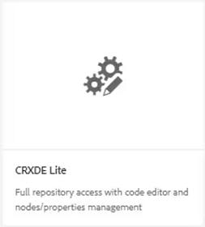
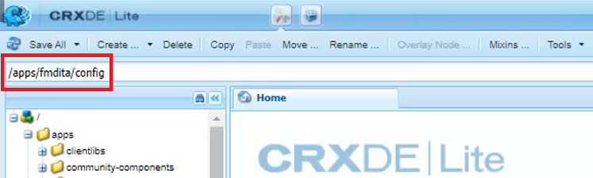
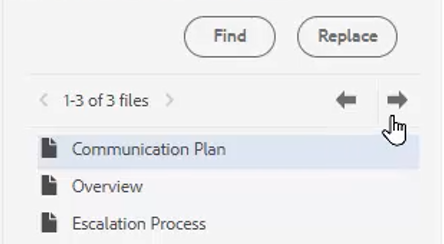

# 拼写检查和查找/替换

AEM Guides编辑器具有强大的拼写检查和查找与替换功能。

>[!VIDEO](https://video.tv.adobe.com/v/342768?quality=12&learn=on)

更正拼写错误

1. 在打开的主题中查找错误，该主题显示红色下划线。

1. 按住Ctrl并单击文字中的鼠标次键。

1. 从建议中选择正确的拼写。

如果没有建议使用正确的拼写，您始终可以手动编辑该字。

## 切换到AEM拼写检查

您可能需要使用除浏览器默认词典之外的拼写检查工具。

1. 导航到&#x200B;**编辑器设置**。

1. 选择&#x200B;**常规**&#x200B;设置选项卡。

   

1. 有两个选项：

   - **浏览器拼写检查** — 拼写检查的默认设置使用浏览器的内置词典。

   - **AEM拼写检查** — 使用此项通过AEM的自定义词典生成自定义词列表。

1. 选择&#x200B;**AEM拼写检查**。

1. 单击&#x200B;[!UICONTROL **保存**]。

配置自定义字典

管理员可以更改设置，以便AEM词典识别自定义单词，如公司名称。

1. 导航到&#x200B;**工具**&#x200B;窗格。

1. 登录到&#x200B;**CRXDE Lite**。

   

1. 导航到&#x200B;**_/apps/fmdita/config节点_**。

   

1. 创建新文件。

   a.右键单击配置文件夹。

   b.选择&#x200B;**创建>创建文件**。

   

   c.命名文件&#x200B;_**user_dictionary.txt**_。

   

   d.单击&#x200B;[!UICONTROL **确定**]。

1. 打开文件。

1. 添加要包含在自定义词典中的单词列表。

1. 单击&#x200B;[!UICONTROL **全部保存**]。

1. 关闭文件。

作者可能需要重新启动Web编辑器会话才能在AEM词典中获取更新的自定义词列表。

## 在单个文件中查找和替换

1. 单击顶部工具栏上的查找和替换图标。

   

1. 在底部工具栏中，键入一个单词或短语。

1. 单击&#x200B;[!UICONTROL **查找**]。

1. 如果需要，键入一个单词以替换找到的单词。

1. 单击&#x200B;[!UICONTROL **替换**]。

## 在存储库中查找和替换

1. 导航到&#x200B;**存储库**。

1. 单击屏幕左下角的&#x200B;[!UICONTROL **查找和替换**]&#x200B;图标。

1. 单击&#x200B;[!UICONTROL **显示设置**]&#x200B;图标。

1. 选择

   - **在替换之前签出文件** — 如果管理员启用了此功能，则在替换搜索词之前将自动签出该文件。

   - **仅限全字** — 将搜索限制为仅返回输入的确切单词或短语。

   

1. 单击&#x200B;[!UICONTROL **应用筛选器**]&#x200B;图标以选择存储库中要执行搜索的路径。

1. 输入要查找和替换的术语。

1. 如果需要，请选择&#x200B;**替换后创建新版本**。

1. 单击&#x200B;[!UICONTROL **查找**]。

1. 打开所需的文件，并使用箭头从一个找到的结果导航到下一个结果。

   
