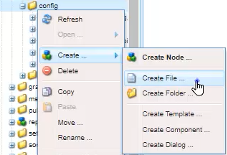

# 拼写检查和查找/替换

AEM Guides编辑器具有强大的拼写检查和查找及替换功能。

>[!VIDEO](https://video.tv.adobe.com/v/342768?quality=12&learn=on)

更正拼写错误

1. 在打开的主题中找到错误，该主题显示红色下划线。

1. 按住Ctrl并单击文字中的鼠标辅助按钮。

1. 从建议中选择正确的拼写。

如果不建议使用正确的拼写，您始终可以手动编辑该字。

## 切换到AEM拼写检查

您可能需要使用除浏览器默认词典之外的拼写检查工具。

1. 导航到 **编辑器设置**.

1. 选择 **常规** “设置”选项卡。

   

1. 有两种选项：

   - **浏览器拼写检查**  — 其中拼写检查的默认设置使用浏览器的内置词典。

   - **AEM拼写检查**  — 使用它通过AEM自定义词典构建自定义单词列表。

1. 选择 **AEM拼写检查**.

1. 单击“[!UICONTROL **保存**]”。

配置自定义词典

管理员可以更改设置，以便AEM词典识别自定义单词，如公司名称。

1. 导航到 **工具** 窗格。

1. 登录 **CRXDE Lite**.

   

1. 导航到 **_/apps/fmdita/config节点_**.

   

1. 创建新文件。

   a.右键单击配置文件夹。

   b.选择 **“创建”>“创建文件”**.

   

   c.为文件命名 _**user_dictionary.txt**_.

   

   d.单击 [!UICONTROL **确定**].

1. 打开文件。

1. 添加要包含在自定义词典中的单词列表。

1. 单击 [!UICONTROL **全部保存**].

1. 关闭文件。

作者可能需要重新启动其Web编辑器会话，才能在AEM词典中获取更新的自定义单词列表。

## 在单个文件中查找和替换

1. 单击顶部工具栏上的查找和替换图标。

   

1. 在底部工具栏中，键入一个单词或短语。

1. 单击 [!UICONTROL **查找**].

1. 如果需要，键入一个单词以替换找到的单词。

1. 单击 [!UICONTROL **Replace**].

## 在存储库中查找和替换

1. 导航到 **存储库**.

1. 单击 [!UICONTROL **查找和替换**] 图标（位于屏幕左下方）。

1. 单击 [!UICONTROL **显示设置**] 图标。

1. 选择以下任一选项

   - **替换前签出文件**  — 如果由管理员启用，则在替换搜索词之前将自动签出文件。

   - **仅全字**  — 将搜索限制为仅返回输入的确切单词或短语。

   

1. 单击 [!UICONTROL **应用筛选器**] 图标，以选择要在存储库中执行搜索的路径。

1. 输入要查找和替换的术语。

1. 如果需要，请选择 **替换后创建新版本**.

1. 单击 [!UICONTROL **查找**].

1. 打开所需的文件，并使用箭头从一个找到的结果导航到下一个结果。

   
