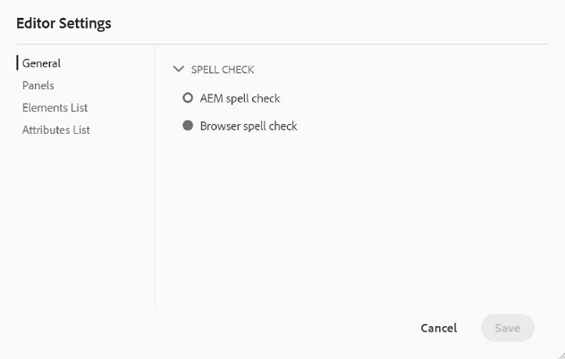

# 拼写检查和查找/替换

AEM指南编辑器具有强大的拼写检查和查找和替换功能。

>[!VIDEO](https://video.tv.adobe.com/v/342768)

更正拼写错误

1. 在打开的主题中找到错误，该主题中显示有红色下划线。

2. 按住Ctrl并单击单词内的鼠标辅助按钮。

3. 从建议中选择正确的拼写。

如果不建议正确拼写，您始终可以手动编辑单词。

## 切换到AEM拼写检查

您可能希望使用浏览器默认词典以外的拼写检查工具。

1. 导航到 **编辑器设置**.

2. 选择 **常规** 设置选项卡。

   

3. 有两个选项：

   - **浏览器拼写检查**  — 拼写检查使用浏览器内置词典的默认设置。

   - **AEM拼写检查**  — 使用它使用AEM自定义词典构建自定义词列表。

4. 选择 **AEM拼写检查**.

5. 单击&#x200B;[!UICONTROL **保存**]。

配置自定义字典

管理员可以更改设置，以便AEM词典可识别自定义词语，如公司名称。

1. 导航到 **工具** 中。

2. 登录到 **CRXDE Lite**.

   

3. 导航到 **_/apps/fmdita/config节点_**.

   

4. 创建新文件。

   a.右键单击配置文件夹。

   b.选择 **创建>创建文件**.

   

   c.命名文件 _**user_dictionary.txt**_.

   

   d.单击 [!UICONTROL **确定**].

5. 打开文件。

6. 添加要包含在自定义词典中的词语列表。

7. 单击 [!UICONTROL **全部保存**].

8. 关闭文件。

作者可能需要重新启动其Web编辑器会话，以在AEM词典中获取更新的自定义词列表。

## 在单个文件中查找并替换

1. 单击顶部工具栏上的查找和替换图标。

   

2. 在底部工具栏中，键入一个单词或短语。

3. 单击 [!UICONTROL **查找**].

4. 如果需要，请键入一个词来替换找到的词。

5. 单击 [!UICONTROL **替换**].

## 在整个存储库中查找和替换

1. 导航到 **存储库**.

2. 单击 [!UICONTROL **查找和替换**] 图标。

3. 单击 [!UICONTROL **显示设置**] 图标。

4. 选择

   - **替换前签出文件**  — 如果管理员启用了，则在替换搜索词之前会自动签出文件。

   - **仅全字**  — 限制搜索仅返回输入的确切字词或短语。

   

5. 单击 [!UICONTROL **应用过滤器**] 图标，以选择要在存储库中执行搜索的路径。

6. 输入“查找并替换”的术语。

7. 如果需要，请选择 **替换后创建新版本**.

8. 单击 [!UICONTROL **查找**].

9. 打开所需的文件，然后使用箭头从一个找到的结果导航到下一个结果。

   
