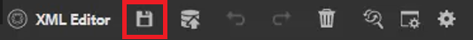

# 跟踪更改

您可以通过启用“跟踪更改”模式来跟踪文档上所做的所有更新。 通过此模式，您和您的团队可以捕获文档审阅过程中的所有插入和删除内容。

>[!VIDEO](https://video.tv.adobe.com/v/342763)

## 使用“跟踪更改”功能

1. 切换 **跟踪更改** 工具栏图标来启用（或禁用）该功能。

   

2. 更改主题。

   添加了内容，该内容现在以绿色显示并带有更改栏。 删除的内容以红色显示，并带有删除线。

3. 选择 **跟踪的更改** 图标。

   

4. 单击&#x200B;[!UICONTROL **保存**]。

   

5. 关闭主题。

其他用户现在可以打开主题并查看现有的跟踪更改。 他们可以接受或拒绝更改并添加自己的更改。

## 搜索跟踪的更改

当存在许多跟踪的更改时，搜索功能会很有帮助，因为滚动浏览这些更改会非常耗时。

1. 选择 **跟踪的更改** 图标。

2. 在“搜索”字段中键入单词或短语。
搜索会返回与搜索词匹配的任何更改。

## 过滤跟踪的更改

也可以按插入、删除或审阅人过滤多个跟踪的更改。

1. 单击 [!UICONTROL **过滤器**] 图标。

2. 选中所需过滤器对应的复选框。

   

3. 单击 [!UICONTROL **应用**].

## 接受或拒绝跟踪的更改

审阅人和主题专家可以单独或同时接受或拒绝其他用户的更改。

1. 单击 [!UICONTROL **跟踪的更改**] 图标。

2. 选择特定更改。

3. 单击 [!UICONTROL **Humbs Up**] 或 [!UICONTROL **拇指朝下**] 与更改关联的图标以接受或拒绝它。

   

   或者

   单击 [!UICONTROL **Humbs Up**] 或 [!UICONTROL **拇指朝下**] 图标以接受或拒绝所有更改。

   

4. [!UICONTROL **保存**] 主题。

## 使用合并功能

在多作者环境中工作时，可能很难跟踪其他作者在主题或映射中所做的更改。 “合并”功能不仅允许您查看更改，还允许您更好地控制哪些更改会保留在文档的最新版本中。

1. 在Web编辑器中打开一个主题。

2. 单击 [!UICONTROL **合并**] 图标。

   

3. 在“合并”对话框中，选择要与当前版本的文件进行比较的文件版本。

4. 从选项中，选择：

   - **跟踪选定版本中的更改**:此选项以跟踪更改的形式显示所有内容更新。 然后，您可以选择一次接受或拒绝文档中的更改，或一次全接受或拒绝文档中的更改。

   - **还原到所选版本**:此选项会将文档的当前版本还原为所选版本。 它不会让您对接受或拒绝的内容拥有任何控制权。

5. 单击&#x200B;[!UICONTROL **完成**]。

如果您选择了 **“跟踪所选版本的更改”选项**，则选定版本的所有更改都会显示在右侧面板的更改选项卡中。
