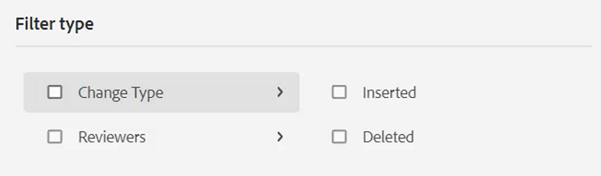

# 跟踪更改

通过启用“跟踪更改”模式，您可以跟踪对文档所做的所有更新。 此模式允许您和您的团队在文档审阅过程中捕获所有插入和删除。

>[!VIDEO](https://video.tv.adobe.com/v/342763?quality=12&learn=on)

## 使用跟踪更改功能

1. 切换&#x200B;**跟踪更改**&#x200B;工具栏图标以启用（或禁用）该功能。

   

1. 对主题进行更改。

   添加的内容现在以绿色显示，带有更改栏。 已删除的内容以红色显示，并带有删除线。

1. 选择右侧的&#x200B;**跟踪的更改**&#x200B;图标以访问跟踪的更改面板。

   

1. 单击&#x200B;[!UICONTROL **保存**]。

   

1. 关闭主题。

其他用户现在可以打开主题并查看现有的跟踪更改。 他们可以接受或拒绝更改并添加自己的更改。

## 搜索跟踪的更改

当存在许多跟踪的更改时，搜索功能会很有用，因为滚动浏览这些更改可能很耗时。

1. 选择右侧的&#x200B;**跟踪的更改**&#x200B;图标以访问跟踪的更改面板。

1. 在“搜索”字段中键入单词或短语。
搜索将返回与搜索词匹配的任何更改。

## 筛选跟踪的更改

此外，还可以通过插入、删除或审核者来筛选多个跟踪的更改。

1. 单击“跟踪的更改”面板底部的&#x200B;[!UICONTROL **筛选器**]&#x200B;图标。

1. 选中所需过滤器对应的复选框。

   

1. 单击&#x200B;[!UICONTROL **应用**]。

## 接受或拒绝跟踪的更改

审阅人和主题专家可以一次单独或全部接受或拒绝其他用户的更改。

1. 单击右侧的&#x200B;[!UICONTROL **跟踪的更改**]&#x200B;图标以访问跟踪的更改面板。

1. 选择特定更改。

1. 单击与更改关联的&#x200B;[!UICONTROL **向上缩略图**]&#x200B;或&#x200B;[!UICONTROL **向下缩略图**]&#x200B;图标以接受或拒绝更改。

   

   或者

   单击搜索栏上方的&#x200B;[!UICONTROL **向上缩略图**]&#x200B;或&#x200B;[!UICONTROL **向下缩略图**]&#x200B;图标以接受或拒绝所有更改。

   

1. [!UICONTROL **保存**]&#x200B;主题。

## 使用合并特征

在多作者环境中工作时，可能很难跟踪其他作者在主题或地图中所做的更改。 “合并”功能不仅让您能够更好地控制变更的查看，而且还可以控制哪些变更保留在文档的最新版本中。

1. 在Web编辑器中打开一个主题。

1. 单击工具栏上的&#x200B;[!UICONTROL **合并**]&#x200B;图标。

   

1. 在“合并”对话框中，选择要与文件的当前版本进行比较的文件版本。

1. 从“选项”中选择：

   - **跟踪选定版本中的更改**：此选项以跟踪更改的形式显示所有内容更新。 然后，您可以选择一次接受或拒绝文档中的更改，或者一次全部接受或拒绝文档中的更改。

   - **还原到所选版本**：此选项将文档的当前版本还原到所选版本。 它不能让您控制接受或拒绝什么内容。

1. 单击&#x200B;[!UICONTROL **完成**]。

如果您选择了&#x200B;**从所选版本跟踪更改选项**，则从所选版本进行的所有更改都会显示在右侧面板的“更改”选项卡中。
