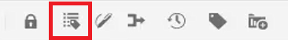
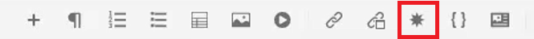
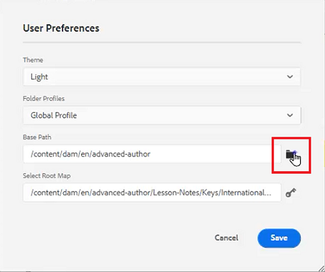
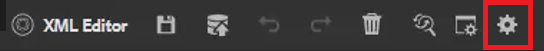

# 用户首选项、编辑器设置和编辑器工具栏

编辑器具有高度可配置的界面。 用户偏好设置、编辑器设置和文件夹配置文件的混合意味着您可以针对特定的工作环境自定义几乎每个方面。

>[!VIDEO](https://video.tv.adobe.com/v/342769?quality=12&learn=on)

## 显示或隐藏元素标记

标记是指示元素边界的可视提示。 元素边界标记元素的开始和结束。 然后，您可以使用这些边界作为视觉提示来放置插入点或选取边界内的文本。

1. 单击辅助工具栏上的&#x200B;[!UICONTROL **切换标记视图**]&#x200B;图标。

   

   标记显示在主题中。 使用“标记视图”，您可以：

   - 通过单击开始或结束标记来选择元素的内容。

   - 单击标记中的+或 — 符号可展开或折叠标记。

   - 使用上下文菜单剪切、复制或粘贴选定的元素。

   - 通过选择标记并将元素拖放到有效位置来拖放元素。

1. 再次单击&#x200B;[!UICONTROL **切换标记视图**]&#x200B;图标可隐藏标记。

标记消失，允许您专注于文本。

## 使用时锁定资源

锁定（或签出）文件为用户提供了对该文件的独占写入权限。 当文件被解锁（或签入）时，更改将保存在文件的当前版本中。

1. 单击辅助工具栏上的&#x200B;[!UICONTROL **锁定**]&#x200B;图标。

   

   文件已签出，并且“存储库”中的文件名旁边会显示一个“锁定”图标。

1. 单击&#x200B;[!UICONTROL **解锁**]&#x200B;图标。

   

存储库将更新，显示文件已签入。

## 插入特殊字符

1. 单击辅助工具栏上的&#x200B;[!UICONTROL **插入特殊字符**]&#x200B;图标。

   

1. 在“插入特殊字符”对话框中，在搜索栏中键入字符的名称。

   或者，使用选择类别下拉菜单显示特定类别中的所有字符。

1. 选择所需的字符。

1. 单击&#x200B;[!UICONTROL **插入**]。

特殊字符会插入到文本中。

## 在“创作”、“Source”和“预览”模式之间切换

利用屏幕右上方的工具栏，可在视图之间切换。

- 选择&#x200B;**作者**&#x200B;查看您处理主题时的结构和内容。

- 选择&#x200B;**Source**&#x200B;以显示组成该主题的基础XML。

- 选择&#x200B;**预览**&#x200B;以显示用户在浏览器中查看主题时主题的显示方式。

## 使用用户首选项更改主题

您可以为编辑器选择浅色或深色主题。 使用浅色主题，工具栏和面板使用浅灰色背景。 工具栏和面板使用深色主题，使用黑色背景。 在这两个主题中，内容编辑区域都以白色背景显示。

1. 单击顶部工具栏上的&#x200B;[!UICONTROL **用户首选项**]&#x200B;图标。

   

1. 在“用户首选项”对话框中，单击&#x200B;[!UICONTROL **主题**]&#x200B;下拉列表。

1. 从可用选项中进行选择。

   

1. 单击&#x200B;[!UICONTROL **保存**]。

编辑器将更新以显示您的首选主题。

## 使用用户首选项更新基本路径

您可以更新基本路径，以便在启动编辑器后，“存储库视图”会立即显示特定位置的内容。 这减少了访问工作文件的时间。

1. 单击顶部工具栏上的&#x200B;[!UICONTROL **用户首选项**]&#x200B;图标。

   

1. 在“用户首选项”对话框中，单击“基本路径”旁边的&#x200B;[!UICONTROL **文件夹**]&#x200B;图标。

   

1. 在选择路径对话框中，单击特定文件夹旁边的复选框。

1. 单击&#x200B;[!UICONTROL **选择**]。

下次启动编辑器时，存储库将显示已在Base Path中指定的文件。

## 分配新的文件夹配置文件

“全局配置文件”是系统缺省设置。 管理员可创建其他文件夹配置文件以供选择。

1. 单击顶部工具栏上的&#x200B;[!UICONTROL **用户首选项**]&#x200B;图标。

   

1. 在“用户首选项”对话框中，单击&#x200B;[!UICONTROL **文件夹配置文件**]&#x200B;下拉列表。

   

1. 从可用选项中选择配置文件。

1. 单击&#x200B;[!UICONTROL **保存**]。

现在已分配新的文件夹配置文件。 它更改了左侧面板中的工具栏选项、视图模式以及条件和代码段。 它还可以更改内容在编辑器中的视觉外观。

## 使用编辑器设置更改字典

编辑器设置可供管理用户使用。 这些首选项允许您配置一系列设置，其中一个是编辑器用于拼写检查的字典。

1. 单击顶部工具栏上的&#x200B;[!UICONTROL **编辑器设置**]&#x200B;图标。

   

1. 在“编辑器设置”对话框中，单击&#x200B;[!UICONTROL **常规**]&#x200B;选项卡。

1. 选择要使用的词典。

1. 单击&#x200B;[!UICONTROL **保存**]。

字典将更新。 请注意，切换到AEM拼写检查允许您使用自定义单词列表。

## 显示和隐藏包含编辑器设置的面板

可以使用“编辑器设置”自定义的功能之一是“面板”。 更具体地说，您可以选择在编辑器中显示或隐藏哪些面板。

1. 单击顶部工具栏上的&#x200B;[!UICONTROL **编辑器设置**]&#x200B;图标。

   

1. 在“编辑器设置”对话框中，单击&#x200B;[!UICONTROL **面板**]&#x200B;选项卡。

1. 根据需要将可用面板切换为显示或隐藏。

   

1. 单击&#x200B;[!UICONTROL **保存**]。

现在，左侧面板配置为仅显示切换为“显示”的面板。

## 编辑器设置中的名称和标签元素

利用“元素列表”，可命名特定元素并为其分配更加人性化的标签。 元素名称应为DITA元素之一。 标签可以是任何字符串。

1. 单击顶部工具栏上的&#x200B;[!UICONTROL **编辑器设置**]&#x200B;图标。

   

1. 在“编辑器设置”对话框中，单击&#x200B;[!UICONTROL **元素列表**]&#x200B;选项卡。

1. 在相应的字段中键入&#x200B;**元素名称**&#x200B;和&#x200B;**标签**。

1. 单击&#x200B;[!UICONTROL **加号**]&#x200B;图标可向列表中添加更多元素。

   

1. 单击&#x200B;[!UICONTROL **保存**]。

您可以立即在编辑器的现有标记中看到对元素列表所做的更改。 您还可以在添加新元素时提供的选项中查看它们。

## 编辑器设置中的名称和标签属性

“属性”列表的工作方式与“元素”列表类似。 在“编辑器设置”中，您可以控制“属性列表”及其显示名称。

1. 单击顶部工具栏上的&#x200B;[!UICONTROL **编辑器设置**]&#x200B;图标。

   

1. 在“编辑器设置”对话框中，单击&#x200B;[!UICONTROL **属性列表**]&#x200B;选项卡。

1. 在各自的字段中键入&#x200B;**属性名称**&#x200B;和&#x200B;**标签**。

1. 单击&#x200B;[!UICONTROL **加号**]&#x200B;图标可向列表中添加更多属性。

## 在编辑器设置中配置条件

利用Condition选项卡，可配置多个属性。

1. 单击顶部工具栏上的&#x200B;[!UICONTROL **编辑器设置**]&#x200B;图标。

   

1. 在“编辑器设置”对话框中，单击&#x200B;[!UICONTROL **条件**]&#x200B;选项卡。

1. 选中要应用的条件的复选框。

   

1. 单击&#x200B;[!UICONTROL **保存**]。

## 在编辑器设置中创建发布配置文件

Publish配置文件可用于发布知识库。 例如，Salesforce使用带有使用者密钥和使用者密钥的配置应用程序。 此信息可用于创建Salesforce发布配置文件。

1. 单击顶部工具栏上的&#x200B;[!UICONTROL **编辑器设置**]&#x200B;图标。

   

1. 在“编辑器设置”对话框中，单击&#x200B;[!UICONTROL **配置文件**]&#x200B;选项卡。

1. 单击配置文件旁边的&#x200B;[!UICONTROL **加号**]&#x200B;图标。

1. 根据需要填充字段。

1. 单击&#x200B;[!UICONTROL **保存**]。

已创建发布配置文件。
