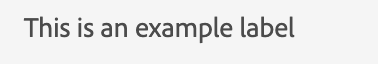

# 标签

要显示任何文本或字符串，我们使用组件label。
JUI中的标签组件表示html `<label/>`.

以下是添加静态标签的示例

```js title="staticLabel.js"
const staticLabelJSON =  {
    "component": "label", //tells the component name
    "label": "This is an example label", // the string to be displayed
}
```

以下JSON显示一个动态字符串：

```js title="dynamicLabel.js"
const labelJSON =  {
    "component": "label", //tells the component name
    "label": "@name", // the variable storing the text to be displayed
},
```

呈现的标签将如下所示：

