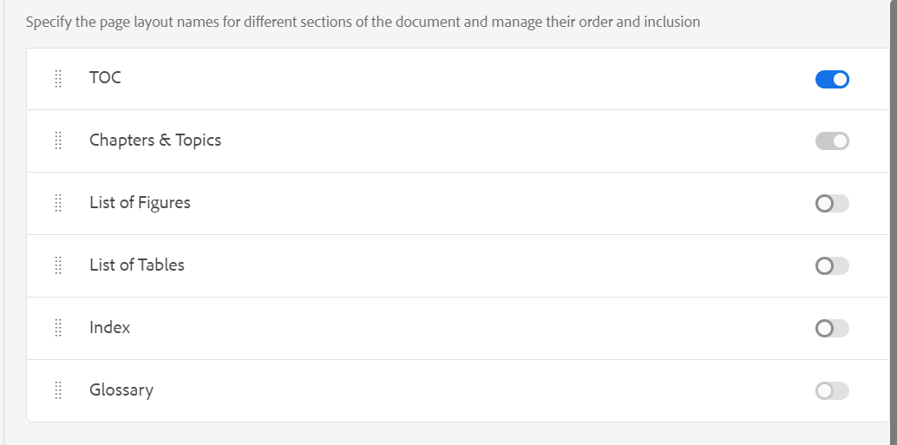

# PDF模板的组件 {#components-pdf-template}

PDF模板包含四个组件：页面布局、样式表、资源和设置。 可通过自定义这些单独的组件并在生成PDF输出时将模板与输出预设相关联来创建模板。 以下部分详细介绍了这些组件及其自定义过程。

## 创建和自定义页面布局 {#create-customize-page-layout}

通过“页面布局”组件中的设置，您可以通过定义页面上的页眉、页脚和内容区域来设计页面的结构。 使用WYSIWYG页面布局编辑器，您可以为PDF中的不同部分创建页面布局，例如正面和背面封面、章节、目录(TOC)、索引、空白页、正面重要页、背面重要页、插图列表(LOF)、表列表(LOT)、术语表，或者为自定义页面创建布局。 在PDF模板设置中，您可以分配一个页面布局，其中包含PDF内的不同部分，然后使用这些部分生成PDF输出。

### 创建新页面布局 {#create-page-layout}

>[!NOTE]
>
>有一些现成的示例页面布局。 您可以自定义这些页面布局或创建新页面布局。

1. 在Web编辑器中，转到 **输出** 选项卡。
1. 展开左侧边栏并单击 **模板**.
1. 打开要使用的模板。

   >[!NOTE]
   >
   >您可以双击模板名称或单击模板名称旁边的>图标来打开模板。

1. 要创建新页面布局，请执行下列操作之一：

   * 将鼠标悬停在 **页面布局** ，然后单击(*选项* 图标) **...** 并选择 **新页面布局**.

   * 在 **模板** 面板中，单击 **+** 图标旁边 **模板** 并选择 **页面布局** 从上下文菜单中。

     这将打开 **添加布局** 对话框。

     

1. 指定新页面布局的名称。
   >[!NOTE]
   >
   >在命名页面布局时，请避免使用任何特殊字符。 名称中的空格会被下划线“_”替换。

1. 单击&#x200B;**完成**。

   新布局随即会创建并添加到“页面布局”下。

### 复制页面布局 {#duplicate-page-layout}

1. 在 **模板** 要复制的模板部分，双击  **页面布局** 或单击 **>** 图标之前 **页面布局**.

   这会显示模板中的页面布局列表。

1. 将鼠标悬停在要复制的页面布局上，然后单击(*选项* 图标) **...** 并选择 **复制** 从上下文菜单中。

1. 在 _复制布局_ 对话框，输入页面布局的名称。

1. 单击&#x200B;**完成**。将创建所选页面布局的副本，并将其添加到“页面布局”下。

### 自定义页面布局 {#customize-page-layout}

1. 在 **模板** 要编辑的模板部分，双击 **页面布局** 或单击 **>** 图标之前 **页面布局**.

   这会显示模板中的页面布局列表。
1. 要自定义任何页面布局，请执行下列操作之一：
   * 双击任何页面布局。
   * 将鼠标悬停在任何页面布局上，然后单击(*选项* 图标) **...** 并选择 **编辑** 从上下文菜单中。

   这将打开页面布局编辑器以进行自定义。
1. 完成所需的更改后，单击 *全部保存* (或 `Crl+S`)。

   有关定义单个布局元素（如页眉、页脚、页码、标题等）的更多信息，请参阅 [设计页面布局](design-page-layout.md).

## 使用样式表自定义PDF {#stylesheet-customization}

样式表组件中的设置允许您使用WYSIWYG编辑器设置页面布局组件和DITA内容的样式或直接处理CSS文件。 您可以创建自己的样式或自定义默认样式属性。 所见即所得编辑器允许您访问设置页面布局或DITA内容样式所需的大多数属性。 对于高级自定义，您可以直接在源视图中工作。

### 创建新样式表 {#create-stylesheet}

虽然为内容和布局提供了CSS文件，但您可以创建新样式表以将多个自定义应用于特定样式类型，然后可以将这些自定义应用于目标组件。 默认情况下，示例CSS文件捆绑在产品中。 这些CSS文件旨在帮助您跨内容和布局组织样式信息。 您可以选择将这些样式合并到一个CSS文件或多个文件中。

默认情况下，无论何时创建新页面布局， `layout.css` 文件包含在新的页面布局中。 如果您希望页面布局包含其他CSS文件中的样式，则只需将所需的CSS文件拖放到新页面布局的内容编辑区域上。 要验证CSS文件是否已嵌入页面布局中，请切换到源视图，您将在中找到指向CSS文件的链接 `<head>` 元素。

要创建样式表，请执行以下步骤：
1. 在 **模板** 执行下面操作之一：
   * 将鼠标悬停在 **样式表** 选项卡，然后单击(*选项* 图标) **...** 并选择 **新建样式表**.
   * 单击 **+** 图标旁边 **模板** 并选择 **样式表** 从上下文菜单中。

   这将打开添加样式表对话框。

   
1. 指定新样式表的名称。
1. 单击&#x200B;**完成**。

   将在“样式表”部分下创建并添加新的样式表。

### 创建新样式 {#create-style}

默认情况下，CSS文件包含标题、段落、字符、超链接、图像、表、div、页面和其他样式的样式。 可以覆盖默认样式格式或创建新样式。

通常，当要关联任何DITA元素的自定义样式时，将创建一个新样式。 要使此类自定义样式正常工作，必须确保将样式的类名与DITA元素的outputclass属性相关联。

要创建新样式，请执行以下步骤：
1. 右键单击任何样式，然后从上下文菜单中选择“新建样式”。

   这将打开“添加样式”对话框。

   
1. 在 **标记** 字段，选择要为其创建新样式的标记。
1. 指定 **类** 名称。

   此类名称必须与源内容中标记的outputclass属性关联。
1. 选择 **伪类** 用于增强元素的样式。
1. 单击&#x200B;**完成**。

   将在基本样式下创建并添加一个新样式。

### 自定义预定义样式或新样式 {#customize-style}

使用默认样式创建新的CSS文件或者希望自定义现有CSS文件中的样式后，可以使用样式编辑器执行此操作。

要自定义样式，请执行以下步骤：
1. 双击 **样式表** 或单击 **>** 图标之前 **样式表**.

   这会显示默认（内容和布局）和自定义CSS文件。
1. 打开样式表进行编辑。

   要打开样式表进行编辑，请执行下列操作之一：
   * 双击样式表名称。
   * 将鼠标悬停在样式表名称上并单击（“选项”图标）。..并选择“编辑”。

   这将打开样式表进行编辑，并在“样式”面板中显示样式列表。

   

1. 要自定义样式，请双击样式或单击样式前的>图标，以使用样式编辑器查看和自定义样式。

有关使用最常见样式的详细信息，请参阅 [使用常见的内容样式](stylesheet.md).

## 使用资源 {#work-with-resources}

这是用于设计模板的所有资产的容器。 您可以将其视为一个文件夹，其中包含背景图像、自定义字体、徽标等资产。 无论何时在模板中添加资源，都会将其上传或签入到资源文件夹。 然后，您可以使用这些资源来自定义或设计您的PDF模板。

要将资源文件添加到“资源”文件夹，请执行以下步骤：
1. 将鼠标悬停在“资源”文件夹选项卡上，单击（“选项”图标）。..并选择“导入”。

   这将打开上传资源对话框。

   

   上传资源文件的路径显示在 **选择资源文件夹** 字段。
   >[!NOTE]
   >
   >您无法更改上传资产的路径。 默认情况下，所有资产都存储在 `/content/dam/dita-templates/pdf/<PDF-template-name>` 文件夹。

1. 单击 **选择文件** 以从本地计算机浏览资源文件

1. 单击 **上传**.
选定的文件将导入并列在“资源”文件夹下。

## 高级PDF设置 {#advanced-pdf-settings}

使用“设置”部分可以配置PDF版面的高级设置，从奇数页或偶数页开始PDF，设置交叉引用的格式，以及允许在使用该模板生成的最终PDF中打印标记。

要配置，请单击 **设置** 在 **模板** 面板查看以下选项：

**常规**

设置从奇数页或偶数页开始章节的基本配置设置、目录结构，并定义目录条目的引线格式。 您可以定义以下设置：

* **从开始任何新章节**：用于定义如何在最终PDF中发布每个章节。 您可以从 **新页面**， **奇数页**， **偶数页**，或 **当前页面**  选项。 如果选择从奇数页开始新章节，则会在结束于奇数页的章节之后插入空白页。 例如，如果您的章节在页码15结束，则发布过程将插入一个空白16th 页面，以便新章节可以从17开始th 页面。  如果您选择 **当前页面** 选项，则所有章节都将连续发布，且不含任何分页符。 例如，如果章节结束于第15页的中间，则下一个章节也将从第15页本身开始。

* **从新页面开始每个主题**：如果您希望章节中的每个主题都从新页面开始，请选择 **从新页面开始每个主题** 选项。 如果要使主题继续显示而不出现任何页面间隙，请取消选择此选项。

* **目录结构**：用于自定义目录的层次结构。 它使用以下附加设置：

   * **使用最高级别的标题**：利用它可调整要在PDF的目录结构中显示的标题级别数量。
   * **不要在目录中显示第一级的页码**：选择此选项可隐藏包含嵌套或子主题的所有章节的相应页码。 请考虑以下示例，其中在不选择此选项的情况下创建输出。

  

  在上述示例中，“高级PDF设置”、“附录”和“法律”是第一级主题标题或章节标题。 页码将分配给所有这些标题。

  现在，如果选择此选项并生成输出，您将获得以下目录：

  

  在这里，您可以注意到第一个章节高级PDF设置未提供任何页码，因为它包含嵌套主题或子主题。 而页码（如果分配给“附录”和“法律”），因为它们是独立主题，没有任何子主题。

* **引线格式**：使用下拉菜单选择虚线、实线或空格引线，将标题级别连接到其相应的页码。
有关应用目录结构和样式标题级别的信息，请参阅 [添加章节目录](design-page-layout.md#add-chapter-toc).

  >[!NOTE]
  >
  >如果您是CSS开发人员，则也可以直接在CSS文件中定义引线格式。

* **使用表续接标记**：选择此选项可定义跨多个页面的长表的标记。 <!--For more information on using table continuation markers, see Use table continuation markers.-->

**页面布局**

通过“页面布局”设置，您可以完全控制指定要用于文档特定部分的页面布局。 例如，要为目录选择布局，请单击目录字段下的下拉菜单，然后选择您为生成目录而设计的布局。

请务必注意，书签映射设置优先于页面布局设置。

“页面布局”部分下提供了以下设置：

**默认页面布局**：选择用作PDF中所有页面的默认布局的页面布局。 这是基础页面布局，应用于尚未创建专用页面布局的那些部分或主题。

**不同部分的页面布局**：您可以使用PDF输出的以下部分映射页面布局。 如果您已经为相关部分设计了页面布局，请从下拉列表中选择它。 如果尚未为特定部分创建页面布局，则应用默认页面布局。

* **章节和主题**：您可以为章节和主题指定页面布局。 所选布局将应用于所有章节和主题。

* **目录**：如果您已设计目录页面布局，请选择 **目录** ，则文档中的所有TOC页面都将具有TOC页面布局。

* **图表列表和表列表**：您还可以指定图和表的页面布局。 所选布局将应用于所有插图和表格。

* **索引和术语表**：如果已设计“索引”页面布局，请将其映射到“索引”选项。 如果您有词汇表页面布局，则将其映射到词汇表选项。

* **前重要页和后重要页**：这些页面布局定义了书籍中前页或后页的重要页面样式。 如果您已经设计前文布局，请将其映射到 **头版重要页面** 选项。 当您从下拉菜单中选择前文布局时，前文布局将应用于前文中的所有主题。

  如果您已经设计了背面物质布局，请将其映射到 **后置重要页面** 选项。 从下拉菜单中选择后置内容布局时，后置内容布局将应用于后置内容中存在的所有主题。

  **头版重要页面** 还用作的后备布局 **目录**， **图表列表**&#x200B;和表列表。  同样， **后置重要页面** 还用作的后备布局 **索引** 和 **术语表** 版面。 如果您尚未为这些页面选择布局，则会应用选定的前置或后置重要页面布局。  如果您未选择正面或背面重要页面布局，则会对其应用默认页面布局。

* **空页面的页面布局**：您还可以为空页面指定页面布局。 所选布局将应用于所有空页面。 例如，如果您为所有空白页面设计了空白页面布局，则选择 **空白** ，则文档中的所有空白页面都将具有空白页面布局。

* **封面页和后页**：如果您设计了封面布局，则将其映射到 **封面** 选项。 同样，如果您有后页布局，则将其映射到 **后页** 选项。 如果尚未创建封面或背面页面布局，则应用默认页面布局。

有关页面布局的更多信息，请参阅 [设计页面布局](design-page-layout.md).

**页面顺序**

您可以在PDF中启用或禁用以下部分，还可以安排这些部分在最终PDF输出中的显示顺序：

* 目录
* 章节和主题
* 图表列表
* 表列表
* 索引
* 术语表

如果不想在PDF输出中显示特定部分，可以通过关闭切换开关来禁用该部分。

您还可以定义在PDF中生成这些不同部分的顺序。 要更改这些页面的默认顺序，请选择虚条以将页面布局拖放到所需位置。

>[!NOTE]
>
> 这些顺序和包含设置仅适用于DITA映射。 对于书图，这些设置不适用。 书签中的页面按照书签中各个部分的顺序显示。

您的PDF将按照您在此处对启用的页面布局进行整理的顺序包含这些布局。
**章节和主题** 布局始终处于启用状态并且 **术语表** 默认情况下始终禁用布局。 无法切换它们。

**打印**

配置打印生产设置以分配打印机标记、选择颜色模型并指定与PDF输出的打印相关的属性。

* **打印机标记**：为打印生产准备文档时，会在页面边界中添加打印机标记，以帮助在打印期间正确对齐、修剪和颜色选择。 通过选择打印机标记，扩展页面边界以容纳在打印期间被修剪的标记。 您可以选择在PDF输出中显示以下打印机标记：
   * **修剪标记**：选择选项以在修剪区域的每个角落处放置标记，以指示打印后需要修剪纸张的位置。
   * **出血标记**：选择以在出血框的每个角处放置一个标记，以指示扩展图像的修剪区域。
   * **注册标记**：选择此项可在裁切区域之外放置标记，以对齐彩色文档中的不同分色。
   * **颜色条**：选择以在修剪区域外添加一条颜色条，以保持颜色一致性和在打印时调整油墨密度。

  使用设置所选打印机标记的尺寸 **线条宽度**， **线条颜色**、和 **出血框宽度** 选项。

* **媒体盒大小**：这是总页面大小，包括打印机标记所占用的扩展区域。 使用下拉选项为PDF输出选择页面大小或创建自己的自定义大小。

* **色彩空间**：您可以选择使用RGB或CMYK色彩空间来打印PDF文档。 选择“RGB”以数字方式显示生成的PDF，选择CMYK进行物理打印。 文档中定义的颜色将转换为所选颜色空间。
  >[!NOTE]
  >
  >如果使用CMYK色彩空间，创建PDF/A时需要ICC色彩配置文件。

  <!--For more information on applying these print settings, see *Printing preferences*.-->

**交叉引用**

使用“交叉引用”选项卡定义如何在PDF中发布交叉引用。 您可以设置主题标题、表格、图表等的交叉引用的格式。 <!--For more information, see *Format cross-references*.-->
