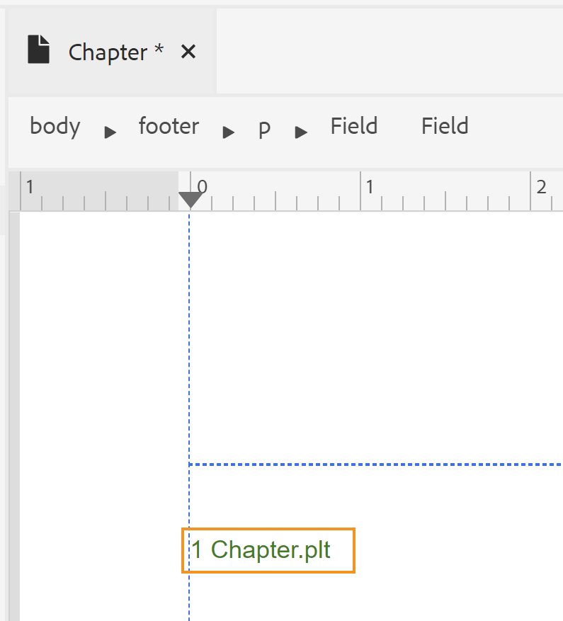
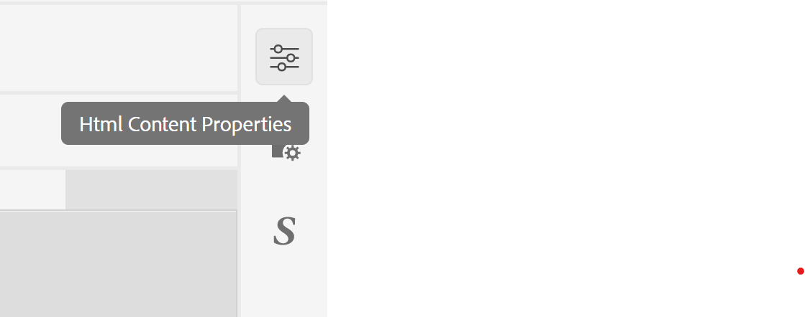
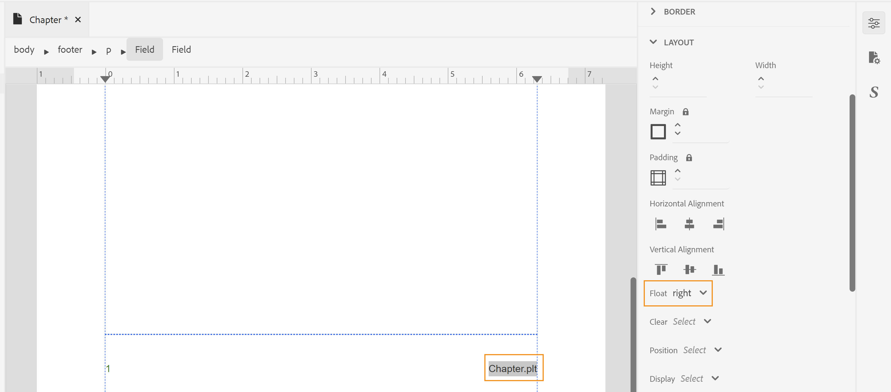
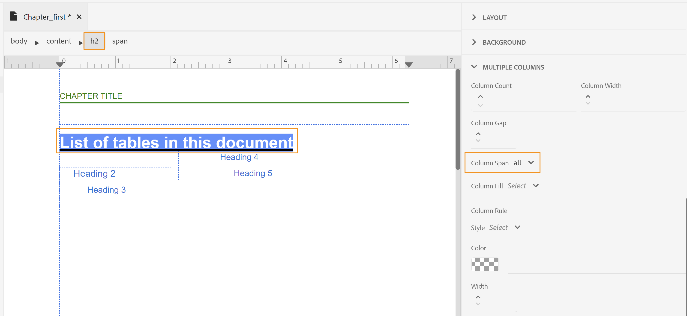

# 设计页面布局

在创建PDF文档时，您会有不同的部分来显示不同类型的信息。 例如，PDF文档将从头页或封面开始，该页面将包含您公司的徽标、书籍标题或版本信息。 然后会有章节、附录或术语表页面。 PDF文档中的每个部分看起来都不同，这是通过创建和自定义页面布局来实现的。

设计页面布局时，您可以定义构成页面的各种元素。 例如，您可以定义页面上的页面大小、边距、页眉和页脚、方向和其他页面规范。 本机PDF发布功能允许您根据CSS分页媒体标准设计页面。 使用本机PDF功能的用户界面，可以轻松自定义CSS分页媒体下涵盖的大多数设置。 对于某些其他高级格式，您可以使用“源”视图编写您自己的CSS代码。

设计页面布局后，您需要将这些布局与“PDF页面布局”设置中的相应部分相关联。 请参阅 _创建和自定义页面布局_ 部分以了解有关如何创建和打开页面布局以进行自定义的详细信息。

## 页面布局类型及其变体

PDF文档通常包含以下部分：

* 封面
* 目录
* 数字提升
* 表格提升度
* 章节或主题页面
* 术语表
* 索引
* 后页

这些部分需要相应的页面布局才能以特定格式显示信息。 此外，您还可以有一个空白页面，用作从奇数或偶数页面开始新章节的填充符。 在这种情况下，您将需要空白的页面布局。

位于 **模板>设置** 部分，用于定义要用于PDF不同部分的模板。 每个页面布局还可以具有不同的首页、右页或左页组合。 这些规则受 *CSS页面媒体* 标准。

## 创建第一个、右个或左个页面布局

通过具有不同的首页、右页或左页布局，可以进一步自定义PDF模板中的不同页面布局。 您可以使用页面布局设计器以不同方式设计这些页面。

> **注意**:如果您想为书籍中的某个部分设置单个页面布局，则无需创建“首页”、“右页”或“左页”布局。

创建页面布局时请考虑以下几点：

* 如果要对章节中的所有页面使用单个页面布局，则只能创建一个章节页面布局。
* 如果您想对书籍中各章的首页有不同的外观，则需要为各章创建首页布局。
* 如果您希望对书籍的每个左侧和右侧页面具有不同的外观，则需要为章节页面布局创建左侧和右侧变体。
* 如果希望章节从奇数或偶数页面开始，则需要创建空白页面布局。 此页面布局用于填充两个章节之间的间隙，以确保章节从所需的奇偶页面开始。

以下示例将指导您完成创建页面布局变体的过程：

1. 使用 *创建新页面布局* 程序。

   将在“页面布局”下创建并添加空白的章节页面布局。

   默认情况下，创建页面布局时，也会打开进行编辑。 以下屏幕截图显示一个空白（默认）的页面布局：

   

   默认情况下，会创建模板中的页眉、页脚和内容区域。 您可以使用用户界面中提供的工具、页面属性和内容属性轻松自定义这些区域。 对于高级配置，您可以使用“源”视图并添加自定义HTML和CSS代码。

1. 为章节页面布局创建变体：

   1. 将鼠标悬停在 **章节** 布局，然后单击 **选项** 以显示上下文菜单。

   1. 单击或将鼠标悬停在 **添加布局变体** 并选择要创建的所需页面布局（“首页”、“左页”或“右页”）。

   所选页面布局是使用基本章节布局的副本创建的。 这意味着，如果您在默认的章节页面布局中进行了任何更改，则变体页面布局中会复制相同的更改。

## 在页面布局中处理图像

根据您的要求，您可能需要添加一个图像，该图像显示在章节(PDF)输出的每个首页。 的 <u>**添加图像**</u> 页面布局编辑器中的工具用于在页面布局中插入图像。

例如，如果要在章节输出的“第一页”的标题区域插入图像，请执行以下步骤：

1. 打开所需的页面布局进行编辑。

   > **注意**:请参阅 _自定义页面布局_ 部分，用于打开页面布局进行自定义或编辑。

1. 单击编辑标题()图标将光标置于标题区域中。

1. 单击“Intert Image（惰性图像）”( ) 图标.

   此时会出现“选择路径”弹出窗口。

1. 浏览到图像位置，然后单击选择以将其插入标题区域。

   以下屏幕截图显示了在标题区域中添加的示例图像。

   

   插入图像后，您可以修改其属性以赋予其所需的外观。 更改页面布局中图像或任何其他元素外观的最简单方法是，使用“内容属性”面板进行更改。 请参阅 _使用“内容属性”面板_ 用于通过UI进行自定义的各种属性。

## 使用字段

当您想要插入一段预定义的信息时，字段非常有用。 例如，您可以在章节标题区域中包含“章节标题”字段，该字段在发布时将替换为实际的章节标题。

可以在页面布局中插入的字段类别如下：

* 日期
* 用时
* 主题标题
* 项目标题
* 页码
* 总页面数
* 章节标题
* 章节编号
* 元数据

每个字段类别都包含可插入字段信息的不同变体。 例如，日期字段可以具有不同的变体，如 `YYYY-MM-DD`, `MM/DD/YY`, `MM/DD/YYYY` 等等。

在以下示例中，我们将在页面布局的页脚区域插入一个页码和一个主题标题。

1. 打开所需的页面布局进行编辑。

   注意：请参阅 _自定义页面布局_ 部分，用于打开页面布局进行自定义或编辑。

1. 单击编辑页脚()图标将光标置于页脚区域。

1. 通过单击插入HTML元素插入段落元素  ，并从元素列表中选择“段落”。

1. 单击插入字段( )图标。

   此时会出现“字段”弹出窗口。

1. 选择 **页码** 类别， **default(1)** 页码格式，然后单击 **插入**.

   

   > **注意**:您还可以编辑所有字段的格式（默认格式除外）。 为此，请单击要编辑的格式旁边的编辑图标，进行更改，然后单击确定。

   默认的页码字段会插入到页面布局的页脚区域。

   

   顶部的痕迹导航列出了存储信息的元素。

1. 在页码字段后面输入空白，然后单击 **插入字段** 图标。

1. 选择 **主题标题** 类别， **Chapter.ptl** 标题格式，然后单击“插入”。

   的 `Chapter.ptl` 字段，该字段在发布时填充了主题标题，并会插入到页脚区域。 此时，页码和主题标题字段之间以空格分隔。

   

1. 要右对齐主题标题，请执行以下步骤：

   1. 单击痕迹导航上的字段元素以选择主题标题字段。

   1. 在右侧面板中，单击HTML内容属性。

      

   1. 展开 **布局** 属性部分，并设置 **浮动** 属性值为 **右**.

      

      主题标题字段与页脚的右侧对齐。

      

> **开发人员角：**  

如果您希望直接使用CSS和HTML代码，则还可以通过转到页面布局的“源”视图并在代码中进行更改来实现此目的。 以下代码片段显示了通过代码完成的相同页脚设置：

```md
…
<div data-region="footer">
	<p>
		<span data-field="page-number" data-format="default">1</span>
		<span data-field="title" data-format="default" style="float: right">Chapter.plt</span>
	</p>
</div>
…
```

## 添加章节目录

章节或迷你目录可作为读者快速了解章节内容的参考。 通常，在章节的开头处添加一个章节目录。 因此，如果要使用章节目录，则可以将其添加到主章节页面布局或章节的首页布局中。

在以下示例中，我们将在章节的第一页布局中插入一个章节目录：

1. 打开所需的页面布局进行编辑。

   注意：请参阅 _自定义页面布局_ 部分，用于打开页面布局进行自定义或编辑。

1. 将光标放在页面布局的内容区域中。
1. 单击章节目录() 图标.

   默认的章节目录会插入到内容区域中。

   

   > **注意**:默认章节目录包含标题1到4。 在本例中，标题1是章节标题本身。 因此，您可能不希望目录中再次显示章节标题，或者希望提高目录中所需标题的级别。 您可以通过更改属性来自定义目录。

1. 打开HTML内容属性面板以自定义目录标题级别。

   例如，如果您要从“标题2”开始，请将第一个下拉列表从2更改为开始。

   

   同样，如果您希望标题一直保持在5级，则将第二个下拉列表更改为5。 更新的目录将如下所示：

   

   > **注意**:最终发布的PDF将仅显示基于章节内容的目录条目。 如果章节中没有级别5标题，则不会在最终输出中显示该标题。

## 使用多列页面布局

多列页面布局在出版杂志或书籍索引中非常常见。 使用本机PDF发布功能，可轻松将文档拆分为多列。 使用不同的页面布局，您可以选择仅将特定部分保留为多列，而将其他部分保留为单列（或普通）布局。

要创建具有多列的页面布局，请执行以下步骤：

1. 打开所需的页面布局进行编辑。

   > **注意**:请参阅 _自定义页面布局_ 部分，用于打开页面布局进行自定义或编辑。

1. 由于多列布局应用于内容（不包括页眉和页脚区域），因此您需要在痕迹导航中选择内容元素。

   选择内容痕迹导航后，HTML内容属性面板将显示多列的属性。

   

1. 使用多列属性自定义多列页面布局：

   * **列计数：** 指定要划分页面的列数。 使用向上和向下箭头图标或输入一个数字来设置列数。

   * **列宽：** 在多列布局中指定列的宽度。 默认情况下，大小以像素(px)为单位进行设置，您还可以以pt、rem、em、%或单位来指定大小。

      >**注意：** 如果未指定大小，则会自动调整列的大小以适合给定的页面边距。

   * **列间隙** :指定各个列之间的间距。

   * **列范围** :如果您希望页面布局中的任何元素能够跨列显示，则需要使用此资产。 这是通过使用样式表修改所需元素的样式来实现的，有关详细信息，请参阅 _\&lt;section explaining=&quot;&quot; style=&quot;&quot; customization=&quot;&quot;>_.

   在页面布局中，如果希望某个文本显示在所有章节页面布局的第一页，则可以将其添加到章节页面布局的第一页变体。

   如以下示例所示，标题文本的“跨列”属性设置为“全部”。 这可确保即使文档是多列的，标题也会跨列。

   

   >[**重要信息**]：
   可以将“跨列”属性应用到任何DITA元素。

   * **列填充** :指定内容填充列的方式。 默认情况下，该值设置为“余额”，该余额将用相等的内容量填充每列。

   * **列规则** :如果要在列之间插入行，请使用此属性定义行样式或划线样式。 指定规则样式、颜色和宽度的值，以在列之间添加一条线。


## 将页面属性用于不同的页面方向**

在设计页面布局时，控制各种页面属性至关重要。 本机PDF功能封装“页面属性”面板下的所有主页属性。 “页面属性”面板提供了对以下部分下的各种属性的访问权限：

* **页面大小**:指定要用于页面布局的页面大小。 “页面大小”下拉列表允许您从15个以上的页面大小中进行选择。

* **方向**:指定用于页面布局的页面方向。 您可以从“纵向”或“横向”页面方向中进行选择。 请注意，您可以选择在页面布局中将不同的方向应用于不同的页面变体。 例如，您可以在第一页上设置纵向方向，在左页和右页布局上设置横向。

* **视图旋转**:指定页面上内容的布局视图或方向。 可以选择顺时针90度、逆时针90度或逆时针180度。 当您想在输出中使用纵向和横向布局的组合时，此选项非常有用。 例如，您可以使用纵向作为通用页面布局，并且可以设置用于捕获长表格的横向页面布局。 在这种情况下，您可以选择顺时针90度显示表内容。 这样，页面将以横向方向定向，内容将旋转90度以保持视图的连续性。 我们将在本节的后面部分作为示例来查看如何实现此目标。

* **重新开始编号**:指定此页面布局的编号将从中开始的页码。 例如，您可以为书籍的附录部分创建页面布局，并将编号设置为从1开始重新开始。

* **布局**:指定页边距以及上边距、下边距、左边距和右边距。

* **背景**:在页面布局中包含作为背景图像的图像。 您可以指定图像的高度和宽度以及重复和位置属性。

* **脚注**:指定要在输出中显示脚注的属性。 您可以选择指定边距和内边距属性以及边框样式。

让我们看一个示例，其中使用了纵向和横向页面方向以及视图旋转属性的组合。 在本例中，我们将创建一个默认纵向方向的PDF，但表格将以横向呈现，内容将以顺时针90度视图显示。 最终输出将类似于：


在以上输出中，联系人列表信息以横向模式显示，内容也旋转了90度。 其余内容以普通纵向模式显示。

要实现这种输出，需要完成以下主要任务：

1. 创建具有横向的页面布局。
1. 更改“视图旋转”属性，以顺时针方向90度渲染内容。
1. 创建自定义样式以使用新页面布局。
1. 在要在横向页面布局中呈现的表的输出定义中添加样式。

执行以下步骤以完成上述任务：

1. 创建具有横向的页面布局。
   1. 使用“创建新页面布局”步骤下给出的步骤创建“横向”页面布局。

   1. 在右侧面板中，单击 **页面属性**.

      
   1. 更改 **方向** to **横向**.

1. 更改“视图旋转”属性，以顺时针方向90度渲染内容。

   1. 选择 **顺时针90°** 从查看旋转下拉列表中。

   1. 单击 **全部保存** 以保存更新的页面布局属性。

1. 创建自定义样式以使用新页面布局。
   1. 展开左侧边栏，并双击要在其中创建样式的模板。

   1. 展开样式表部分。

   1. 将鼠标悬停在布局样式表上，然后单击&#x200B;_选项_ 图标) **...** 选择 **编辑**.

      将打开布局样式表进行编辑。

   1. 右键单击 **其他样式** 选择 **新样式**.

      

   1. 在 **添加样式** 弹出窗口，输入 `landscape-style` 在 **类** 名称字段。

      

   1. 单击&#x200B;**完成**。

      一种名为 `.landscape-style` 的末尾创建并添加 **其他样式** 列表。

   1. 双击 `.landscape-style` 样式进行编辑。

   1. 展开 **分页** 属性。

   1. 输入 `Landscape` 在 **页面布局** 属性。

      

1. 在要在横向页面布局中呈现的表的输出定义中添加样式。

   1. 在Web编辑器中，打开要应用新页面布局的文件。

   1. 查找 `<table>` 元素，以横向模式呈现。

   1. 在痕迹导航中，单击 `table` 元素来选择表。

      

   1. 在右侧面板中，单击并打开 **内容属性** 的上界。

   1. 在 **内容属性** 面板，添加新 `outputclass` 属性 `landscape-style` 作为属性值。

      

   1. 单击 **全部保存** 以保存更新的文件。

   1. 生成PDF输出。

最终PDF将以横向模式呈现表内容，如示例开头所示。

## 使用“内容属性”面板

通过“内容属性”面板，您可以轻松更新页面布局中元素的外观。 “内容属性”面板下的属性分为以下几部分：

>**注意**:有关这些属性用法的更多详细信息，请参阅W3C CSS页面媒体标准文档。

* **属性**:包含ID、类和转换属性。 如果将Translate属性设置为no，则该特定元素中的内容不会进行翻译。

* **字体**:包含与字体相关的属性。 您可以设置字体系列、粗细、大小、文本修饰（下划线、上线、直线）、文本样式（粗体、斜体等）、文本对齐（左、右、中或两端对齐）、处理空格（预定义格式、无换行、换行空格等）、行高、字母间距和文本缩进。

* **边框**:包含用于向页面布局中的元素添加边框并设置其格式的属性。 您可以设置“边框侧”（全部为上边框、下边框、右边框或左边框）、“边框样式”（实线、虚线、虚线等）、“边框颜色”、“宽度”和“半径”，以便具有弯曲的边框。 在以下示例中，在页面的标题区域中添加了一个弯曲的边框。

   

* **布局**:包含用于在页面布局中配置元素布局的属性。 您可以设置“高度”、“宽度”、“边距和内边距”（适用于顶部、底部、左侧或右侧）、“水平”或“垂直对齐”、“浮动”（适用于左、右、无）、“清除”（适用于左、右、两者或无）、元素的位置（作为绝对、固定、相对或更多）、“显示”（作为块、内容、修复或更多）、“Z索引”、“透明度”、“变换”（通过旋转或缩放）以及“变换原点”（按X和Y偏移）。

* **背景**:包含用于包含背景图像或颜色阴影的属性。 您可以设置“图像大小”（通过设置“高度”或“宽度”）、“背景重复”（作为重复、不重复、倒圆角或更多）和“背景位置”（作为左上、右中心、居中底部或更多）。

* **多列**:包含用于为页面或任何特定元素（如章节目录）配置多列属性的属性。 有关属性及其使用方式的更多详细信息，请参阅 _使用多列页面布局_.

