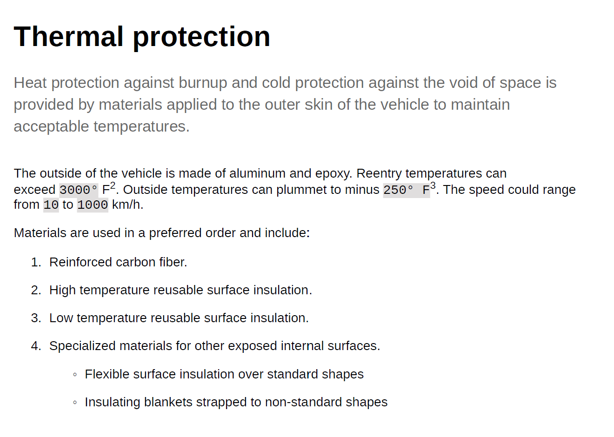

# 使用常用内容样式 {#work-with-common-styles}

样式表包含在PDF输出中使用的元素的样式定义。 您可以选择使用示例样式表或创建新样式表。 在大多数情况下，创建OOTB示例样式表副本将帮助您快速入门。

样式编辑器是WYSIWYG编辑器，可隐藏用户界面后面CSS代码的所有复杂情况。 使用样式编辑器，您可以轻松且非常快速地自定义所选元素的样式。 样式按以下标题分类：

* 标题样式
* 段落样式
* 字符样式
* 超链接样式
* 图像样式
* 列表样式
* 表样式
* Div样式
* 页面样式
* 其他样式

使用结构化DITA内容时，大多数DITA元素的样式映射都位于默认样式表中。 如果您使用标准DITA元素，则可以通过直接更改样式定义来更改其外观。 这些样式定义位于“其他样式”类别下。 有关更多详细信息，请参阅 [使用其他样式](#other-styles) 稍后在本主题中。

以下部分以示例形式介绍了最常用的样式设置。

>[!NOTE]
>
>在以下示例中，假定您正在使用随产品提供的示例样式表。

## 使用标题样式 {#heading-styles}

标题样式可封装内容中使用的标题的所有基本样式。 OOTB将为主题/章节和附录的标题标题提供6个基本标题样式和标题样式。 在结构化文档中，H1表示主题或章节的标题，H2到H6用于主题/章节中的子主题或章节。 每当找到相应的标题时，都会自动将此标题层次结构应用于您的内容。

>[!NOTE]
>
>您可以创建自己的自定义标题样式，并且可以使用输出类在内容中使用这些样式。 有关更多详细信息，请参阅 [使用页面方向和视图旋转](design-page-layout.md#page-orientation-rotation) 示例。

### 创建自定义章节级别标题 {#create-chapter-level-heading}

在书（或书籍图）中，您使用章节。 基本标题样式的设计方式是，无需进行任何自定义，即可将其应用于您的章节级别标题。 但是，如果要为内容创建专门的标题，则必须创建这些标题。 例如，默认 `h1.chapter` 标题。 如果您希望章节标题以不同的样式显示，则需要自定义 `h1.chapter` 样式。 同样，您也可以为章节中的子标题创建自定义样式。 例如，如果要为所有2个nd 和3rd 级别标题，则需要创建新样式作为 `h2.chatper` 和 `h3.chatper`.

由于“本机PDF发布”功能包含最常见的样式的基本样式定义，因此即使意外删除了样式，默认样式也会应用于内容。 例如，如果样式表中没有h2样式的样式定义，则“本机PDF发布”功能将对h2内容应用一些基本样式。

在本例中，我们将创建第2级章节标题样式：

1. 打开所需的样式表进行编辑。
   >[!NOTE]
   >
   >请参阅 [自定义预定义或新样式](components-pdf-template.md#customize-style) 用于打开样式表以进行自定义或编辑的部分。

1. 在 **样式** 列表中，展开 **标题样式**.
1. 右键单击 **标题样式** 样式和选择 **新样式**.
1. 在 *添加样式* 对话框，保留 **标记** 名称 `h2` 输入 `chapter` 在 **类** 名称字段。
1. 单击&#x200B;**完成**。

新标题样式名为 `h2.chapter` 将创建并添加到“标题样式”列表下。

创建样式后，可以使用样式编辑器自定义样式的所需属性。

### 创建自动编号标题 {#auto-number-heading}

最常用的输出样式之一是自动编号的标题。 这些标题表示章节编号、主题和子主题编号。 自动编号标题与为主题中的项目列表分配自动编号的列表样式不同。

在本例中，我们将自定义从1级到3级的标题，以使用不同格式的自动编号。

1. 打开所需的样式表进行编辑。

   >[!NOTE]
   >
   >请参阅 [自定义预定义或新样式](components-pdf-template.md#customize-style) 用于打开样式表以进行自定义或编辑的部分。

1. 在 **样式** 列表中，展开 **标题样式**.

1. 选择 **h1** 样式。
“属性”面板中显示h1样式的属性及其“预览”。

   >[!NOTE]
   >
   >通过“预览”面板，您可以实时查看应用于任何元素的任何样式更新。

1. 选择 **自动编号** 属性。

   可在自动编号列表中应用的样式显示在Autonumber属性下方。

1. 设置以下属性：
   * **样式**:从各种特定于区域设置或通用编号样式中进行选择。 您可以选择阿拉伯 — 印第语、梵文、格鲁吉亚语、小数、下字母等样式。 对于当前示例，选择 `upper-alpha`.

   * **格式**:默认格式设置为 `<x>`，其中 `x` 值将替换为您在“样式”属性中选择的编号样式。 例如，如果您已选择 `decimal` (1)样式，则 `x` 每个实例的自动递增量 `h1` 样式，以2、3等形式显示。 您还可以在字段中添加自定义文本以设置标题样式的格式。 例如，如果希望所有h1标题的前缀都为 `Chapter`，则需要将此字段设置为 `Chapter <x>`.

   * **插入字符**:如果要在“格式”中添加任何特殊字符，请单击“插入字符”() 图标. 选择要以样式格式添加的所需字符，然后单击“插入”。 您可以从“选择类别”下拉列表中选择不同类型的特殊字符。 例如，从标点类别中选择右指双角引号。

      

   * **起始编号**:如果希望从特定数字开始编号，请提供该值。 对于我们的示例，保留默认值1。

   * **缩进**:如果要缩进标题，则需要设置“缩进”值。 例如，将其设置为0 px。

      >[!NOTE]
      >
      >您可以以像素（像素）、pt（点）、rem、em、%（百分比）或（英寸）单位输入值。

   * **前缀宽度**:这是自动编号格式所占用的区域。 它会自动设置为可轻松适应所选样式格式的大小。 如果要增加大小，则可以替换默认值。

      手动设置此值时，请尝试更改对宽度产生影响的其他属性。 例如，更改字体大小、带前缀的格式（章节）或后缀(:)，在 *起始编号* 属性，以及各种字体属性，以获得最佳大小。

      例如，保留默认值。

   * **间距**:指定水平和垂直间距。 例如，保留默认值。

      通过上述自定义，可自定义样式，如下所示：

      

   * **将格式应用于**:自动编号类别下的属性将帮助您定义编号样式。 要对标题格式的编号样式或内容应用进一步的自定义设置，您可以在此字段中选择“编号”或“段落”。 如果选择“编号”，则对“字体”、“边框”、“布局”和其他类别所做的任何更改将仅应用于标题中的编号样式。 但是，如果选择“段落”，则更改将应用于标题内容，而不是编号样式。

   使用以下设置生成如下屏幕截图中所示的输出：

   |**标题样式**|**属性**|**值**|**其他评论**| | :- | :- | :- | :- | |h1|样式|小数|这些属性位于“自动编号”类别下 | ||格式|`Capter <x>:`|| ||前缀宽度|160 px|| ||字体>文本对齐|左|确保将格式设置为编号| |h2|样式|小数|这些属性位于“自动编号”类别下 | ||格式|`Section <x>:`|| ||前缀宽度|125 px|| ||字体>文本对齐|左|确保将格式设置为编号| |h3|样式|小数|这些属性位于“自动编号”类别下 | ||插入级别|2|| ||格式|`Section <2>.<x>:`|| ||前缀宽度|125 px|| ||字体>文本对齐|左|确保将格式设置为编号| ||

   

## 使用段落样式 {#paragraph-style}

可以创建段落样式以对整个段落应用特殊格式。 但是，使用伪类，可以仅将样式应用于文本的特定部分。 在以下示例中，我们将创建一个段落样式以使用首字下沉样式。

### 创建首字下沉样式 {#drop-cap-style}

在杂志和文学文档中，首字母（或首字母）的样式被使用，其中段落或部分的第一个字符被赋予一些特殊的样式。 使用本机PDF发布功能可以实现相同的效果。

在以下示例中，我们将创建一个首字下沉样式：

1. 打开所需的样式表进行编辑。

   >[!NOTE]
   请参阅 [自定义预定义或新样式](components-pdf-template.md#customize-style) 用于打开样式表以进行自定义或编辑的部分。

1. 在 **样式** 列表中，展开 **段落样式**.

1. 右键单击 **段落样式** 选择 **新样式**.

1. 在 *添加样式* 对话框，保留 **标记** 名称为p，在中为 **伪** **类** 字段，选择 `::first-letter`.

1. 单击&#x200B;**完成**。

   新的段落样式已命名 `::first-letter`  在下创建和添加 **段落样式** 列表。

1. 选择 `::first-letter` 在p样式下，并设置以下属性：

   * **字体**:为段落中的第一个字母设置所需的字体。 例如，将“字体系列”设置为草体，将字体粗细设置为500，将字体大小设置为30 pt，然后选择字体颜色。

   * **布局**:设置下拉帽样式周围文本的垂直对齐方式。 例如，我们将“垂直对齐”(Vertical Alignment)设置为“底部”(Bottom)。

作为 `p` 标记已映射 `
` 元素，您无需使用outputclass属性显式添加此样式。 内容中的任意位置a `
` 元素时，会自动对其应用首字下沉样式。 在以下屏幕截图中，章节标题、简短说明和定义列表元素未使用首字下沉样式进行格式设置。 只有段落样式使用首字下沉样式进行格式设置：

## 使用字符样式 {#char-style}

使用字符样式，您可以为内容中的字符或单词创建格式化样式。 例如，您可以为内联代码或文件名创建字符样式，也可以为选定内容创建使用多种样式格式的样式。

### 创建内联字符样式 {#inline-char-style}

在段落中设置内联字符或单词的格式非常常见。 创建内联样式的过程涉及两个任务 — 首先，在样式表中创建新样式，然后使用 `outputclass` 属性。

在以下示例中，我们将创建内联字符样式：

1. 打开所需的样式表进行编辑。

   >[!NOTE]
   请参阅 [自定义预定义或新样式](components-pdf-template.md#customize-style) 用于打开样式表以进行自定义或编辑的部分。

1. 在 **样式** 列表中，展开 **字符样式**.

1. 右键单击 **字符样式** 选择 **新样式**.

1. 在“添加样式”对话框中，将 **标记** 名称为span ，然后输入 `BoldItalic` 在 **类** 名称字段。

   

1. 单击&#x200B;**完成**。

   将在“字符样式”列表下创建并添加名为代码的新字符样式。

1. 选择 `span.BoldItalic` 从 **字符样式** ，并设置以下属性：

   * **字体**:可通过此部分自定义所有与字体相关的属性。 默认情况下，有些字体与产品捆绑在一起。 您可以为字符样式选择所需的字体。 在本例中，将“字体系列”设置为 *衬线，* 选择 *粗体* 和 *斜体* 在“字体样式”属性中。 您还可以自定义其他字体属性，如“字体粗细”（如粗体、浅色）、“文本修饰”（如下划线、上线）、“字体大小”、“字体颜色”、“文本对齐”等。

      >[!NOTE]
      您还可以向模板添加字体，这些字体存储在模板的“资源”部分中。 有关添加字体和使用资源的更多详细信息，请参阅 [使用资源](components-pdf-template.md#work-with-resources).

   * **布局**:您可以设置与布局相关的属性，如“高度和宽度”、“边距”、“内边距”、“对齐方式”等。

   * **背景**:背景属性允许您设置特定样式的背景颜色的格式。 您可以为任何样式定义背景颜色或图像。

创建内联字符样式后，需要将其应用到内容中。 要应用内联代码样式，请转到源视图并添加 `outputclass` 属性：

`outputclass="BoldItalic"`

以下示例显示了在运行文本中的不同位置应用的粗体斜体格式：

## 自定义列表样式 {#custom-list-style}

列表样式包含已排序和未排序列表的默认样式设置。 您可以轻松自定义这些列表样式以满足文档要求。

在以下示例中，我们将自定义编号或排序列表样式：

1. 打开所需的样式表进行编辑。

   >[!NOTE]
   请参阅 [自定义预定义或新样式](components-pdf-template.md#customize-style) 用于打开样式表以进行自定义或编辑的部分。

1. 在 **样式** 列表中，展开 **列表样式**.

1. 选择 **ol** 样式。

   属性面板中显示了旧样式的属性及其预览。

   

1. 选择 **高级格式** 选项。

   随即会显示确认消息。

1. 单击 **是** 在 *确认* 用于打开的消息 **高级格式** 属性。

   默认情况下，以下属性可用：

   * **级别**:默认情况下，有6个级别的编号列表。 在此下拉列表中选择的级别控制所选级别和所有后续级别的样式更改。 例如，如果选择级别4，则您应用的所有样式更改都将在级别4、5和6上设置。

   * **列表样式类型**:您可以从中选择许多列表编号样式。 该列表包含特定于区域设置的和通用的编号样式，这些样式用于创建编号列表。 一些列表样式类型是阿拉伯语、柬埔寨语、天成文、埃塞俄比亚文、朝鲜文、希伯来语、日语、朝鲜语、简单中文、乌尔都语等。

   此外，您还可以使用以下高级格式属性：

   * **数字格式**:默认格式设置为 `<x>`，其中 `x` 值将替换为您在“列表样式类型”属性中选择的编号样式。 例如，如果您已选择 `decimal` (1)样式，则 `x` 列表元素的每个实例的自动递增，并依次为2、3等。 您还可以在字段中添加自定义文本以设置列表样式的格式。 例如，如果您希望所有第一级列表样式都具有后缀“`)`“ ”，则需要将第一级列表样式的此字段设置为“`<x>)`&quot;

   * **插入字符**:如果要在数字格式中添加任何特殊字符，请单击插入字符() 图标. 选择要以样式格式添加的所需字符，然后单击“插入”。 您可以从“选择类别”下拉列表中选择不同类型的特殊字符。

   * **插入级别**:您可以采用数字格式包含任何上一级别的数字。 例如，如果要在第6级编号格式中包含第5级的编号格式，则在“插入级别”下拉列表中选择“5”。 请注意，“插入级别”下拉列表仅显示之前级别的数量，而不显示后续级别的数量。 例如，当您处于级别3时，“插入级别”列表将仅显示级别1和级别2。

      

      您还可以根据需要更改数字格式以显示列表值。 例如，当您对第3级使用嵌套的编号样式时，可以将其格式设置为“`<2>.<x>))`&quot; 这将显示列表编号2，后跟一个句点，后跟列表编号3，然后两个括号，如 `2.3))`.

   * **缩进**:如果要缩进列表，则需要设置“缩进”值。 可以在“预览”面板中查看并调整缩进中的任何更改。

      >[!NOTE]
      您可以以像素（像素）、pt（点）、rem、em、%（百分比）或（英寸）单位输入值。

   * **前缀宽度**:这是Number Format占据的区域。 它会自动设置为可轻松适应所选格式的大小。 如果要增加大小，则可以替换默认值。

      手动设置此值时，请尝试更改对宽度产生影响的其他属性。 例如，更改字体大小、带前缀的格式或后缀，以及各种字体属性，以获得最佳大小。

   * **间距**:在列表编号格式和内容之间指定水平间距。 垂直间距控制两个列表项之间的间隙。

      以下屏幕截图显示了每个级别的自定义有序列表：

      

## 使用表样式 {#table-styles}

使用样式表，您可以设计 *n* 表样式的数量。 使用表样式，您可以设计整个表、特定行或列的方式。 借助单元格级别的样式控制，您可以创建非常呈现的表样式。

在以下示例中，我们将看到如何创建表样式以及可以自定义的各种表样式选项：

1. 打开所需的样式表进行编辑。

   >[!NOTE]
   请参阅 [自定义预定义或新样式](components-pdf-template.md#customize-style) 用于打开样式表以进行自定义或编辑的部分。

1. 在 **样式** 列表，右键单击 **表样式** 选择 **新样式**.

1. 在 *添加样式* 对话框，保留 **标记** 名称 `table` 输入 `double-border` 在 **类** 名称字段。

1. 单击&#x200B;**完成**。

   名为的新表样式 `table.double-border` 将在“表样式”列表下创建和添加。

1. 选择 `table.double-border` 从 **表样式** ，并设置以下属性：

   * **将格式应用于**:您可以选择将样式格式应用于整个表、奇数/偶数行或列，或第一行/最后一行或列。

      >[!NOTE]
      在 **常规** 部分 **将格式应用于** 设置为 **整表**.

   * **文本换行**:选择如何在表格周围环绕文本。 当表位于另一个块级别元素内，并且表必须与块元素中的其他内容一起呈现时，此功能非常有用。 封装选项包括 *left* 或 *右* 对齐，或 *无*.

   * **边框折叠**:选择表边框的外观。 如果选择折叠，则表单元格之间只会绘制一条边框线。 但是，对于单独的样式，边框在每个单元格周围都会显示，并且附加了内边距。

      

   * **边框间距**:仅当“边框折叠”设置为“单独”时，此设置才可用。 使用此设置，可以指定单元格边框之间的垂直和水平间距。

      

      >[!NOTE]
      在 **单元格** 部分 **将格式应用于** 设置为 **整表**.

   * **内边距**:在表单元格之间指定内边距。 您可以为上侧、下侧、左侧和右侧指定不同的填充值。

   * **垂直对齐**:为单元格内容指定垂直对齐方式。 可用选项包括：顶部、中部和底部。

   * **边框侧、样式、颜色、宽度、半径：** 指定与边框相关的属性。 您可以选择仅在特定侧（如“左”或“右”）上使用边框。 “边框样式”列出了可用的边框样式，如实线、虚线、双线等。 使用调色板指定边框颜色。 您可以以px、pt、rem、em、%和单位指定边框宽度。 “半径”(Radius)定义曲线以制作圆角。

   “字体”、“边框”、“布局”、“分页”和“背景”下的其他属性将在本主题的其他示例中进行说明。 根据您在 **将格式应用于** 属性中，可以将这些值应用于整个表或选定的行或列。

   下面显示了以不同方式格式的不同行的示例表格预览：

   

## 使用其他样式 {#other-styles}

如果您使用结构化(DITA)内容，则会注意到几乎所有DITA元素在默认样式表中都有样式映射。 例如， `<shortdesc>` 元素样式在 **其他样式** > **.shortdesc** 样式定义。 您可以轻松自定义其中的任何样式，并且这些样式会自动应用于从结构化内容生成的PDF输出。 这表示与其他自定义样式不同，您无需添加 `outputclass` 属性。

如果要为默认不可用的任何元素创建样式定义，或者您有自定义元素，则可以在样式表中轻松创建它。 您必须考虑的唯一一点是创建与结构化元素名称同名的样式。

在以下示例中，我们将创建新窗口的标题(`wintitle`)样式：

1. 打开所需的样式表进行编辑。

   >[!NOTE]
   请参阅 [自定义预定义或新样式](components-pdf-template.md#customize-style) 用于打开样式表以进行自定义或编辑的部分。

1. 在 **样式** 列表，展开 **其他样式**.

1. 右键单击 **其他样式** 选择 **新样式**.

1. 在 *添加样式* 对话框，保留 **标记** 名称 *空白* 输入 `wintitle` 在 **类** 名称字段。

   作为 `wintitle` 是可识别的DITA元素名称，其样式定义会自动映射到 `<wintitle>` 元素。

1. 单击&#x200B;**完成**。

   一种名为 `.wintitle` 在下创建和添加 **其他样式** 列表。

1. 从 **其他样式** ，并根据需要设置属性。

以下屏幕截图显示将应用于文本“Primary Control”的wintitle样式。

