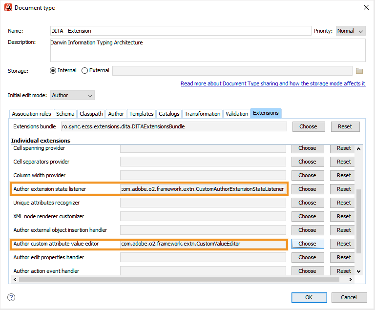

# Oxon Plugin for Adobe Experience Manager Guides {#id1645H6010Q5}

用于Adobe Experience Manager指南的Oxon Plugin \(稍后在指南中称为用于AEM指南的Oxon Plugin\)允许您将Oxon XML作者与Adobe Experience Manager \(AEM\)存储库连接，以用于创作和管理内容。 您可以使用该插件浏览、搜索和打开文件；签入文件；上载AEM存储库上的文件夹和文件。 桌面应用程序中的AEM指南面板允许您将所需的文件夹\(从AEM存储库\)标记到最喜爱的文件夹列表，以便快速访问。 此外，您还可以在AEM Web界面中安装包，并直接从AEM Web界面以Ox XML Author格式打开DITA文件。

## 下载并安装 {#id1826M0L0PUI}

AEM指南的Oxo插件可通过您的Adobe软件分发门户获取。 在“Experience Manager”选项卡中搜索“oxing”，然后从 [Adobe软件分发门户](https://experience.adobe.com/#/downloads/content/software-distribution/en/general.html).

>[!NOTE]
>
>查看特定Adobe Experience Manager指南的发行说明中的Oxon Connector版本兼容性。

安装完安装程序后，请将其安装到安装了Ox XML Author的本地计算机上。 在开始安装过程之前，必须确保系统满足安装AEM指南的Oxon Plugin的技术要求。

### 技术要求

- Oxon XML作者版本24.1

- Adobe Experience Manager Guides版本3.4或更高版本

- Adobe Experience Manager 6.5版（带有Service Pack 10、11、12和13）

- Oxon XML Author版本24.1支持的操作系统

- Java开发工具包
   - OracleSE 8 JRE 1.8

### 在Windows上安装插件

>[!IMPORTANT]
>
>如果系统上安装了旧版本的插件，请确保在开始安装过程之前卸载该插件。 请参阅 **卸载包** 部分 [如何使用包](https://helpx.adobe.com/cn/experience-manager/6-4/sites/administering/using/package-manager.html) 有关卸载说明的文章。

在安装Oxo XML Author的系统上执行以下步骤：

1. 启动安装程序的 `.exe` 文件。

   出现安装向导的欢迎屏幕。

1. 单击 **下一个** 并浏览到Oxon XML Author的.exe文件可用的位置。

1. 选择文件，然后单击 **打开**.

   所选文件的位置将添加到安装向导中。

1. 单击&#x200B;**下一步**。

1. 单击 **安装**.

1. 单击 **完成** 以关闭安装向导。
1. 启动Oxion XML作者。

   AEM Guides面板显示在Oxo XML Author中。

   

   >[!NOTE]
   >
   >如果未看到“AEM指南”面板，请参阅疑难解答部分 — [缺少AEM指南面板](#id192BH200ZAX).


### 在Mac上安装插件

>[!IMPORTANT]
>
>如果系统上安装了旧版本的插件，请确保在开始安装过程之前卸载该插件。 请参阅 **卸载包** 部分 [如何使用包](https://helpx.adobe.com/cn/experience-manager/6-4/sites/administering/using/package-manager.html) 文章卸载说明。

在安装Oxo XML Author的系统上执行以下步骤：

1. 在系统上找到插件的.dmg文件。

1. 双击.dmg文件以打开文件内容。

   .dmg文件包含aem-connector-x.x文件夹和aem-connector-x.x-setup文件。

   >[!NOTE]
   >
   >文件名中的x.x是插件的版本号。

1. 复制Oxon XML Author的plugins文件夹中的aem-connector-x.x文件夹。
1. 双击aem-connector-x.x-setup文件以启动安装程序。

1. 启动Oxion XML作者。

   AEM Guides面板显示在Oxo XML Author中。

   

   >[!NOTE]
   >
   >如果未看到“AEM指南”面板，请参阅疑难解答部分 — [缺少AEM指南面板](#id192BH200ZAX).


### 安装用于从AEM Web界面启用文档编辑功能的包 {#id182CE0Q0TY4}

作为作者，您可以直接从AEM Web界面打开和编辑Oxon XML Author中的DITA映射或主题。 要在AEM Web界面中启用此功能，AEM管理员需要在AEM创作实例中安装包。

作为AEM管理员，请执行以下步骤来安装包：

1. 从您的IT团队获取包的.zip文件。
1. 登录AEM实例 *\（作为管理员\）* 并导航到CRX包管理器。 访问包管理器的默认URL是

   `http://<server name>:<port>/crx/packmgr/index.jsp`

   包管理器管理本地AEM安装上的包。 有关使用包管理器的更多信息，请参阅 [如何使用包](https://experienceleague.adobe.com/docs/experience-manager-cloud-service/content/implementing/developer-tools/package-manager.html?lang=en) 在AEM文档中。

   

1. 要上载氧气包，请单击 **上传包**.
1. 在上传包对话框中，导航到您在步骤1中下载的Oxon包文件，然后单击确定。

   包会上传到您的AEM实例。

1. 要启动安装过程，请单击 **安装**.

   

1. 在安装包对话框中，单击 **安装**.
1. 安装完成后，单击CRX包管理器左上角的“主页”按钮。
1. 在资产文件夹中选择DITA文件。

   **在氧气中编辑** 选项。 有关使用此选项的更多信息，请参阅 [从AEM Web界面打开Ox XML Author中的DITA主题](#id182CE0I905Z).

   >[!NOTE]
   >
   >的 **在氧气中编辑** 选择一个DITA主题时，会显示选项。 如果选择多个主题，则选项将不可见。


## 为AEM指南配置Oxon插件 {#id1826KF00AHS}

下载并安装该插件后，您需要配置以下配置以与插件一起使用：

- **Web身份验证设置**:AEM指南插件中的SSO身份验证设置。
- **常规设置**:插件的连接设置，如AEM服务器URL、登录详细信息等。
- **配置属性自定义首选项**:文档集的分析属性方案需要此配置。

### Web身份验证设置

JxBrowser用于Oxon连接器插件的SSO身份验证。 它是一个基于铬的浏览器。 对于Java 9及以上版本的非公共API的访问权限，您必须明确授予对JxBrowser的此访问权限。 有关更多详细信息，请参阅 [JxBrowser疑难解答](https://jxbrowser-support.teamdev.com/docs/guides/troubleshooting/issues.html).

更新给定文件，以在AEM指南的Oxon Plugin中配置Web身份验证设置：

>[!NOTE]
>
>在更新文件之前备份该文件。

**对于Mac和氧气24.1**

在env.sh中添加以下行

```java
--illegal-access=permit\
--add-opens=java.desktop/javax.swing.plaf.basic=ALL-UNNAMED\
--add-exports=javafx.controls/com.sun.javafx.scene.control=ALL-UNNAMED\
--add-exports=javafx.graphics/com.sun.javafx.stage=ALL-UNNAMED\
--add-exports=javafx.graphics/com.sun.javafx.scene=ALL-UNNAMED\
--add-exports=javafx.graphics/com.sun.javafx.scene.traversal=ALL-UNNAMED\
--add-exports=javafx.graphics/com.sun.javafx.tk=ALL-UNNAMED\
--add-exports=javafx.graphics/com.sun.glass.ui=ALL-UNNAMED\
--add-opens=javafx.graphics/com.sun.glass.ui=ALL-UNNAMED\
--add-opens=javafx.graphics/javafx.stage=ALL-UNNAMED\
--add-opens=javafx.graphics/com.sun.javafx.tk.quantum=ALL-UNNAMED\
--add-exports=java.desktop/sun.awt=ALL-UNNAMED\
--add-opens javafx.swing/javafx.embed.swing=ALL-UNNAMED
```

在oxonAuthor.sh中添加以下行

```java
-Djdk.module.illegalAccess=permit\-Djava.ipc.external=true\
```

**对于Windows和Ox24.1**

在env.bat中添加以下行

```java
--illegal-access=permit --add-opens=java.desktop/javax.swing.plaf.basic=ALL-UNNAMED --add-exports=javafx.controls/com.sun.javafx.scene.control=ALL-UNNAMED --add-exports=javafx.graphics/com.sun.javafx.stage=ALL-UNNAMED --add-exports=javafx.graphics/com.sun.javafx.scene=ALL-UNNAMED --add-exports=javafx.graphics/com.sun.javafx.scene.traversal=ALL-UNNAMED --add-exports=javafx.graphics/com.sun.javafx.tk=ALL-UNNAMED --add-exports=javafx.graphics/com.sun.glass.ui=ALL-UNNAMED --add-opens=javafx.graphics/com.sun.glass.ui=ALL-UNNAMED --add-opens=javafx.graphics/javafx.stage=ALL-UNNAMED --add-opens=javafx.graphics/com.sun.javafx.tk.quantum=ALL-UNNAMED --add-exports=java.desktop/sun.awt=ALL-UNNAMED --add-opens javafx.swing/javafx.embed.swing=ALL-UNNAMED
```

在oxonAuthor.bat中添加以下行

```java
-Djdk.module.illegalAccess=permit -Djava.ipc.external=true
```

>[!NOTE]
>
>您需要以管理员身份从Mac的oxonAuthor.sh和Windows的oxonAuthor.bat中运行氧气。

### 常规设置

请执行以下步骤，在Oxon Plugin for Adobe Experience Manager指南中配置连接设置：

1. 在AEM参考线面板中，单击设置图标，然后选择 **设置**.

   

1. 指定以下详细信息：
   - **服务器URL**:AEM服务器的URL，例如：

      ```http
      http[s]://<host>:<port>
      ```

      在上述URL中，指定部署AEM服务器的服务器的主机名和端口。

      >[!IMPORTANT]
      >
      >如果您的AEM服务器部署在端口80或443上，则无需在URL中指定。

   - **身份验证：** 选择 **基本\（用户名/密码\）** 或 **Web身份验证**. 如果您选择 **基本** 需要输入的身份验证 **用户名** 和 **密码** 中。

      如果选择“Web身份验证”，则会显示“AEM登录”屏幕。 输入您的登录凭据并单击 **登录** 按钮。 成功登录后，“AEM登录”屏幕将关闭，“AEM指南”面板将显示AEM服务器中的文件列表。

   - **连接超时**:指定客户端将等待AEM服务器响应的时间（以秒为单位）。 如果在指定时间内未收到来自服务器的响应，则请求终止。 默认值为20秒。

   - **本地文件夹**:在本地计算机上签出后存储AEM存储库中文件的位置。 如果指定的位置在驱动器上不存在，则插件会创建该位置。
   - **签出时打开文件**:如果选中，则在签出时打开文件。
   - **签入时关闭文件**:如果选中，则在签入时关闭文件。 在关闭文件之前，将显示一个弹出窗口，您可以在其中指定版本注释。
   - **关闭文件时显示签入对话框**:如果选中，将在关闭文件时显示一个弹出窗口。 从弹出窗口中，您可以选择签入文件或关闭文件而不签入。
   - **打开时自动签出文件**:如果选中，双击文件会自动将其检出并打开进行编辑。 如果文件已签出，则只需打开进行编辑即可。 如果未选择此选项，则打开您没有锁定的文件时，会以只读模式将其打开。
1. 单击&#x200B;**确定**。

### 配置属性自定义首选项 {#id1827K0D0OHT}

您需要配置Oxo XML Author中的首选项，以使用与AEM存储库中的DITA主题关联的配置属性。

执行以下步骤以配置分析属性：

1. 在Oxon XML Author中，单击 **选项** \> **首选项**.
1. 在 **文档类型关联** 选项卡，选择 **DITA**，然后单击 **扩展**.

   

1. 在 **类路径** 选项卡中，选择com.adobe.o2.connector **使用插件中的父类加载器，并包含ID** 下拉菜单。

   

1. 在 **扩展** 选项卡，请进行以下更改：
1. 
   - 单击 **选择** 旁边 **创作扩展状态侦听器** 在 **单个扩展** ，并在 **类** 列表。 单击&#x200B;**确定**。
- 单击 **选择** 旁边 **作者自定义属性值编辑器** 在 **单个扩展** ，然后在 **类** 列表。 单击&#x200B;**确定**。以下屏幕截图显示了已配置的 **扩展** DITA主题的选项卡：

   

1. 单击 **确定** 来保存更改。

### 配置DITA映射扩展

需要DITA映射扩展配置，才能直接从AEM Web界面在Ox XML Author中打开映射文件。 这些配置与上述步骤中完成的性能分析属性配置类似。

执行以下步骤以配置DITA映射扩展：

1. 在Oxon XML Author中，单击&#x200B;**选项** \> **首选项**.
1. 在 **文档类型关联** 选项卡，选择 **DITA映射**，然后单击 **扩展**.
1. 在 **类路径** 选项卡中，选择com.adobe.o2.connector **使用插件中的父类加载器，并包含ID** 下拉菜单。
1. 在 **扩展** 选项卡，请进行以下更改：
1. 
   - 单击 **选择** 旁边 **创作扩展状态侦听器** 在 **单个扩展** 并在 **类** 列表。 单击&#x200B;**确定**。
- 单击 **选择** 旁边 **作者自定义属性值编辑器** 在 **单个扩展** ，然后在 **类** 列表。 单击&#x200B;**确定**。
- *\（可选\）* 如果您不想在打开映射文件时解析引用，则需要执行以下其他配置：

   单击 **选择** 旁边 **引用解析程序**&#x200B;在 **单个扩展** ，然后在 **类** 列表。 单击&#x200B;**确定**。

   以下屏幕截图显示了已配置的 **扩展** 选项卡：

   

1. 单击 **确定** 来保存更改。

## 使用Oxon Plugin for AEM指南 {#id1826JG00WY4}

### AEM指南面板

以下屏幕显示了“AEM指南”面板。


**A**\)显示搜索栏。

**B**\)显示收藏夹文件夹。 默认情况下，为空。 您可以从AEM存储库将文件夹添加为收藏夹，最喜爱的文件夹随后将显示在此处。

**C**\)DAM文件夹会显示AEM存储库。 您可以展开和折叠文件夹视图。

**D**\)设置\（齿轮\）图标，其中包含以下选项：

- **连接**:选择此选项以连接到AEM服务器。 将Oxon XML Author连接到AEM Server时，会禁用选项。
- **刷新**:选择此选项可从AEM存储库获取文件和文件夹的最新状态。

   >[!NOTE]
   >
   >确保在刷新文件之前保存文件。 选择 **刷新** 选项时，您会收到一则警告，以在刷新文件之前保存它们。 如果尚未保存文件，可单击 **取消** 然后救他们。

- **设置**:您可以使用此选项打开插件的常规首选项对话框。
- **注销**:选择此选项可关闭AEM服务器连接。 仅当您使用Web身份验证模式时，此选项才可用。

### 上下文菜单函数

右键单击AEM存储库中的文件夹或文件后，即可使用Oxon Plugin for AEM Guides的功能。 可用于文件夹的功能与文件不同。 以下是Oxon Plugin for AEM Guides上下文菜单中的功能完整列表：

- **打开**:打开所选文件或展开所选文件夹。
- **打开位置**:您可以选择在AEM指南的Web编辑器、映射功能板或映射编辑器中打开所选文件。 有关这些选项的更多信息，请参阅 [在AEM指南编辑器中打开文件](#id195GH0V30KX).
- **结帐**:从AEM存储库中签出文件。 有关更多详细信息，请参阅 [签出文件](#id195HC020TS4).
- **用依赖项签出**:检出包含其直接引用的文件。 有关更多详细信息，请参阅 [签出文件](#id195HC020TS4).
- **使用只读依赖项签出**:检出所选文件及其依赖项。 不能对从属文件进行任何更改。 有关更多详细信息，请参阅 [签出文件](#id195HC020TS4).
- **取消签出**:取消签出文件，从编辑器中关闭文件，并还原对服务器上保存文件的最新版本所做的更改。
- **刷新**:如果是文件，则从AEM存储库中获取该文件的最新副本。 对于文件夹，它会获取文件夹结构和文件的状态。 这表示添加了文件，然后该文件将显示在AEM指南视图中。 此外，如果在AEM服务器上签出文件，在“氧作者刷新”中执行刷新操作会将文件显示为签出。 但是，这不会更新 *AEM指南中的签出文件* 查看。
- **刷新签出的文件**:刷新 *AEM指南中的签出文件* 查看。 如果文件在AEM服务器上签出，则执行“刷新”操作将更新 *AEM指南中的签出文件* 查看。 但是，如果添加了新文件或文件状态发生了更改，则它不会在AEM指南树视图中更新它。 要更新AEM上文件的状态，必须进行刷新。
- **签入**:签入已签出的文件。 有关更多详细信息，请参阅 [签入文件](#id182CF0J0FHS).
- **包含依赖项的签入**:如果已检出包含依赖项的文件，则此选项将检查主文件及其依赖项。 有关更多详细信息，请参阅 [签入文件](#id182CF0J0FHS).
- **创建文件夹**:在AEM存储库中创建文件夹。 此选项仅在文件夹级别可用。
- **上传文件**:上传单个或多个文件。 有关更多详细信息，请参阅 [上传文件和文件夹](#id195HC03F03J).
- **上载依赖项**:上载DITA文件\（XML、DITA、Book映射或DITA映射\）及其依赖项。 有关更多详细信息，请参阅 [上传文件和文件夹](#id195HC03F03J).
- **上传文件夹**:在AEM存储库上传文件夹。 有关更多详细信息，请参阅 [上传文件和文件夹](#id195HC03F03J).
- **添加到收藏夹**:将文件夹添加到 *收藏夹* 文件夹。 建议在此处添加工作文件夹，以便更轻松地从AEM同步文件和文件状态。
- **从收藏夹中删除**:从中删除文件夹 *收藏夹*. 有关更多详细信息，请参阅 [添加或删除收藏夹](#id195HC04405P).
- **查看元数据**:显示元数据，如DITA类、文档的标题、类型、UUID，以及与文件关联的其他信息。 有关更多详细信息，请参阅 [查看文件的元数据](#id195GHN0H05C).
- **查看版本**:显示文件的版本历史记录。 有关更多详细信息，请参阅 [查看文件的版本历史记录](#id195GI000D5Q).

### 在Oxon XML作者中打开文件 {#id195GHJ0A0UB}

连接到AEM存储库后，可以打开文件以在Oxon XML Author中进行编辑。 执行以下步骤以打开一个文件，以在Oxion XML作者中进行编辑：

1. 在“AEM指南”面板中，右键单击要打开进行编辑的文件。

1. 选择 **打开** 中。

   文件在Oxon XML Author的编辑器中打开。

   

   将鼠标指针悬停在文件的选项卡上时，会显示服务器路径及其UUID。 在以上屏幕截图中，会突出显示文档的UUID。


如果已选择 **打开时自动签出文件** 选项\（在“首选项”对话框中），打开文件时，该文件将自动签出并可供编辑。 要打开文件，可以双击文件名或右键单击文件名并选择 **打开** 中。 如果未选择此选项，则文件将以只读模式打开。

>[!NOTE]
>
>您还可以双击文件以将其打开。

### 在AEM指南编辑器中打开文件 {#id195GH0V30KX}

如果要使用AEM指南中提供的编辑器，可以通过从上下文菜单中选择所需的选项来实现。 执行以下步骤，以使用AEM Guides的编辑器代替Oxo XML Author的编辑器：

1. 在“AEM指南”面板中，右键单击要打开进行编辑的文件。

1. 选择 **打开位置** 从上下文菜单中选择以下选项：

   - **Web主题编辑器**:如果要打开的文件是.xml或.dita文件，则可以在Web编辑器中打开该文件进行编辑。 选择 **Web主题编辑器** 选项，以在Web编辑器中打开要编辑的选定文件。

   - **地图功能板**:您可以选择在映射仪表板中编辑.ditamap文件，在该仪表板中，您可以对映射文件执行各种操作。 这些操作取决于您所属的角色/组。

   - **Web DITA映射编辑器**:如果要打开.ditamap文件以在映射编辑器中进行编辑，请选择此选项。 使用DITA映射编辑器选项，您可以添加或删除主题、添加关系表以及对映射执行其他操作。


### 签出文件 {#id195HC020TS4}

签出文件时，该文件将存储在系统的本地，并锁定在AEM存储库中进行编辑。 执行以下步骤以签出文件：

1. 在“AEM指南”面板中右键单击文件。
1. 选择以下选项之一：
   - **结帐：** 从AEM存储库中签出文件并使其可进行编辑。
   - **用依赖项签出**:检出包含其直接引用的文件。 您可以使用此选项更改父页面和子页面。 Oxon Plugin for AEM Guides支持签出一级依赖项。 例如，映射引用主题A和主题A引用主题B。检出映射A将签出主题A，而不考虑其在目录层次结构中的级别。 但是，它不会签出主题B，因为它没有直接从映射A链接。
   - **使用只读依赖项签出**:签出文件并将其依赖项作为只读副本下载到本地计算机。 不能对从属文件进行任何更改。

如果已选择 **在结帐时打开文件** 选项\（在“首选项”对话框中），然后签出文件时，会自动打开该文件进行编辑。

如果已选择 **打开时自动签出文件** 选项\（在“首选项”对话框中），打开文件时，该文件将自动签出并可供编辑。 要打开文件，可以双击文件名或右键单击文件名并选择 **打开** 中。

签出文件后，文件的图标会发生更改，以显示其锁定状态。


在上述屏幕截图中，其他用户签出的文件将显示一个黑色锁图标\(A\)。 当前用户签出的文件将显示一个绿色的锁定\(B\)。

>[!NOTE]
>
>如果签出的文件被删除或移动到AEM中的任何其他文件夹，则在签入文件时会收到错误消息。 确保未使用AEM Web界面移动或删除签出的文件。

### 签入文件 {#id182CF0J0FHS}

签入文件时，来自系统的本地副本将存储在AEM存储库中，并且文件上的锁定会被删除。 执行以下步骤以签入文件：

1. 通过单击 **文件** \> **保存**.

1. 右键单击检出文件，然后从以下两个选项中进行选择：

   - **签入**:将选定文件从本地系统签入到AEM存储库中。
   - **通过依赖项签入：** 如果已签出文件及其依赖项，则使用此选项可在一次操作中签入所有依赖文件。 选择此选项时，将显示包含所有从属文件的签入对话框。 单击“确定”(OK)一次签入所有文件。

   如果尚未签出相关文件，然后选择此选项，则将只签入那些已\（单独\）签出的相关文件。 将显示无法签入的文件列表：

   

   强烈建议不要移动已签出的文件。 但是，如果签出的文件被移动到其他位置，则必须取消对该文件的签出。 如果要对该文件进行更新，请再次签出该文件，进行更改，然后重新签入。 如果尝试签入已从其原始位置移动的文件，则会收到错误。

   如果在AEM中签出从属文件，则“与从属项签入”(Check-In with Dependents)将不会在“签入”(Check-In)对话框中显示从属文件。 要获取在AEM中签出的从属文件列表，必须执行“刷新”文件夹操作。

   同样，如果您通过AEM签入了从属文件，则在执行“刷新和刷新签出文件”文件夹之前，不会在“Oxon Author”中刷新文件列表。 如果通过AEM签入包含某些文件的Check-in with Dependents ，则会收到一个错误，其中列出了无法签入的文件。

1. \（可选\）在签入对话框中，将注释添加到 **版本注释** 框中。

   >[!NOTE]
   >
   >此注释显示在文件的AEM版本历史记录中。

1. 单击&#x200B;**确定**。

>[!NOTE]
>
>如果签出的文件被删除或移动到AEM中的任何其他文件夹，则在签入文件时会收到错误消息。 确保未使用AEM Web界面移动或删除签出的文件。

### “AEM指南”视图中的“签出文件”

当您在多个文件夹中时，很难在一个视图中找出有多少个文件签出。 AEM指南在AEM指南视图中提供了“已签出文件”，该视图可提供当前已签出文件的完整快照。 使用此视图，您可以使用AEM指南轻松地在AEM存储库中查找已检查的文件。 执行以下步骤以访问并使用此视图：

1. 单击 **窗口** \> **显示视图** \> **AEM指南中的签出文件**.

   此时将显示“AEM参考线”视图中的“已签出文件”。

   

1. 在此视图中右键单击文件，可获取以下选项：

   - [打开](#id195GH0V30KX)
   - [打开位置](#id195GH0V30KX)
   - 取消签出
   - [签入](#id182CF0J0FHS)
   - [使用依赖项签入](#id182CF0J0FHS)
   - [查看元数据](#id195GHN0H05C)
   - [查看版本](#id195GI000D5Q)

**关于“AEM指南”视图中已签出文件的注释：**

- 的 *AEM指南中的签出文件* 视图维护用户的会话。 这表示当前用户签出的文件将在同一用户会话\（或cache\）的视图中进行存储和维护。

- 如果用户更改了登录凭据或AEM服务器，则会重置视图中已签出文件的数据\（或缓存\）。 用户必须手动运行 *刷新签出的文件* 命令。 为简化此过程，建议将工作文件夹添加到 *收藏夹* 快速刷新文件夹的位置。

- 您可以根据文件的“文件名”、“标题”或“路径”对文件列表进行排序。 如果签出了新文件，则该文件将在视图中按排序顺序显示。


### 上传文件和文件夹 {#id195HC03F03J}

执行以下步骤以上载文件或文件夹：

1. 在AEM指南面板中，右键单击文件夹。
1. 选择以下选项之一：
   - **上传文件**:选择此选项可将一个或多个文件上传到AEM存储库中的选定文件夹。 在选择要上载的文件\(s\)对话框中，选择文件并单击 **打开**.
   - **上载依赖项**:选择此选项可上载包含其依赖项的DITA文件。 在选择要上载的文件对话框中，选择文件并单击 **打开**.
   - **上传文件夹**:选择此选项可上传AEM存储库中的文件夹。 在选择对话框中，选择文件夹并单击 **选择**.

**有关使用基于UUID的文件的其他说明**:

在将内容从本地系统移动或复制到AEM存储库时，必须考虑以下几点：

- 在上传一个或多个文件时，会为没有任何UUID的文件生成新的UUID。 此UUID会添加在 `topic id` DITA文件的URL。

- 复制文件夹时，对文件\（在文件夹\内）的引用将在该文件夹中引用文件的所有DITA映射中自动更新。

- 复制DITA映射文件时，映射文件中的UUID引用不会发生更改。

- 如果文件或文件夹存在冲突或重复项，则会为要复制或移动的新文件生成唯一的文件名。

- 没有两个文件可以具有相同的UUID。 所有新文件都分配了唯一的UUID。

- 如果两个不同用户同时上传文件，则稍后处理的文件将覆盖之前的文件。 但是，应避免这种做法。

- 从AEM存储库中签出内容并在本地系统上进行更改时，请确保在上传文件时未更改文件名。


### 添加或删除收藏夹 {#id195HC04405P}

执行以下步骤，在“AEM指南”面板的“收藏夹”文件夹中添加或删除文件夹：

- 右键单击文件夹并选择 **添加到收藏夹**. 如果文件夹不在“收藏夹”中，则可以将其添加到收藏夹。
- 您可以通过以下方式从收藏夹中删除文件夹：
   - 右键单击 **收藏夹** 文件夹，选择 **从收藏夹中删除**.
   - 右键单击AEM存储库中的 **DAM** 已添加为收藏的文件夹，然后选择 **从收藏夹中删除**.

### 查看文件的版本历史记录 {#id195GI000D5Q}

执行以下步骤以查看文件的版本历史记录：

1. 在“AEM指南”面板中右键单击文件。

1. 选择 **查看版本** 中。

   文件的版本历史记录显示在版本对话框中。

   


### 查看文件的元数据 {#id195GHN0H05C}

执行以下步骤以查看文件的元数据：

1. 在“AEM指南”面板中右键单击文件。

1. 选择 **查看元数据** 中。

   文件的元数据（如DITA类、文档状态、修改日期、大小、标题和UUID）显示在元数据对话框中。

   


## 在AEM存储库中搜索主题 {#id1826J20405Z}

您可以使用AEM“指南”面板中的搜索栏在AEM存储库中搜索主题。 您可以在整个DAM文件夹中搜索，或选择一个文件夹，然后在该文件夹中搜索主题。 搜索结果中显示的主题文本与您的搜索查询相匹配。

执行以下步骤以搜索主题：

1. 在AEM存储库中选择要在其中搜索主题的文件夹。
1. 输入搜索查询\(例如， `introduction`\)。
1. 单击搜索按钮或按Enter。

   结果在“搜索结果”选项卡中以具有文件路径的列表形式显示。 如果搜索查询没有匹配的结果，则在 &lt;path of=&quot;&quot; the=&quot;&quot; selected=&quot;&quot; folder=&quot;&quot;> 消息。

   

1. \（可选\）双击搜索结果中的文件，以在Oxon XML Author中将其打开。
1. 要返回到“ AEM存储库”视图，请执行以下操作之一：
   - 要在不清除搜索结果的情况下查看AEM Repository视图，请单击 **浏览** 选项卡。
   - 要清除搜索结果并查看AEM存储库，请单击删除搜索图标。

## 从AEM Web界面打开Ox XML Author中的DITA主题 {#id182CE0I905Z}

您可以在AEM Web界面的Oxon XML Author中打开和编辑DITA主题。 您需要在AEM中安装包才能启用此选项。 有关软件包安装的详细信息，请参阅 [安装用于从AEM Web界面启用文档编辑功能的包](#id182CE0Q0TY4).

>[!NOTE]
>
>的 **在氧气中编辑** 选项可从AEM中的各个位置访问：选择主题后，预览主题时，或从DITA映射控制台的主题和报表选项卡中选择主题。 如果选择多个主题，则工具栏中不会显示选项。

**打开DITA主题**

执行以下步骤以在Oxon XML Author中打开DITA主题：

1. 选择资产中的主题，然后单击 **在氧气中编辑** 的双曲余切值。

   >[!NOTE]
   >
   >如果主题未签出，则首先将其签出，然后在编辑模式下以“氧气”打开。

1. 选择Oxion XML作者 *&lt;version>* 在 **启动应用程序** 框中。 您可以选择 **请记住我为AEM链接所做的选择** 选项来保存首选项。

**编辑DITA主题**

执行以下步骤以在Oxon XML Author中编辑DITA主题：

1. 在资产中选择并签出主题。
1. 单击 **在氧气中编辑** 的双曲余切值。

   >[!NOTE]
   >
   >如果主题未签出，则首先将其签出，然后在编辑模式下以“氧气”打开。

1. 选择Oxion XML作者 *&lt;version>* 在 **启动应用程序** 框中。 您可以选择 **请记住我为AEM链接所做的选择** 选项来保存首选项。
1. 在Oxon XML作者中编辑主题。
1. 请查看Oxon Plugin for AEM指南中的主题。

   有关使用Oxo Plugin for AEM Guides签入主题的详细信息，请参阅 [签入文件](#id182CF0J0FHS).

   >[!NOTE]
   >
   >确保使用Oxon Plugin for AEM Guides签入主题，如果从AEM Web界面签入，则在Oxon XML Author中所做的更改不会保存在主题的签入版本中。


## 使用属性配置文件 {#id1827JA002YK}

AEM指南允许您使用相关的DITA属性轻松创建和关联条件属性。 您可以在全局级别或文件夹级别定义条件属性。 全局定义的条件在所有项目中都可见，而文件夹级别条件仅在指定文件夹内创建的项目中可见。 内容作者可以使用这些条件属性对其DITA主题中的内容进行条件化处理，或对其创建或使用的映射进行条件化处理。 要详细了解如何使用AEM指南在AEM中创建条件属性，请参阅 *为全局或文件夹级别配置文件配置条件属性* 部分。

>[!NOTE]
>
>确保已在AEM中添加条件属性，并且已设置 [配置属性自定义首选项](#id1827K0D0OHT) 在向内容添加条件属性之前。

执行以下步骤，向Oxon XML Author中的内容添加条件属性：

1. 签出并打开 *Oxon Plugin for AEM Guides*.
1. 选择要应用条件属性的内容部分。
1. 双击Ox XML Author的“属性”面板中的条件属性。

   

1. 在 **可用** 在“编辑属性”对话框的列中，选择属性，然后单击 **添加**.

   以下屏幕显示 `audience` 属性。

   

1. 单击&#x200B;**确定**。

   属性会添加到内容中。


## 常见问题故障诊断 {#id188ABC00RY4}

本主题介绍在使用插件时可能会遇到的一些最常见问题及其解决方案。

### 缺少AEM指南面板 {#id192BH200ZAX}

**问题**  — 如果在Oxo XML Author中未看到“AEM Guides”面板，请尝试以下解决方案：

解决方案1:

1. 在Oxion XML Author中，启用插件。

   单击 **选项** \> **首选项** \> **插件** 选择 **Oxon Plugin for Adobe Experience Manager Guides。**

1. 重新启动Oxion XML作者。


解决方案2:

1. 如果仍看不到AEM参考线面板，请启用AEM参考线窗口。

   在Oxion XML作者中，单击 **窗口** \> **显示视图** \> **AEM指南**.

解决方案3:

1. 卸载并重新安装Adobe Experience Manager指南的Oxon插件。

   - 在Windows上，从 **添加或删除程序** 列表。 然后，重新安装插件。

   - 在Mac上，访问Ox XML Author的plugins文件夹中的aem-connector-x.x文件夹，并将其移至 **垃圾**. 然后，清空 **垃圾** 文件夹。


### 配置DITA-OT转换的端口

**问题**  — 在插件处理的文件上运行任何DITA-OT转换时，转换失败，并出现以下错误：


**解决方案**  — 通过在DITA-OT和插件之间添加代理服务器，此问题已得到修复。 此代理服务器处理并共享DITA-OT为转换请求的所有文件。 配置此服务器的默认端口为： `5972`. 如果您将此端口用于其他某些服务器，则可以为代理服务器指定其他端口。

执行以下步骤以更改代理服务器的默认端口：

1. 浏览到您的\（用户的\）主目录。
1. 创建名为aem\_connector\_proxy的文件。
1. 在任何文本编辑器中打开文件，并在文件的第一行中添加可用的端口号。
1. 保存并关闭文件。
1. 重新启动Oxion XML创作并运行DITA-OT转换。


### AEM参考线面板未浏览到打开的文件位置

问题：如果选择从AEM Server打开一个文件以在Ox XML Author中进行编辑，则会打开该文件以在Oxon XML Author中进行编辑。 但是，“AEM参考线”面板不显示文件在导航树中的位置。

解决方案：在文件路径中包含/content/dam两次的情况中，已发现此问题。 默认情况下，AEM中的所有资产都存储在/content/dam文件夹下。 如果您上传或创建的文件夹结构中也包含/content/dam，则会发现此问题。 您可以对此类文件执行所有正常操作，但默认情况下不会显示它们在导航树中的位置。 要在导航树中访问此类文件，您必须手动浏览到文件的位置。 请注意，在导航树中，重复的/content/dam路径将替换为/content/assets。

### 配置日志记录

问题：默认情况下，AEM指南的Oxon插件不生成任何日志，这使得调试任何错误情景变得困难。

解决方案：执行以下步骤以在插件中启用日志生成功能：

1. 浏览Oxon XML Author的安装位置。

1. 在文本编辑器中打开oxonAuthor19.1.vmoptions文件。

   >[!NOTE]
   >
   >文件的版本号可能因系统上安装的应用程序版本号而异。

1. 在文件中附加以下行：

   ```java
   -Djava.util.logging.config.file=./log.properties
   ```

1. 保存并关闭文件。

1. 在同一位置，创建一个名为log.properties的文件，其中包含以下内容：

   ```java
   handlers=java.util.logging.FileHandler
   java.util.logging.FileHandler.level = DEBUG
   java.util.logging.FileHandler.limit = 1048576
   java.util.logging.FileHandler.count = 5
   java.util.logging.FileHandler.pattern = %h/aem-plugin%g.log
   java.util.logging.FileHandler.formatter = java.util.logging.SimpleFormatter
   java.util.logging.FileHandler.format=[%1$tF %1$tT] [%4$s] %5$s %n
   ```

1. 保存并关闭文件。
1. 启动Oxion XML作者。


该插件现在使用文件名aem-pluginX.log \(*其中X表示旋转数*\)。