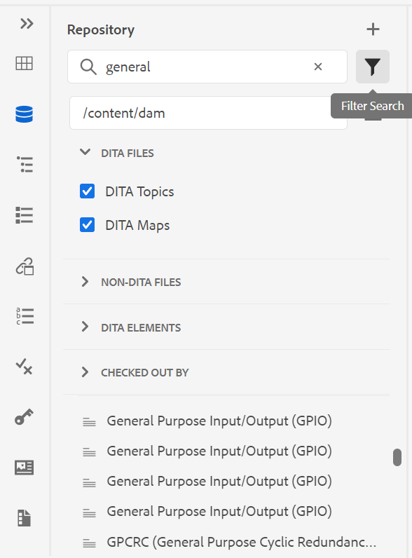
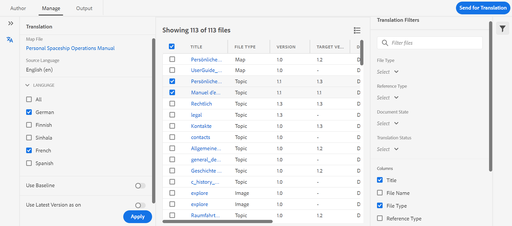

# 1月版 [!DNL Adobe Experience Manager Guides] as a Cloud Service

## 升级到1月版

升级当前版本 [!DNL Adobe Experience Manager Guides] as a Cloud Service(后称为 [!DNL AEM Guides] as a Cloud Service)设置：
1. 查看Cloud Services的Git代码，并切换到在与要升级的环境对应的Cloud Services管道中配置的分支。
2. 更新 `<dox.version>` 属性 `/dox/dox.installer/pom.xml` 文件，以将Cloud ServicesGit代码复制到2022.1.78。
3. 提交更改并运行Cloud Services管道以升级到的1月版 [!DNL AEM Guides] as a Cloud Service。

## 兼容性矩阵

本部分列出了支持的软件应用程序的兼容性矩阵 [!DNL AEM Guides] as a Cloud Service于2022年1月版。

### FrameMaker和FrameMaker Publishing Server

| FMPS | FrameMaker |
| --- | --- |
| 不兼容 | 2020更新4及更高版本 |
|  |  |

### 氧连接器

| [!DNL AEM Guides] Cloud版本 | 氧连接器窗口 | 氧连接器Mac | 在氧气窗口中编辑 | 在Oxon Mac中编辑 |
| --- | --- | --- | --- | --- |
| 2022.1.0 | 2.4.0 | 2.4.0 | 2.2 | 2.2 |
|  |  |  |  |  |

## 新增功能和增强功能

### 基于文章的发布

在1月版中，我们引入了在Web编辑器中集成的基于文章的发布功能。 您可以使用基于文章的发布功能以增量方式生成一个或多个主题的输出，或将您的内容发布到知识库平台。

此功能允许用户以添加方式构建DITA映射，并在准备就绪时发布主题。 发布映射后，使用基于文章的发布功能仅实现更新文章的增量发布。

除了AEM之外，您还可以使用此独特功能将您的文章发布到任何知识库门户，如Salesforce。 此功能还附带一个基于AEM核心组件构建的OOTB内容模板，该模板允许您创建技术内容的基于知识的存储库。 此模板的优点在于，它完全可定制以符合您的组织要求，并且还可支持诸如公司内部网门户之类的用例。
您还可以根据文章的文档状态和修改时间对文章进行筛选。

这篇基于需求的随时文章发布不仅可以让您完全控制内容发布，而且还可以缩短发布更新内容的整体时间。
使用此模板发布文章时，还可以将元数据传递到已发布的页面。
有关更多详细信息，请参阅 *从Web编辑器中基于文章的发布* 中。

### 改进的Web编辑器

Web编辑器中引入了许多增强功能和新功能：

* 在Web编辑器中还增加了对主题方案的支持。 您现在可以使用“主题方案”面板创建和使用主题方案。 通过添加主题方案，您现在可以使用自己的公司元数据和分类。

* 此版本中引入了新的术语表热点工具，用于批量管理术语表。 使用此工具，您可以快速将文本转换为术语表和术语表，并批量转换为所选映射或打开主题的术语。

* 在可重用内容面板中添加了刷新功能，该功能允许您快速刷新引用文件中的可重用内容。
* 新的工作副本指示器显示文件的当前（工作副本）是否与保存的版本同步。

* “存储库面板”和“文件浏览”对话框中的搜索筛选器已得到增强，可提供更多筛选选项，这些选项可进一步自定义。

* 您现在可以从Web编辑器上传.docx文件。

### 使用FrameMaker创作

现在，您可以在FrameMaker中创作和发布文档。 FrameMaker附带一个到Adobe Experience Manager的现成连接器。 在FrameMaker中，您可以获得易于使用的界面，该界面允许您在分布式协作环境中维护文档的版本。

创建内容后，FrameMaker允许您以不同格式(PDF、HTML5、EPUB和DITA)发布文档。 您还可以执行各种文件管理操作，如签出、与依赖项签出、签入、刷新等。
在中使用FrameMaker创作 [!DNL AEM Guides] as a Cloud Service使用FrameMaker版本2020.4及更高版本。

### 新的翻译功能板

Web编辑器中引入了新的翻译功能板，该功能板具有以下功能：

* 对主题列表进行排序、搜索和筛选。
* 按引用类型筛选内容 — 直接或间接引用。
* 在启动翻译请求时，轻松导航以查找现有项目。
* 引入了多语言翻译机制，以避免在针对多种语言启动翻译请求时为每个语言创建多个项目。
* 引入了用于隐藏地图功能板中翻译选项卡的配置。 默认情况下，该变量可见。 您可以选择使用映射功能板或Web编辑器来翻译内容。

### 增强的发布功能

* 作者现在可以将映射和主题级别的元数据传递到DITA-OT发布。 当自定义PDF模板设计为使用文件元数据属性（如标记、作者、文档状态等）时，此功能非常有用。

* 添加了新配置，以允许用户在 **删除和创建** 选项。

### 改进了文件处理

现在，在AEM Assets中处理文件时可以看到以下改进：
* 引入了新的文件上传体验和用于选择冲突解决策略的新对话。

* 能够创建已上传文件的新版本，并能够防止覆盖已签出的文件。
* 现在，您可以直接从版本历史记录视图中查看图像的预览。 此外，对于DITA和非DITA文件，版本历史记录会单独显示当前版本信息。

* 每当用户创建DITA文件时，默认文件名都会以小写形式显示，并与本机AEM文件夹创建方案内联。

### 新报表导出功能

报表在确定内容的运行状况方面非常有用。 [!DNL AEM Guides] as a Cloud Service提供各种报表来控制您的内容。 现在，您不仅可以查看报表，还可以将报表数据导出为CSV文件，以便与较大的团队查看和共享。 报表数据可让您快速查看任何损坏的链接或缺少的图像。

### 改进了氧DAM刷新体验

从AEM Server的“氧气”中刷新文件时，如果您当前的“氧气”会话中有未保存的文件，则会显示一条警告消息。 您可以选择取消刷新操作以保存任何未保存的文件。 如果没有此功能，用户将丢失其文档中任何未保存的信息。

### 其他功能增强

* 您现在可以创建新 **Dita项目** 模板 **/apps/projects/templates** 路径。
* 现在下载默认 **ui_config.json** 文件。 这可用于合并现有 **ui_config.json** 文件。
* 即使JS文件有新版本，您也无需清除浏览器缓存。

## 修复的问题

下面列出了各个区域中修复的错误：

### Web编辑器

* Conref以红色显示，即使它们未损坏。 (8239)
* 在DITAVAL编辑器中选择“添加所有属性”后，不会自动填充条件属性的值。 (8234)
* 作者无法使用相对路径在主题中插入图像。 (8112)
* 如果文件名中存在空格，则“查看”任务页不显示多媒体文件。 (8111)
* 表格单元格中添加的Ph值以红色显示。 (8083)
* 移动审阅文件时，审阅任务中的链接将不会更新。 (8080)
* Web编辑器无法正确呈现将缩放属性设置为75%或更高的图像。 (8073)
* GIF图像在Web编辑器中呈现为静态图像。 (8024)
* 注释元素中的上下文引用不会显示在Web编辑器预览或输出中。 (8006)
* 对于本身为conref的元素，不会在编辑器中解析xref。 (7933)
* 在编辑器预览和“存储库”面板中，具有键的标题未正确呈现。 (7909)
* 包含特殊字符的代码片段无法正确存储。 (7908)
* 在格式化MathML方程后保存主题会导致错误。 (7954)
* 具有(tm)的keydef在编辑器中无法正确呈现，而AEM站点输出包含重复的TM符号。 (7859)
* 拖放代码片段的操作不能按DTD进行。 (7758)
* HTML忽略图形的自定义尺寸。 (7718)
* 在移动源文件时，conrefend属性不会更新。 (7698)
* 使用参考主题类型文档会导致多个UI问题。 (7656)
* 当作者在映射中添加ditavalref时，DITAVAL文件不显示。 (7594)
* 在每个空白中都发现意外的空格 `<entry>` 元素 `<tgroup>` 元素。 (7532)
* “源”按钮不适用于通过“映射”功能板打开的主题。 (7465)
* 漂亮的打印插入了空白行和空格，当文件在FrameMaker或Oxo中打开时可以看到这些行和空格。 (7408)
* 任何主题中具有href=&quot;/&quot;的映射不会在AEM站点上发布。 (7405)
* 当根映射具有大量键默认值时，在编辑器中发现性能问题。 (7400)
* 具有自定义模板的映射的文档状态不会从其相应的状态配置文件继承。 (7359)
* `<tm>` 元素未正确呈现为块元素。 (7286)
* 创建新模板后，编辑器模板面板中会显示重复的模板。 (5814)
* 在ui_config中为图像定义的用于设置其他属性的模板不适用于拖放情况。 (5713)
* menucascade中uicontrol的默认外观不正确。 (5483)
* 主题/映射的自定义模板在UI中不显示新名称。 它将名称显示为“Topic”/“Map”，而不显示配置的名称。 (4958)
* 能够从用户首选项设置中清除rootmap。 (8534)
* 即使在刷新页面后，也不会列出新创建的映射集合。(8603)
* 无法关闭已解锁的主题。 (8545)
* 在源模式和创作模式之间切换会将主题标记为脏乱，并要求再次保存内容。(8524)
* 搜索特殊字符时重复使用内容面板崩溃 `[` 或 `*` .(8279)
* 使用键盘快捷键Alt+Enter打开插入元素对话框时，光标不会显示在搜索栏中。(7912)
* 搜索选项仅在文件名中搜索，而不在内容中搜索。 (7784)

### 氧连接器

* 在氧气中加载父文件夹具有特殊字符的文件会出错。 (8054)
* 在Oxon中打开新创建的文档时，会引发“找不到GUID”错误。 (7856)
* 使用“在氧气中编辑”从AEM中签出文件后，签入选项会被禁用。 (7471)

### 审核

* 实时同步不适用于注释。 (7661)

### 地图功能板

* 在映射功能板的主题或报表选项卡的主题标题中，无法看到主题的内容。 (8263)
* AEM Sites输出 |更新DITA主题标题时，生成的站点页面的jcr:title不会更新。 (8131)
* 下载MAP不会下载主题中使用的视频文件。 (8070)
* 当通过下载书签API使用对象标记时，不会下载媒体文件。 (8057)
* 如果任何主题包含标题以conref开头的文件，则“报告”选项卡中显示的报告不正确。 (4698)
* “基线”选项卡上的“应用标签”对话框不在下拉菜单中显示标签。 (8455)

### 发布

* PDF创建在选择启用版本控制时首次失败。 (8053, 8294)
* 在“tm”后自动添加空格字符；标记。 (7964)
* 无法在AEM Site输出中查看YouTube视频。 (7401)
* 在用户单击“地图”功能板的基线选项卡中的浏览所有主题后，按标签过滤引用内容失败。 (7388)
* 使用元素发布主题 `<tm>` 在生成的输出中，属性值SM或reg显示不正确。 (7239)
* 使用图像进行基线发布时，不会在已发布的输出中选取图像的最新版本。 (7231)
* 基线选项卡中显示了可相关引用的主题。 (5424)
* 标题中包含conkeyref的主题的增量发布无法按预期工作。 (4474)
* 即使勾选了该设置，页面标题也不会用于生成输出URL。 (8257)
* 基线发布会选取当前版本的图像，而不是冻结节点。 如果图像的文件名中包含空格或特殊字符，则也会出现这种情况。 (8274, 8322)
* 对于具有mapref的类型主体方案的DITA映射，增量发布失败。 (8218)
* 每当将映射添加到批量发布功能板时，都会添加空值。 (8695)
* 在主题中使用将图像作为参考的基线发布时，图像不会在输出中发布。 (8564)
* 如果删除了AEM网站发布中使用的基线，则发布会失败，但出现异常。 (8572)
* 主题重新生成不起作用。 (8091)
* 在表格中发布脚注时出现问题。 (4709)

### AEM Assets

* 在资产UI中对大型内容集执行选择/删除时发现性能问题。 (8238)
* 如果将DITA谓词添加到搜索筛选器，则保存的搜索功能（智能收藏集）会中断。 (8048)
* 无法将图像还原到旧版本。 (DXML-7903)
* 对于没有删除权限的作者，也会显示删除选项。 (7322)
* 资产编辑器的CCMS叠加图会中断删除选项的呈现。 (8093)
* 文档配置文件未被删除。 (8604)
* 执行“全选”并将多媒体/Dita_Content移动到其他文件夹时，引用中断。 (8621)
* 移动资产时，源中的引用不正确。 (8627)
* 未加载修复的列表视图。 (8542)

### 内容导入

* HTML到DITA的转换 |具有“tr”的“td”条目为空的表会导致输出中额外的行。 (8132)
* HTML到DITA的转换 |HTML有一个具有多个表体的表失败，但出现异常。 (7940)
* HTML到DITA的转换 |如果源HTML包含注释，则会出错。 (7937)
* 导入DITA 1.3 DITA文件会导致某些href转换为格式错误的链接。 (8019)

## 已知问题

Adobe已识别 [!DNL AEM Guides] as a Cloud Service于2022年1月版。

### 解决方法的已知问题

对于以下已知问题，请使用给定的解决方法：

* Web身份验证对Mac上的Oxon连接器不起作用。
   **解决方法**:暂时在Windows上使用氧连接器。

* 在Firefox浏览器中，如果不打开并排视图，则无法导入审阅注释。
   **解决方法**:现在使用Chrome浏览器。

* 在移动文件名中具有空格的图像或多媒体文件时，引用会中断。
   **解决方法**:重命名文件，并在移动文件名之前从文件名中删除空格。

* 在最新版本的Chrome浏览器中，地图功能板不会间歇性地加载。
   **解决方法**:刷新映射功能板页面。

### 其他已知问题

* 如果氧气与 [!DNL AEM Guides] 解决方案时，会失败。
* 无法将审核任务重新分配给用户。
* 映射收集UI中存在问题，如文本扭曲和 **全选** 功能无法正常运行。
