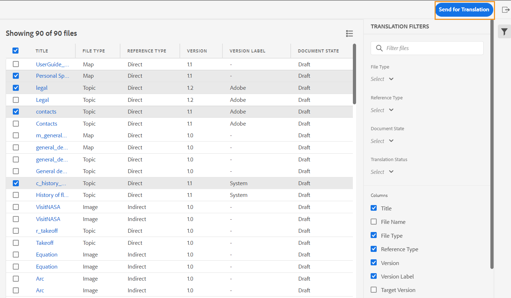

# 11月版Adobe Experience Manager指南as a Cloud Service

## 升级到11月版

升级您当前的Adobe Experience Manager指南as a Cloud Service(以后称为 *AEM指南as a Cloud Service*)设置：
1. 查看Cloud Services的Git代码，并切换到在Cloud Services管道中配置的分支，该管道与您要升级的环境相对应。
1. 更新 `<dox.version>` 属性 `/dox/dox.installer/pom.xml` 将Cloud ServicesGit代码的文件2022.11.198.
1. 提交更改并运行Cloud Services管道以升级到11月版AEM指南as a Cloud Service。

## 索引现有内容的步骤(仅当您使用的是9月版AEM指南之前的版本时as a Cloud Service)

执行以下步骤以索引现有内容，并在映射级别使用新的查找和替换文本：

* 向服务器运行POST请求（验证正确） —  `http://<server:port>/bin/guides/map-find/indexing`.
(可选：您可以传递映射的特定路径来索引它们，默认情况下，所有映射都将编入索引 ||示例： `https://<Server:port>/bin/guides/map-find/indexing?paths=<map_path_in_repository>`)

* 该API将返回jobId。 要检查作业的状态，您可以向同一端点发送具有作业ID的GET请求 —  `http://<server:port>/bin/guides/map-find/indexing?jobId={jobId}`
(例如：http://&lt;
_localhost:8080_>/bin/guides/map-find/indexing?jobId=2022/9/15/7/27/7dfa1271-981e-4617-b5a4-c18379f11c42_678)

* 作业完成后，上述GET请求将做出成功响应，并在任何映射失败时提及。 可以从服务器日志中确认已成功索引的映射。

## 兼容性矩阵

本部分列出了AEM指南as a Cloud Service于2022年11月发布的软件应用程序所支持的兼容性矩阵。

### FrameMaker和FrameMaker Publishing Server

| FMPS | FrameMaker |
| --- | --- |
| 不兼容 | 2020更新4及更高版本 |
|  |  |

*从2020.2开始的FMPS版本支持在AEM中创建的基线和条件。

### 氧连接器

| AEM Guides as a Cloud Release | 氧连接器窗口 | 氧连接器Mac | 在氧气窗口中编辑 | 在Oxon Mac中编辑 |
| --- | --- | --- | --- | --- |
| 2022.11.0 | 2.7.13 | 2.7.13 | 2.3 | 2.3 |
|  |  |  |  |

## 新增功能和增强功能

AEM指南as a Cloud Service在11月版中提供了增强功能和新增功能：

### 从存储库面板中删除文件

现在，您可以轻松地从 **选项** “存储库”面板中选定文件的菜单。

在删除文件之前，将显示确认提示。 如果文件未从任何其他文件中引用，则会删除该文件，并显示成功消息。

如果选定文件已签出，则无法删除它，并显示一条错误消息。 如果所选文件被添加到收藏夹集合或从任何其他文件中引用，AEM指南会检查您的确认情况，并为您提供强制删除该文件的选项。 如果删除引用的主题，并且已打开包含要编辑的引用的文件，则将显示引用文件的断开链接。

**注意**:您还可以使用键盘的Delete键删除所选文件。

### 清除所选版本的文件

在创建和维护内容时，可能会为存储库中的DITA文件创建许多版本。 AEM指南允许您从存储库中清除旧版DITA文件并释放磁盘空间。

AEM指南不会删除文件的第一个版本或基线中包含的版本，或者已对其应用标签。 清除操作甚至不会删除翻译或审阅工作流中包含的文件。 您可以选择要保留的版本数，还可以决定删除早于定义天数的文件。

在开始清除操作之前，您可以预览报表以查看要清除的版本。 然后，您可以决定启动或取消清除操作。

清除操作完成后，您可以检查清除报告以查看已清除的文件。

### 管理全局和文件夹配置文件输出预设

AEM指南为您提供了为全局配置文件和文件夹配置文件创建和管理输出预设的功能。 然后，您可以使用这些输出预设为与该全局或文件夹配置文件相关的所有映射生成输出。

**注意** 只有文件夹级别的管理用户才能创建全局预设和文件夹配置文件预设。

这些全局预设显示在 **输出** 选项卡。 您可以使用它们为所有相关映射生成输出。 您可以选择预设作为默认PDF预设，以生成PDF输出。 您还可以 **编辑**, **重命名**, **复制**&#x200B;或 **删除** 现有的输出预设 **选项** 菜单。

### 版本标签列已添加到翻译功能板

在翻译功能板中，您还可以看到“版本标签”列。 此时会显示所选源文件版本的标签。 这可以帮助您选择具有特定标签的所有文件并一次翻译它们。

### 本机PDF |PDF，更改栏显示文档版本之间的差异

现在，您可以使用更改栏创建一个PDF，以显示两个版本之间的内容差异。 您可以选择比较当前版本与先前版本的基线，或比较两个选定的基线版本。

PDF中会显示一个更改栏，用于指示已修改、已插入或已删除的内容。 您还可以选择执行以下操作：
* 以绿色显示插入内容并带下划线
* 以红色显示已删除的内容，并标有删除线

### 本机PDF |对输出路径和PDF文件名的变量支持

现在，您还可以使用以下现成的变量来定义输出路径和PDF文件。 您可以使用单个或一组变量来定义以下选项：
* `${map_filename}`
* `${map_title}`
* `${preset_name}`
* `${language_code}`
* `${map_parentpath}` （仅用于输出路径）
* `${path_after_langfolder}` （仅用于输出路径）

### 本机PDF |为DITA映射生成目录并重新排序页面布局

现在，您还可以使用模板的高级PDF设置在DITA映射中生成目录。 您可以选择启用或禁用各种页面布局的显示，还可以重新排序其位置。

## 修复的问题

下面列出了各个区域中修复的错误：

* 本机PDF | `conkeyref` 未在生成的PDF输出中得到解析。 (10564)
* 本机PDF |访问PDF输出中映射的元数据时出现问题。 (10556)
* 本机PDF |内联样式用于生成标记，而不是类名称。  (10498)
* Web编辑器间歇性地加载空白页面。 (10678)
* 如果我们通过复制现有预设来创建预设，则PDF发布会失败。 (10584)
* **查看日志** 当预设的PDF生成失败时，按钮不起作用。 (10576)
* 在作为conref的段落标记内的注释不会在预览中显示。 (10559)
* 点击列表项末尾的回退空间将删除整个列表。 (10540)
* 使用本机PDF导出嵌套 `<indexterm>` 未嵌套在索引中。 (10521)
* **自动缩进** “源”视图中缺少工具栏中的按钮。 (10448)
* 在编辑器中创作列表时，列表项的第一个字符丢失。 (10447)
* 如果更改了任何DITA资产版本并将其保存在基线编辑窗口中，则会显示多个弹出窗口。 (10399)
* 单击时发生应用程序错误 **编辑** 按钮。 (10388)
* 从资产UI中执行复制粘贴操作时，DITA主题的自定义元数据不会保留。 (10367)
* 对于活动翻译项目中存在资产的整个语言文件夹，将阻止后处理。 (10332)
* 文件夹配置文件管理员看不到XML编辑器中的“模板”选项卡。 (10266)
* 升级4.0后，Web编辑器中出现导航问题。 (10159)
* SVG文件在“预览”模式下不显示。 (10010)
* 如果编辑器的“输出”选项卡包含更多预设，则无法滚动预设部分，并且不显示所有预设。 (9787)
* **编辑** 和 **注释** 列视图中图像的选项无法正常工作。 (8758)
* 对等链接未解析，在生成的输出中显示为普通文本。 (7774)
